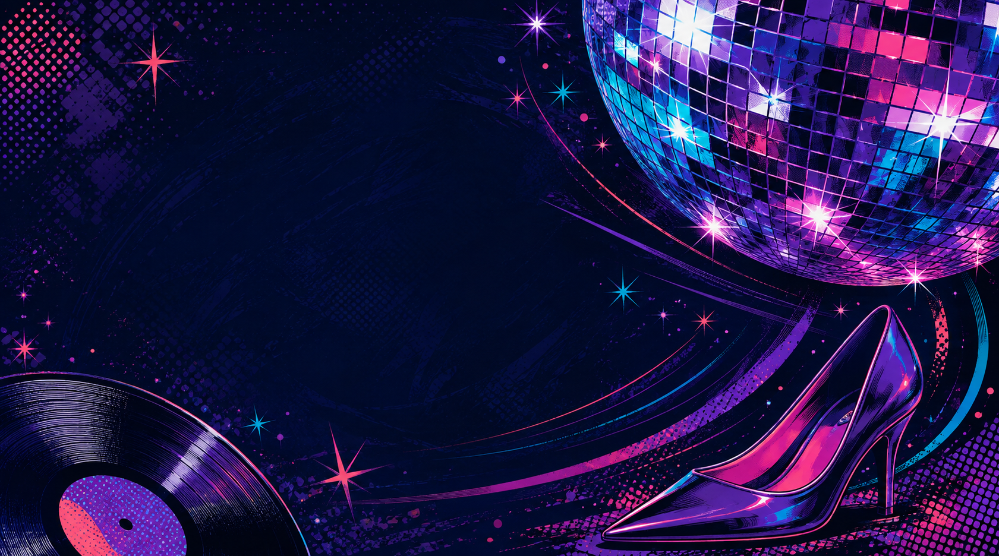

# Six Resident Card background options — rebuilt from Ali’s references

These six original background-art candidates replace the earlier thin-border experiments. They are unselected artwork, not Ali-approved assets or an installed page update. Memphis remains rejected. The old stretched zigzag and off-brand pastel colourways must not be reused.

## What changed

Ali asked for more than two options, flagged stretching and colours that were not LAiDIES, then asked why the designs only used tapes and instructed a fresh look at her backgrounds. These designs use six separate compositions and the wider original reference set: skates, sneakers, sunglasses, disco objects, computing hardware, music equipment and two full abstract prints. Only Radio Night contains a cassette. No near-identical header/body rectangles or compressed bottom ribbon.

Current electric palette source: `operations/reference/current-colours.md`, with exact token values preserved in each prompt. Rendered illustrations contain ink shading, material neutrals and highlights; no claim that every raster pixel equals a brand token. No old pastel pairings are used as a colour reference. Prompt/source correspondence is in `prompts.json`.

## Important page-fit boundary

These are full background compositions, not prebuilt Card shells. The fixed current portrait/text mount has NOT been integrated or tested against these new images. Preserve the live Card/account/Closet identity and saved IDs; do not flatten resident data into any background. In particular, Disco and Neon Brushwork need light text or an independently tested readable overlay, while the object images need deliberate crop/layer decisions to avoid covering their visual subjects with the portrait. Do not copy these into production as automatic drop-ins. Check actual contrast, text fit and desktop/mobile layout after a selection. No deployment is included.

## Options

### Disco after dark

Disco ball, heel and vinyl; navy, purple, cyan and pink. Inspiration references: 04,10.

Original: [01-disco.png](01-disco.png) — 1681 × 936; SHA-256 `81792fea9ac1c18d3577972a4ffc92c3adcd5317a8345a608705bc75b8f0651f`.

### Roller rink

Quad skate, sneaker and sunglasses; pink, cyan, purple and lime. Inspiration references: 05,06,08.

Original: [02-roller-rink-v2.png](02-roller-rink-v2.png) — 1681 × 935; SHA-256 `dc6990e75c34514c3a8b6c2b134607599dd8ac1244c54ffee40d91ab221b7a12`.

### Retro desktop

CRT computer, floppy disk and compact disc; cyan, cobalt, pink and orange. Inspiration references: 05,08,09.

Original: [03-retro-desktop.png](03-retro-desktop.png) — 1680 × 936; SHA-256 `8772513a58087da6d0cb49621562c804eef861b24dbd08076c4df5ac2445a0d0`.

### Radio night

Boombox, headphones and one cassette; coral, purple, cyan and ink. Inspiration references: 07,08.

Original: [04-radio-night-v3.png](04-radio-night-v3.png) — 1680 × 936; SHA-256 `6e4702af260a7ab08f43e10190d51cb405549d42f16c4e34265489c94372070a`.

### Electric diagonal

Broad diagonal print, round halftone and splatter; cyan, pink, ink and orange. Inspiration references: 01,03.

Original: [05-electric-diagonal.png](05-electric-diagonal.png) — 1681 × 936; SHA-256 `300c9babf4baa98b485beeefd0d1e04cee6a8ce80e2626c53354fbc7a543d814`.

### Neon brushwork

Layered dry-ink strokes and angular shapes; purple, pink, coral, cyan and ink. Inspiration references: 02.

Original: [06-neon-brushwork.png](06-neon-brushwork.png) — 1679 × 937; SHA-256 `237a57cb0ff360562d8e5ff4666a70be9f43bcfccf791d9807323ecf8c5628ec`.

## Artwork review

Maker inspected each original; independent Terra/Medium review applied the revised original-reference bar after rejecting old04/05 as negative calibration. No visible failure found for palette family, physical proportions, composition/variety, stretched objects or illegible text. Reviewer judged all six suitable as standalone art candidates, with Roller Rink strongest among object-led designs. This does not bind Ali taste, exact-hex matching, page compositing, contrast or release approval.
