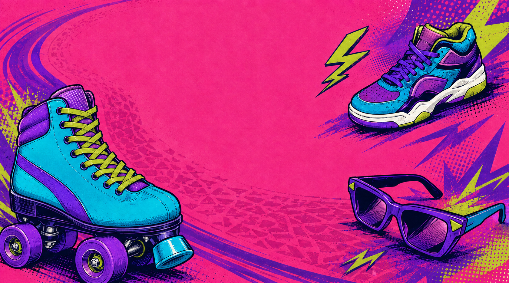
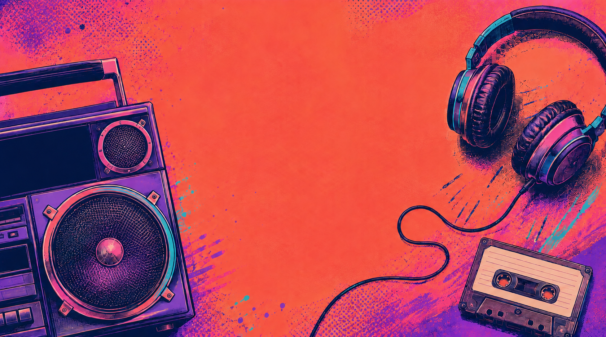
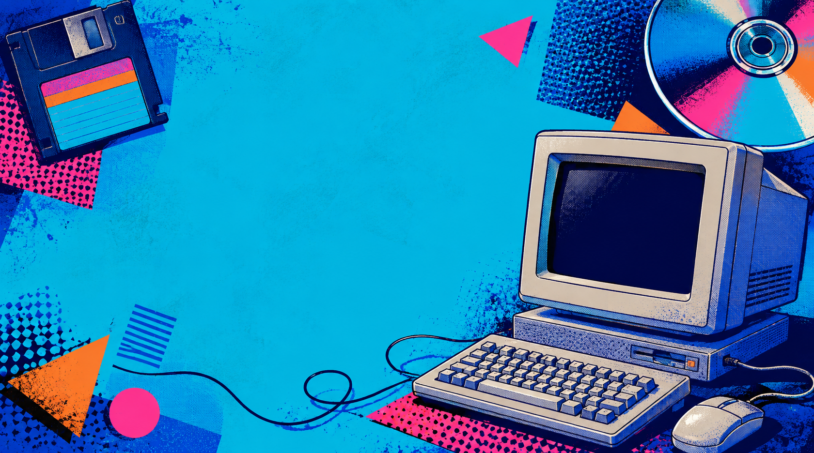
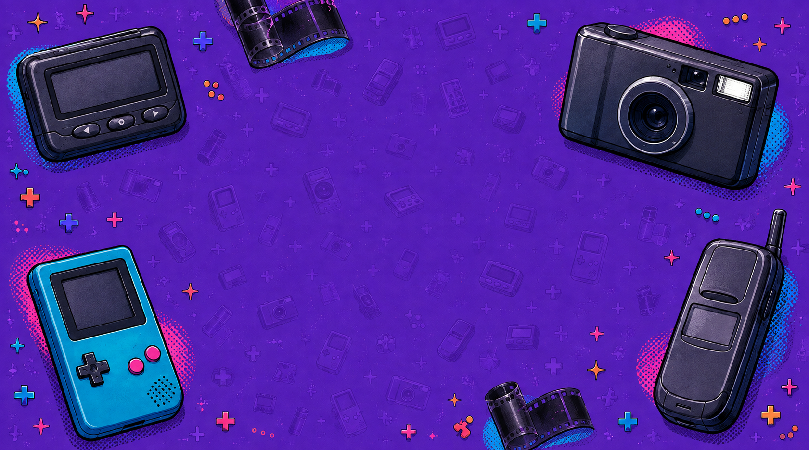
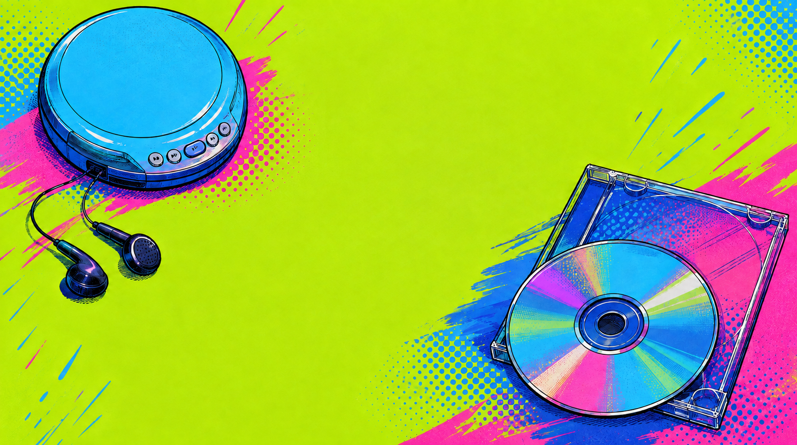
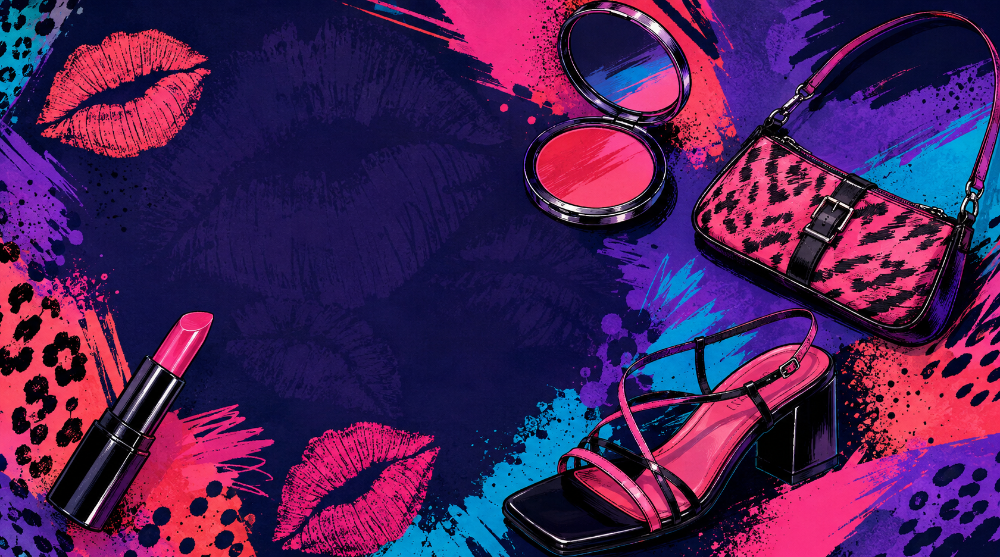
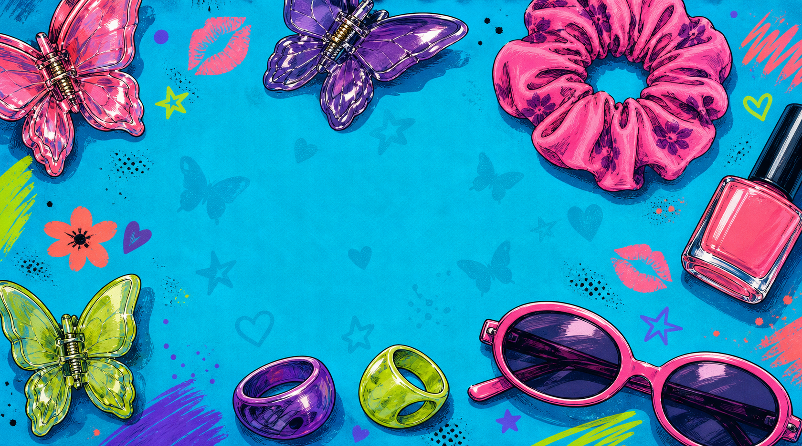

# Resident Card backgrounds — current review

**Three you like:** Skates, Boombox and Computer. Those image files are unchanged.

**Existing options described as okay, not great:** Diagonal Print, Pocket Tech and CD Player.

**Two new options:** Girls’ Night Out and Getting Ready, following Ali's request for heels, lips and other fun feminine accessories.

Only these eight images belong to this review. Purple Brushwork was withdrawn because Ali found it too similar to Diagonal Print. Disco, Memphis and all older stretched/pastel/thin-border drafts are excluded. These are artwork choices; page fit, readable text and installation remain separate work. Nothing is installed.

## 1. Skates — You said this is good.

[Open original](02-roller-rink-v2.png)

## 2. Boombox — You said this is good.

[Open original](04-radio-night-v3.png)

## 3. Computer — You said this is good.

[Open original](03-retro-desktop.png)

## 4. Diagonal print — Awaiting your verdict.

[Open original](05-electric-diagonal.png)

## 5. Pocket tech — New replacement for Purple Brushwork.

[Open original](07-pocket-tech-v2.png)

## 6. CD player — New replacement for Disco.

[Open original](08-cd-summer-v2.png)

## 7. Girls’ Night Out — New, awaiting Ali's verdict.

## 8. Getting Ready — New, awaiting Ali's verdict.

