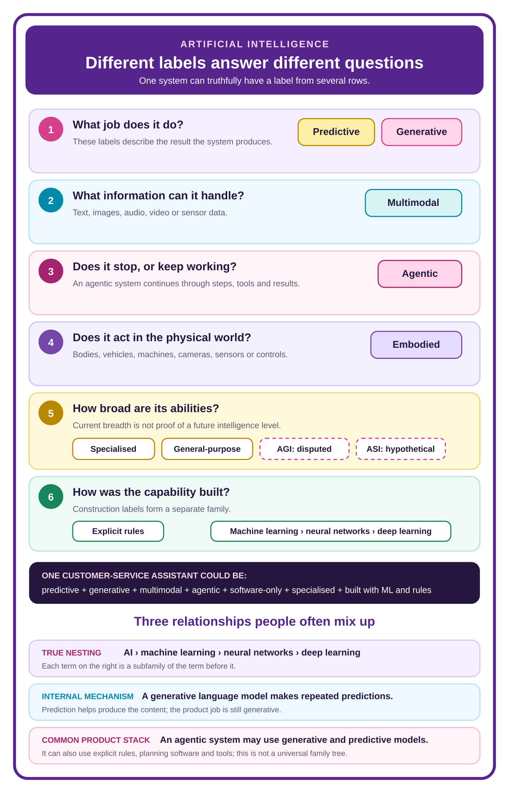

# AI Fundamentals 101

## Introduction

Alright LAiDIES, listen (or should we say, read?) up! This book is really important. We made *AI Fundamentals 101* so there is finally something that explains all the fundamental AI concepts, how they work and how the whole end-to-end AI ecosystem is connected. Basically, all the systems, hardware, software and infrastructure needed for you to type something into an AI application and get an output. All the buzzwords you hear in news stories—chips, compute, data centres, frontier models, sandboxes, agents—what they actually mean, how they affect you when you use an AI tool and, obviously, why you should care.

But *AI Fundamentals 101* is not your standard textbook or just a collection of definitions you can look up online. No, no. LAiDIES would never do that to you. This is not a florals-for-spring situation. We can (and we will) do better!

So why is it important for you, as a woman of distinction (or friend to womankind—all are welcome here) who does not have a PhD in AI, to know all this?

We’re so glad you asked. Here’s why:

### From “ARGHH, WTF?” to “Ahh. That’s why.”

AI is a truly transformative technology that, in some form, is accessible to almost everyone. It is going to transform the way we work, live and operate as a society. But it is different from essentially any other technology that has done this in the past.

Let’s take electricity, for example. That was obviously a transformative technology that also changed the way we work, live and function as a society. However, with electricity, most people just flick on a switch or plug something in and—bam!—you’ve got light at night. That is, for the most part, how most of the world interacts directly with the technology. We may understand a bit of how electricity works (thanks, Nikola Tesla and Thomas Edison!), but it is essentially plug and play. Pun intended.

The way we interact with AI is different. We have the ability to get it to help us build and create (almost... at least for now) anything we can imagine—like this website, for example. But to get it to actually do what we want, we need to understand more about how it works and the best way to interact with it to get the output we want.

If we don’t, we are more likely to get something completely different from what we intended, become frustrated and walk away. We don’t want that. This technology is too useful to simply say, “I don’t get what the hype is about. This thing sucks!” and walk away.

No, no, no, dear reader, thou shalt not forsaketh the AI. Thou shalt first consult the AI Bible (a.k.a. this book), take one of our classes (coming soon!) or check out one of the other books or articles on LAiDIES.ai. We shall take you from “WTF!!!!! I hate this [expletive] thing. Why can’t it follow my basic [expletive] instruction?” to “Oh... yes... I get it now. I know what I have to do to get this back on track.”

TL;DR: from “ARGHH, WTF?” to “Ahh. That’s why.”

### From “OMG, THE END IS NIGH!” to “Ugh, as if.”

Let’s be clear. This is not about jumping on the proverbial bandwagon; we’ll leave that to our bro friends in crypto. (“Ooo, sick burn!” someone shouts from the back.)

AI is not a fad or a trend that still struggles to explain how it will actually be useful to society. The pace of change in AI is phenomenally fast, and everyone is trying to get their piece of it. We are fully aware of the irony in that statement, given that LAiDIES.ai is a website dedicated to AI literacy.

There are dozens of stories a day about something to do with AI. Some are well researched; others seem like they belong in the tabloids. As we know, not all journalists, content creators or AI voices are created equal. So how can we cut through all this noise and understand what is really happening? What do we need to pay attention to? Which stories should actually influence our decisions and how we approach things?

That isn’t possible unless you have a fundamental understanding of the basics. And while LAiDIES does try to call these stories out and go deeper in the NewsStand, you should be able to (eventually) do this on your own. So when the headlines make it seem like Skynet is taking over and Judgment Day is just around the corner—or a content creator says three prompts will solve all your problems and tells you to DM them—you will be able to get to the real story and decide whether that “hack” is something you are already doing or deserves an “Ugh, as if!”

### From “Whatever!” to RSVPing “Yes” to policy discussions

Which brings us to our last main reason. Once you understand how AI works, how you can use it better and how to identify overly positive, overly negative or clickbait claims, you can start to understand the truly transformative impacts AI is going to have on society.

But with such a powerful technology, there are certainly risks. What you need to decide is whether the benefits outweigh those risks, what kind of guardrails we want to put in place to manage them and how we want the world to look and operate. There are many questions and debates that need to be—and should be—happening right now.

It is vitally important that you have the tools and knowledge to participate in those debates, whether that is at a workplace implementation meeting, an employee consultation, city hall discussing a potential new data centre in your area or a larger philosophical discussion about who should control these models, how access to compute should work, and how we should think about the economy if the world we live in becomes fundamentally different.

Those are invitations. RSVP “yes.” Not because every use of AI deserves your approval, but because the discussion deserves your informed participation.

As our old friend Karen Spärck Jones said, “Computing is too important to be left to men.” Well, LAiDIES, ditto for AI.

And it isn’t just men. The people who do not actually understand the facts and impacts often have the loudest voices. For example, your Aunt Linda may insist that the data centre that went up in her friend’s city is what killed her friend’s cat. No, Linda. The cat was 20 and should have been dead for the last 5 years.

Many mean well, but failing to engage because of this means we risk making incredibly poor decisions about AI that affect everyone. And to be fair to your Aunt Linda, no one has ever actually explained how all this works to her.

Well, now you can.

### Meet the Nerd-O-Meter

AI changes quickly, so this book will be updated regularly to include new concepts and reflect how our understanding changes.

You can also read this book in three modes: **Standard**, **Tell Me More!** and **Full Nerd Alert!** Each mode goes a little deeper into the technical explanation, so you can choose what you want to get out of it at the time and change the setting whenever you like.

No matter which mode you choose, this book will help you get better results from your AI tools, understand the headlines and what is actually happening, and help shape how you want the world to look.

So let’s get to it.

---

# Chapter 1: The different types of AI and how they fit together

The words have escaped the lab and are now breeding in PowerPoint. And we bet you two bucks that the person giving the presentation likely doesn't know what many of these terms actually mean.

Predictive AI. Generative AI. Multimodal AI. Agentic AI. Embodied AI. Narrow AI. General-purpose AI. AGI. ASI. You hear one term in a product launch, another in the news and four more in a meeting where everyone is nodding with the serene confidence of people who absolutely plan to Google them later.

If the list feels confusing, you have not missed one basic lesson that everyone else understood. The language really is tangled. Engineers may use a label to describe how a system was built. A product team may use one to describe what the system does. A researcher may be talking about the forms of information it can process. A keynote speaker may be making a claim about how intelligent future systems could become. Then all four call their answer a “type of AI” and place it in the same slide deck. Excellent. Very helpful.

Before we sort out the words, let’s start with the thing they are trying to describe.

An **AI system** receives information—an **input**—and uses represented patterns, rules or relationships to infer a result—an **output**. Your spam filter receives an email and estimates whether it belongs in spam. A chatbot receives your words and produces a response. A warehouse robot receives sensor information and may use an AI result to help control a physical movement. All count as AI systems; clearly, they are not doing the same job or carrying the same stakes.

Now imagine a plant-care assistant on your phone. You upload a photograph of a very unhappy fern and ask what is wrong. One part estimates which plant and problem it is seeing. Another writes an explanation. The system works with both an image and text. If you give it permission to continue into a shop and prepare an order, it may work through several steps instead of stopping after one answer.

That one product could therefore be described as **predictive**, **generative**, **multimodal** and **agentic**. Those words are not four rival species. Each reveals something different:

- **Predictive** tells you that part of the system estimates what is likely.
- **Generative** tells you that part of it produces content.
- **Multimodal** tells you that it works with more than one form of information.
- **Agentic** tells you that it may continue through steps and actions.

The distinctions matter in real life. If a system is generative, a polished answer may have been produced rather than retrieved from a checked source. If it is agentic, permissions and stopping points suddenly matter because the system may do something after answering. If someone calls it AGI, she is making a much larger and far more disputed claim about the breadth and adaptability of its intelligence.

So we are not going to memorize one giant list. We are going to untangle six different questions people have bundled inside the phrase **type of AI**:

1. What job does it perform?
2. What forms of information can it handle?
3. Does it stop after one result or continue through steps and actions?
4. Does it interact with the physical world?
5. How broad and adaptable are its abilities?
6. How was the capability built?

Some answers genuinely nest inside others. Machine learning sits inside the broader AI field; neural networks sit inside machine learning; deep learning sits inside the neural-network family. Other answers can overlap in one product. A generative system can be multimodal. An agentic system may use generative and predictive models. An embodied robot may be highly specialised. None of those combinations automatically makes it AGI.

The diagram below gives you the whole relationship once. Then we will take it apart slowly, with actual examples, and put it back together at the end. No mystery labels. No taxonomy Jenga.

## Predictive AI estimates what is likely

**Predictive AI** is a broad public label for systems that estimate a likely category, value, outcome or order from available information.

You were using predictive AI long before everyone started asking chatbots to write poems. Spam filters, fraud alerts, arrival-time estimates, search rankings and streaming recommendations all involve some form of estimation.

Four common predictive jobs are related, but they are not interchangeable:

| Predictive job | What it estimates | Everyday example |
| --- | --- | --- |
| **Classification or recognition** | Which category an input most likely belongs to | “Probably spam”; “probably a dog”; “probably the same face” |
| **Prediction** | An unknown or future value or outcome | “Likely arrival time”; “chance this transaction is fraudulent” |
| **Ranking** | The relative order of several options | Which search result, song or product appears first |
| **Recommendation** | Which option or options may be most relevant | “You may want to watch this next” |

Think of a Friday night at Blockbuster. The clerk classifies *Scream* as horror, predicts that your mother will absolutely refuse to watch it, ranks the remaining choices and recommends *Clueless*. Four related moves; four different jobs inside the larger predictive family.

An AI product can connect them in the same order. It may classify hundreds of films, predict how relevant each one is to you, rank the candidates and recommend the top few. The recommendation is what you see. Several predictive steps may sit behind it.

This is useful because each step can fail differently. The system can assign the wrong category, make a weak prediction, rank for a goal you dislike or recommend something using incomplete information. “The recommendation was bad” describes the visible result. It does not tell you where the problem began.

Predictive does not mean psychic, certain or capable of predicting everything. The system is estimating from the information and patterns available to it. A probability wearing lip gloss is still a probability.

## Tell Me More! How a predictive system turns information into a score

A predictive system does not begin with a tiny opinion about you. It begins with **features**: pieces of information made available for the task. A fraud system might receive the transaction amount, time, location and recent account activity. A recommendation system might receive the title you selected, what you previously watched and which options are available now.

The model uses relationships learned from earlier examples to produce a score. That score might mean “estimated chance of fraud” or “estimated relevance to this viewer.” Product software then decides what to do with it. A score above a chosen threshold might trigger a review; a set of relevance scores might determine which five films appear first.

That separation matters. The model produces an estimate. People and surrounding software decide what the score means operationally: which threshold to use, what gets flagged, what appears first and whether a person can challenge the result.

## Full Nerd Alert! Why a confident score can still be wrong

During training, a machine-learning system adjusts its internal parameters so its estimates improve against an objective measured on examples. But “improve” depends on what the builders chose to measure.

A fraud detector can be tuned to catch more suspicious transactions, but that may also block more legitimate purchases. A recommendation model can become better at predicting what keeps someone watching without becoming better at finding what she will actually value. The objective is not a neutral law of mathematics. It is a chosen target.

Two technical questions help here:

- **Discrimination:** can the model usually rank the more likely case above the less likely one?
- **Calibration:** when the model says “70 per cent,” do roughly seven out of ten comparable cases actually occur?

A model can rank cases well while its probability numbers are poorly calibrated. It can also perform well on test data and badly after the people, products or conditions change. The score is the end of a calculation, not the end of the investigation.

## Generative AI produces new content

**Generative AI** produces content: text, images, audio, video, code or other digital material. When you ask for a draft, illustration or summary, the system creates an output using patterns learned during training plus the information and instructions available for your request.

It is not usually searching a filing cabinet for one completed answer that was stored there waiting for you. It produces the result as it goes. That is why the same request can yield different wording and why small changes in context can matter.

Generated does not mean true, original or good. It means the system produced this output instead of only retrieving one finished item. The output may still repeat common patterns, clichés, biases or errors. If you request a campaign slogan and receive “Unlock Your Potential,” the system has technically generated content. Creativity has filed a grievance.

Predictive and generative describe different visible jobs:

- Predictive AI estimates a category, value, outcome or order.
- Generative AI produces content.

A product may do both. It might predict which support issue a customer has and then generate a reply. We will go deeper on the overlap in Tell Me More!.

## Tell Me More! Why generative AI is also predictive under the hood

The public labels **predictive AI** and **generative AI** usually describe different product jobs. One estimates something; the other produces content.

Inside a generative language model, however, prediction is part of the generation mechanism. The model receives the text available so far and estimates which token—a word or piece of a word—is likely to come next. It selects one, adds it to the sequence and repeats the process. Many successive predictions become a sentence, paragraph or longer response.

That gives us two true statements at two different levels:

- At the **product-job level**, a fraud score is predictive and a drafted email is generative.
- Inside a **generative language model**, repeated next-token predictions help produce the email.

A product may also connect separate components. It might use one predictive system to estimate customer urgency and a generative model to draft the response. Same product; different jobs; different mechanisms.

## Full Nerd Alert! How one token becomes a whole response

The model does not normally choose from complete sentences stored in a vault. It calculates a probability distribution over possible next tokens. Product settings and decoding rules then determine how the next token is selected.

Always choosing the highest-probability token can make writing rigid and repetitive. Allowing lower-probability choices can produce more variety, but it can also produce stranger turns. Settings commonly described through terms such as **temperature** influence that balance; they do not add facts, judgment or understanding.

The chosen token joins the context, the model predicts again and the loop continues. This is why three things can all be true:

1. the response is newly assembled;
2. every step is based on learned statistical relationships and current context; and
3. fluent wording does not prove that the underlying claim is true.

Generative is therefore a useful description of the output job. Prediction explains an important part of the mechanism underneath it.

## Multimodal AI works across more than one modality

A **modality** is a form of information, such as text, image, audio, video or sensor data.

A text-only system works with one modality. A **multimodal AI** system can work with more than one. It might receive a photograph and a spoken question, then produce text or speech.

Multimodal does not compete with predictive or generative because it answers a different question:

- **Predictive or generative** describes the job.
- **Multimodal** describes the forms of information involved.

Imagine uploading a photograph of a damaged chair and asking an assistant to draft a repair request. Examining the image and reading your instructions makes the interaction multimodal. Writing the request makes it generative. If the system also estimates the severity of the damage, that part is predictive.

One interaction; three truthful labels; three different properties.

Multimodal does not mean the system understands the scene as a person does. It tells you which forms of information it can process, not whether its interpretation is correct.

## Tell Me More! How different forms of information meet inside a model

A computer cannot feed a photograph and a sentence directly into one shared thought. Each input must first be converted into numerical representations the model can process.

An image may be divided into small regions. Text may be divided into tokens. Audio may be divided into short slices or other features. Learned components turn those pieces into representations that preserve useful patterns. The system can then relate the photograph of the cracked chair to the words “Is this safe to sit on?”

The important achievement is not merely accepting two upload formats. It is connecting information across them well enough to perform a task. A product that stores an image beside some text is not automatically doing meaningful multimodal reasoning.

## Full Nerd Alert! Why multimodal alignment is difficult

Different modalities organize information differently. Word order matters in a sentence. Spatial position matters in an image. Timing matters in speech and video. A multimodal model needs learned ways to represent those structures and align relevant parts across them.

Depending on the architecture, separate encoders may first process each modality, or several modalities may be converted into token-like units for a shared model. Attention mechanisms can then help the model weight relationships—for example, connecting the word “crack” to the damaged joint rather than the wallpaper behind the chair.

This alignment is imperfect. The model may focus on the wrong region, miss a quiet sound, confuse text printed inside an image or infer a relationship that is not there. Multimodal expands what information a system can use. It also expands the number of places where information can be misunderstood.

## Agentic AI continues through steps and actions

Ask a typical chatbot to draft an itinerary and it produces an answer. You decide what to do next.

An **agentic AI** system can continue through a task. It selects a next step, may use a tool, observes what happened, updates what it knows about the task and continues until it reaches a stopping point or needs help.

Compare these two results:

1. “Here is a suggested itinerary for Montreal.”
2. “I checked the dates you approved, searched the permitted booking service, compared the available flights with your budget, asked you to choose between the two reasonable options and—after you confirmed—submitted the booking.”

The first system generated an answer. The second continued through a sequence of steps, observations and permission-bound actions. That continued loop is the important agentic idea.

Agentic does not mean alive, conscious, correct or free to do whatever it likes. Its available tools, permissions, instructions, checkpoints and stopping conditions are designed by people. The autonomy is delegated and bounded, even when someone has designed the boundaries badly.

Generative and agentic can overlap, but neither contains the other:

- A generative chatbot can write one answer and stop. It is generative but not meaningfully agentic.
- An agentic system may use a generative model to write messages while it works through a task.
- An agentic system can also rely on predictive components, fixed rules and tools.

We will build the complete agent loop in Chapter 6. For now: **generative produces content; agentic continues through a task.**

## Tell Me More! Why agentic AI is a system pattern

Agentic AI is often discussed as though someone discovered a smarter species of model. Usually, the more useful explanation is that **agentic describes how a complete system is organized over time**.

A basic agentic loop contains:

1. a **goal** or current task;
2. a proposed **next step**;
3. a **tool** or action the system is allowed to use;
4. an **observation** of what actually happened;
5. updated **state**, meaning the information carried into the next step; and
6. a **stopping condition** that says finish, ask for help or continue.

The model may predict, classify or generate inside that loop. Surrounding software supplies tools, permissions, state and control. The agentic behaviour comes from how those parts keep working together, not from the word *agent* sprinkled on a product page.

A common modern arrangement is: **an agentic system uses a generative model, and that generative model uses repeated predictions internally.** That is a common product stack, not a universal family tree. An agentic system can also use specialised predictive models, explicit rules, search, planning software and ordinary code.

## Full Nerd Alert! Why more steps create more ways to fail

An agentic system is an orchestration problem as much as a model problem. The surrounding system must translate a model output into a valid tool request, supply the right credentials, preserve useful state, interpret the result and decide whether to continue.

Each pass through the loop can introduce error. The model may choose the wrong tool. The tool may return incomplete information. The system may store a mistaken result as state, then use it as the premise for the next step. Five individually plausible moves can therefore produce one impressively wrong outcome.

This is why checkpoints and stopping conditions are technical controls, not administrative garnish. A well-designed system can require confirmation before spending money, refuse a tool outside its permissions, stop after repeated failure or return to a person when the evidence is ambiguous.

Agentic still does not mean AGI. A highly specialised returns assistant can operate through ten steps without acquiring broad intelligence, consciousness or an opinion about your shoes.

## Embodied AI can sense or act through physical equipment

**Embodied AI** interacts with the physical world through equipment such as a robot body, camera, microphone, vehicle, sensor or mechanical control.

A warehouse robot may sense its surroundings, choose a route and move an object. A self-driving vehicle may use cameras and other sensors to estimate what is around it and control its movement. The physical connection is what makes these systems embodied.

Embodied and agentic are not synonyms:

- A physical robot may follow a tightly fixed process. It is embodied but not necessarily agentic.
- An agentic assistant may work entirely in software. It is agentic but not embodied.
- An embodied robot may also be predictive, multimodal and agentic.

This distinction becomes rather important when “the system made a poor recommendation” turns into “the system moved a 200-kilogram object toward Janet.”

Janet would like the risk assessment updated.

## Tell Me More! How embodied AI closes the loop with the world

An embodied system repeatedly moves through three practical jobs:

1. **Sense:** collect information through cameras, microphones, touch sensors or other instruments.
2. **Estimate and plan:** infer what is happening and select a possible next movement.
3. **Act and check:** move a wheel, arm or control, then sense what actually happened.

That final check matters because the physical world does not politely update itself like a spreadsheet. A wheel can slip. A person can step into the route. The object can be heavier than expected. The system needs fresh observations because its previous estimate may already be out of date.

## Full Nerd Alert! Why physical AI needs control, not just intelligence

Physical action introduces **feedback**, **latency** and **control**. Feedback is the new information received after an action. Latency is the delay between sensing, deciding and acting. Control is the process of adjusting movement so the system approaches the intended state without becoming unstable.

A warehouse robot may plan a route correctly and still fail if its position estimate drifts, its sensor misses a person or its controller reacts too slowly. Training in simulation can expose a system to many situations, but the real world adds friction, glare, wear, unusual objects and human behaviour that the simulation did not reproduce perfectly.

That gap is often called the **sim-to-real gap**. It is one reason a capable software model cannot simply be placed inside a machine and sent outside with a jaunty “Good luck!”

## How broad is the system’s capability?

### Specialised or narrow AI has a bounded job

**Specialised AI**, also called **narrow AI** or sometimes **artificial narrow intelligence (ANI)**, is designed for a bounded function or domain: detecting spam, recognising a particular pattern, recommending products or optimising a defined process.

Narrow does not mean weak. A specialised system can outperform people at its particular task while being unable to help with anything outside it. A calculator is narrow. So is a chess system. Being spectacular at one job does not secretly make either one your new life coach.

### General-purpose AI can help with many different tasks

**General-purpose AI** can perform a wide variety of tasks rather than one bounded function. Current general-purpose systems may work with language, images or code; answer questions; summarize; translate; analyse and assist with many well-scoped activities.

That breadth is real. It is also jagged. A system can solve a difficult problem and then fail at something that appears much simpler. It may do well on a familiar task and poorly when the situation becomes unusual, long, culturally specific or dependent on the physical world.

General-purpose does not mean universally capable, consistently reliable or generally intelligent in the human sense. It describes breadth across tasks, not perfection across them.

### AGI is a disputed proposed threshold

**Artificial general intelligence (AGI)** is the proposed idea of an AI that can understand, learn and apply knowledge across a very wide range of intellectual tasks—including genuinely unfamiliar ones—with something closer to the adaptability we expect from a capable person.

The crucial word is **general**. A specialised system may be exceptional at one bounded job. A current general-purpose system may attempt writing, coding, image analysis, planning and many other tasks. A proposed AGI would need to do more than attempt a long menu of familiar tasks. It would need to carry useful understanding from one kind of problem into another, work out what it needs to learn and adapt when the situation does not match the examples it has already seen.

#### Picture it: the charity auction from hell

Imagine your smartest friend agrees to help with a charity auction she has never organized before. She learns the auction rules, works out the unfamiliar software, connects what she knows about budgets and events, notices that the venue plan will not work, asks for the missing information and adjusts when a donor sends a spreadsheet last touched in 2003.

She is not following one memorized auction script. She is carrying useful knowledge into a new situation, learning what is different and adapting as the problem changes. AGI proposals are trying to describe that kind of **general adaptability across intellectual work**, demonstrated across many different domains and not merely one heroic evening involving a raffle basket and a corrupt Excel file.

Imagine giving a system a problem from a field it has never worked in before. You explain the goal, provide the available evidence and introduce an unfamiliar rule. Can it identify what it does not know, learn the new rule, connect it to relevant prior knowledge, test its reasoning, notice when its first approach fails and adjust? Can it do that across many materially different fields—not once, but reliably? That is closer to the capability AGI proposals are trying to describe.

There is no universally accepted definition or test. Researchers and companies disagree about how broad the task range must be, what level of performance counts, how much new learning or transfer is required and how reliable the system must remain when conditions change.

LAiDIES does **not** classify today’s products as AGI. Current general-purpose systems can do astonishingly different things, but they remain jagged: brilliant on one problem, baffling on another, heavily dependent on human-supplied context and unreliable in genuinely unfamiliar situations.

AGI is also not another word for **generative**, **agentic**, **conscious** or **embodied**. Generative describes producing content. Agentic describes continuing through steps and actions. Embodied describes physical interaction. AGI is a disputed claim about the breadth, transfer and robustness of capability. A system could be agentic without being AGI; current systems already are.

If you need one confident sentence, use this: **AGI is the disputed idea of AI that can adapt and apply what it knows across many unfamiliar intellectual tasks, rather than being capable only within bounded or previously learned patterns. No current system has universally accepted evidence that it meets that threshold.**

### ASI is hypothetical

**Artificial superintelligence (ASI)** is a hypothetical category for intelligence far beyond human capability across a broad range of cognitive work.

This is not the same as a specialised system beating every person at one task. A chess system can defeat the world champion and remain unable to explain a parking ticket. An ASI claim would be much larger: a system exceeding the strongest human experts or teams across most intellectual fields, potentially connecting ideas and solving problems that people could not solve—or independently verify—on their own.

Picture the earlier charity-auction comparison. A proposed AGI would resemble the remarkably adaptable friend who can enter many unfamiliar intellectual situations, learn and perform capably. ASI would not mean that friend became slightly faster. It would mean a hypothetical intelligence operating beyond the best available human capability across the planning, science, mathematics, persuasion, design and every other intellectual problem in the room.

There is no current ASI system and no agreed test for one. ASI belongs in serious discussion about possible futures, governance and risk, not in a product feature list beside “accepts PDFs.”

If you need one confident sentence, use this: **ASI is the hypothetical idea of AI that greatly exceeds human capability across most intellectual work. It does not exist today, and AGI does not automatically or inevitably lead to it.**

Specialised AI, general-purpose AI, AGI and ASI are often displayed as one neat ladder. Do not mistake the slide for a law of nature. Specialised and general-purpose describe systems that exist now. AGI has no agreed threshold. ASI is hypothetical. A neat arrow on a slide is a theory about the future, not a timetable.

## Tell Me More! Breadth, reliability and transfer are different

A system has greater **breadth** when it can perform more kinds of tasks. It shows **transfer** when knowledge or skill learned in one situation helps it handle a genuinely different one. It shows **reliability** when it performs consistently under the conditions that matter.

Those qualities can move separately. A general-purpose system may attempt thousands of tasks while remaining unreliable on some of them. A specialised medical model may handle one task with excellent measured consistency while being useless outside that domain. Breadth is not a promotion above specialised ability; it is a different capability profile.

That is also why a long feature list does not settle the AGI question. Breadth without robust transfer, reliability or adaptation may still fall short of a proposed AGI definition.

## Full Nerd Alert! Why there is no agreed AGI finish line

Any serious AGI claim has to choose what counts across several dimensions:

- **breadth:** how many materially different tasks;
- **performance:** compared with which people, tools or baselines;
- **robustness:** how performance changes under unfamiliar conditions;
- **transfer:** whether capability carries into genuinely new tasks;
- **adaptation:** whether the system can learn or adjust effectively;
- **autonomy:** how much continued work it can perform without intervention; and
- **reliability and safety:** how often it fails and what those failures cost.

Researchers disagree about the required combination and the evidence that would demonstrate it. Benchmarks can be useful, but a high score can reflect training overlap, test-specific optimization or a narrow evaluation setup. One impressive demonstration is evidence of that demonstration—not automatic evidence of every broader capability someone attaches to it.

ASI is even more speculative because the proposed category extends beyond broad human capability, and both the threshold and the route to it remain unsettled.

## How was the capability built?

Some AI systems follow **rules** explicitly written by people. Others use **machine learning**, which develops a model from data or examples instead of requiring someone to write every mapping from input to output.

A **neural network** is one family of machine-learning models. **Deep learning** uses neural networks with multiple learned layers. These are construction labels: they tell us how a capability was built, not what job the finished product performs.

That is why deep learning can appear inside a predictive fraud system, a generative image tool, a multimodal assistant or an embodied robot. Same construction family; very different products.

## Tell Me More! The difference between rules and learning from examples

Imagine building an email filter. With explicit rules, people might write instructions such as “flag a message when this phrase appears and the sender is unknown.” The system follows the logic people supplied.

With machine learning, people supply examples and an objective. A training process adjusts the model so it becomes better at separating messages labelled as spam from messages labelled as legitimate. People still make consequential choices: which examples count, which errors matter most, how performance is tested and what threshold triggers the spam folder.

Modern products often combine both. A learned model produces a score; fixed rules enforce a legal or safety requirement; ordinary software moves the message; and a person can restore the email when the system sends Brenda’s budget approval into the abyss.

## Full Nerd Alert! The true nesting: AI, machine learning and deep learning

The construction labels form the clearest genuine family tree in this chapter.

**Artificial intelligence** is the broad field. Inside it, **machine learning** develops models from data or examples instead of requiring people to write every input-to-output mapping directly. Inside machine learning, **neural networks** use connected layers of adjustable mathematical operations. **Deep learning** is the neural-network family that uses multiple learned layers.

So the nesting is:

**AI → machine learning → neural networks → deep learning**

The arrow means “can contain as a subfamily,” not “every system advances through these levels.” Not all AI uses machine learning. Not all machine learning uses neural networks. Deep learning is not a more generally intelligent destination; it is a construction approach.

**Rule-based AI** sits elsewhere inside the broad AI field. Its relevant logic is explicitly encoded by people. Real products are often **hybrid systems**: a learned model classifies a request, explicit rules block prohibited actions, a generative model drafts text and ordinary software requires human approval.

Construction can power many visible jobs. Deep learning can support prediction, generation, multimodal processing, agentic components and embodied systems. The construction method does not tell you, by itself, what the finished product does.

## One system can have several types

Let’s carry one system through all six questions.

Imagine a customer-service assistant that reads a customer’s email and photograph, estimates how urgent the problem is, drafts a response and—after a person approves—opens a service ticket and checks whether it succeeded.

### Its job

It is **predictive** when it estimates urgency. It is **generative** when it drafts the response.

### Its information

It is **multimodal** because it works with text and an image.

### How it operates

It is **agentic** only if it continues through the ticket process, uses the permitted tool, observes the result and decides whether the task is complete. Drafting one response and stopping would not be enough.

### Where it acts

It is not **embodied** if it operates only through software. If it controlled a repair robot in the physical world, embodiment would become relevant.

### How broad it is

The customer-service product has a **specialised** job. Nothing in this example demonstrates AGI.

### How it was built

We cannot tell from the visible behaviour alone. It may use machine-learning models, explicit rules and ordinary software together. “Unknown” is the technically tidy answer until we have evidence.

The labels do not compete. Together, they give you a more complete description: a specialised, multimodal product that uses predictive and generative AI and may operate agentically.

## Try it on something you use

Choose one AI feature you encountered this week. Describe it without using the phrase “AI-powered.”

1. What job did it perform: classification, prediction, ranking, recommendation, generation or something else?
2. Which forms of information did it receive and produce?
3. Did it stop after one result or continue through tools and actions?
4. Did it interact with the physical world?
5. Was its job specialised or broad?
6. What evidence shows how it was built: explicit rules, machine learning or a combination?
7. Which parts are unknown from the information you have?

If you can answer those questions, you have moved from a marketing label to a useful description. Congratulations. You have already improved the meeting.

## Full Nerd Alert! A complete description of one AI system

Return to the customer-service assistant. A technically tidier description separates six questions:

| Question | What we can say |
| --- | --- |
| **Job** | Predicts urgency and generates a response |
| **Information forms** | Multimodal: text and image input, text output |
| **Operating pattern** | Agentic only if it continues through the ticket process and observes results |
| **Physical interaction** | Software-only, so not embodied |
| **Breadth** | Specialised customer-service product; not evidence of AGI |
| **Construction method** | Unknown unless we have technical evidence; it may combine learned models, rules and ordinary software |

Notice the last answer: **unknown**. A useful classification does not invent a technical detail merely because the table has an empty cell.

Later chapters will add more questions. Which model sits inside the product? What current information can it access? Which tools and permissions does it have? Where does the data go? What infrastructure runs it? Who designed the goals, checks the results and bears the consequences?

Chapter 1 gives us the relationships between the labels. The rest of the book explains the models, products, data, tools, infrastructure and people that make the complete system work.

## The chapter in one minute

AI is the broad field. A single AI system can receive several type labels because the labels describe different properties:

- **Predictive** and **generative** describe jobs.
- **Multimodal** describes information forms.
- **Agentic** describes continued operation through steps and actions.
- **Embodied** describes physical-world interaction.
- **Specialised**, **general-purpose**, **AGI** and **ASI** describe different breadth claims or categories, with AGI disputed and ASI hypothetical.
- **Rule-based AI**, **machine learning** and **deep learning** describe ways capabilities can be built.

The question is not “Which single type wins?” The useful question is “Which properties describe this system, and what evidence do we have for each one?”

## See more at LAiDIES

- [Episode 01: *On Wednesdays We Do AI*](/issues/issue-01.html) begins with generative AI in everyday life and why women’s participation in shaping it matters.
- [Episode 04: *The Founding Mothers*](/issues/issue-04.html) follows the people, ideas and turning points that built the field these labels now describe.
- [The LAiDIES Glossary](/learn/glossary.html) is the quick-reference route when you need one term without rereading the whole chapter.

Classes and NewsStand articles appear here only after they actually exist and have passed their own review. No velvet rope leading to an empty room.

## Key Definitions

- **Agentic AI** — AI that continues through steps, tools and observations toward a goal; introduced here and explained fully in Chapter 6.
- **Agent loop** — the repeating goal, next-step, tool, observation, updated-state and stopping sequence used by an agentic system.
- **AGI** — the disputed idea of AI that can adapt and apply what it knows across many unfamiliar intellectual tasks, rather than remaining capable only within bounded or previously learned patterns; no current system has universally accepted evidence that it meets the threshold.
- **AI system** — a system that receives inputs and infers outputs using represented patterns, rules or relationships.
- **ANI** — artificial narrow intelligence; another name used for specialised or narrow AI.
- **ASI** — the hypothetical idea of AI that greatly exceeds human capability across most intellectual work; it does not exist today, and AGI would not automatically or inevitably lead to it.
- **Classification or recognition** — estimating which category an input most likely belongs to.
- **Deep learning** — machine learning using neural networks with multiple learned layers; introduced here and explained fully in Chapter 3.
- **Embodied AI** — AI that senses or acts through physical equipment.
- **General-purpose AI** — current AI intended to perform a variety of tasks rather than one specialised function.
- **Generative AI** — AI whose product job includes producing new content from learned patterns and current input.
- **Input** — information supplied to an AI system for its current operation.
- **Machine learning** — building a model from data or examples rather than writing every input-to-output mapping directly; explained fully in Chapter 3.
- **Modality** — a form of information, such as text, image, audio, video or sensor data.
- **Multimodal AI** — AI that handles more than one modality.
- **Neural network** — a machine-learning model built from connected layers of adjustable mathematical operations.
- **Output** — the result an AI system infers or produces from an input.
- **Prediction** — estimating an unknown or future value or outcome.
- **Predictive AI** — AI whose product job includes estimating a category, value, outcome or order.
- **Ranking** — ordering options using predicted scores or relevance.
- **Recommendation** — selecting or presenting options judged relevant to a person or situation.
- **Rule-based AI** — AI whose relevant logic is explicitly represented in designed rules.
- **Specialised or narrow AI** — AI designed for a bounded task or domain.

#### Sources and freshness

Checked 10 August 2026 against the [OECD AI-system definition](https://oecd.ai/en/wonk/definition) and [classification framework](https://oecd.ai/en/wonk/classification), [NIST Generative AI Profile](https://www.nist.gov/publications/artificial-intelligence-risk-management-framework-generative-artificial-intelligence), [Google machine-learning glossary](https://developers.google.com/machine-learning/glossary), [Anthropic’s workflows-and-agents engineering distinction](https://www.anthropic.com/engineering/building-effective-agents), [Google DeepMind’s proposed Levels of AGI framework](https://deepmind.google/research/publications/66938/), Oxford’s [*Reframing Superintelligence*](https://ora.ox.ac.uk/objects/uuid%3A9c05427a-6390-4b42-9c55-ee45f73a26ad) record and the [*International AI Safety Report 2026*](https://internationalaisafetyreport.org/sites/default/files/2026-02/ai-safety-report-2026-extended-summary-for-policymakers.pdf). Recheck current capabilities and AGI claims before publication because both evidence and organisational language change.
