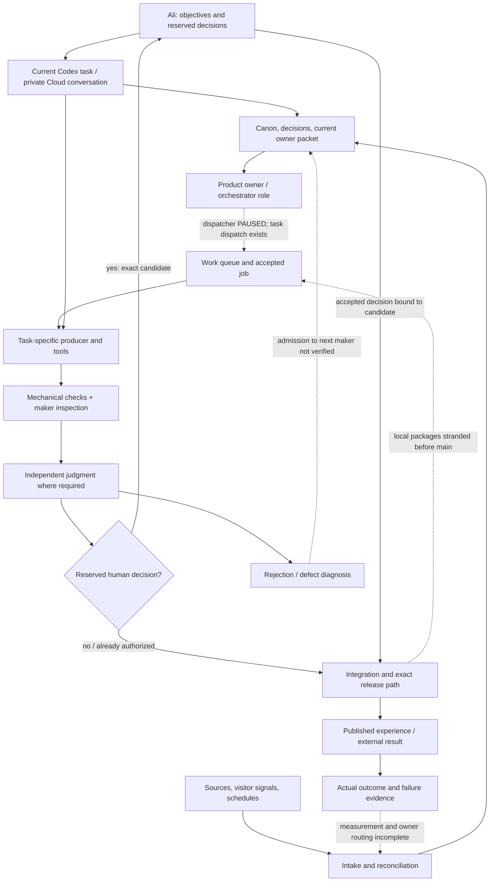
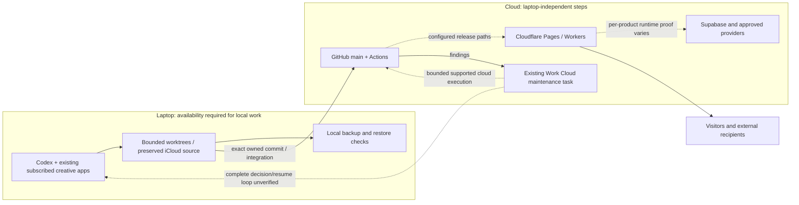
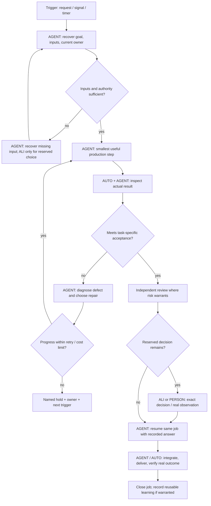
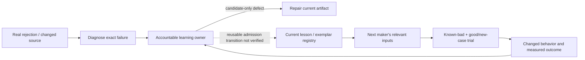
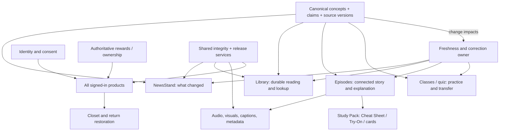
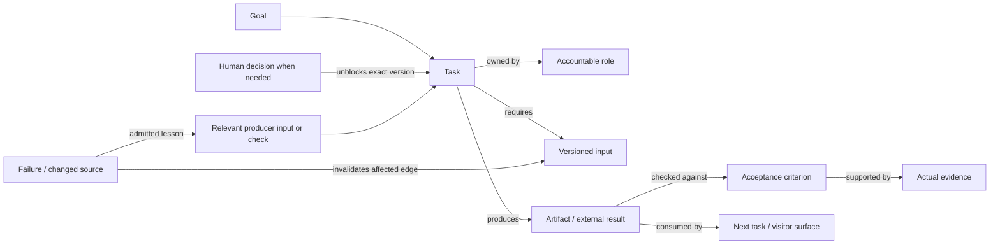

# LAiDIES: end-to-end operating map

September 6, 2026 · Current-state map and proposed design boundaries · Operating-system review owner

**Start here:** LAiDIES has many defined responsibilities, several working automations and substantial local production. It does not yet have one verified, connected operating loop. This map describes what connects, what only claims to connect, and where a person enters. It does not endorse existing checks or recommend deploying every registered role as an agent.

## Coverage and how to read this map

The accompanying [catalogue](operating-system-map-catalogue.json) inventories **67 product/champion responsibilities, 34 specialist roles, 5 competition roles, 9 legacy agent descriptions, all 7 workflows on main, and 9 local automation definitions**. It links 148 source documents, including every available product dossier and the 18 functionality maps. Those maps contain the detailed visitor transaction contracts; they are attached to their product in the catalogue. This is a dated descriptive snapshot, not another runtime registry or instruction source.

Main was inspected through Git at `4a4726e3694c9c987a5df89d0721cea311c99364`, including files absent from this sparse checkout. Shared product documents were inspected under `/Users/alisoneakin/Library/Mobile Documents/com~apple~CloudDocs/LAIDIES/Website-homepage`. Registry claims can be older than current owner work. The 67 entries are responsibilities, **not 67 running agents**. Specialist and competition roles overlap work; they must not be added together as a count of active workers.

Coverage is complete for those enumerated registries and workflow definitions, not for every unregistered script, external account or historical task. No claim of complete runtime coverage is possible without reconciling those unknowns. Product-source contracts are mapped in full where present; missing end-to-end contracts remain visible gaps. Live public features, provider deliveries and all native-device paths were not retested for this descriptive map.

Execution labels:

| Label | Meaning | Does Ali do the work? |
|---|---|---|
| **AUTO** | A configured machine step runs after its trigger. Runtime evidence must be stated separately. | No. A schedule alone does not prove success. |
| **AGENT** | Codex or another agent performs the work using authorized tools. | No. Local work may require the laptop/app to be available. |
| **ALI** | A real taste, mission, public identity, meaningful spending or specifically reserved release decision. | A decision only; the agent prepares and executes the work. Existing authorization is reused. |
| **PERSON** | A visitor, participant, moderator, recipient or other accountable human performs a real-world action/judgment. | Not necessarily Ali. This cannot be replaced by invented user evidence. |
| **GAP** | A missing connection, runner, owner acceptance or recovery path currently interrupts the intended flow. | Not automatically Ali's permanent job. |
| **UNKNOWN** | Evidence does not establish the behavior or who must act. | Investigate before assigning work. |

“Owner”, “reviewer”, “signer” and “manual dispatch” do **not** inherently mean human. An agent can dispatch an authorized operation, inspect a browser and conduct independent review. A real recipient's consent, an actual research participant's response or an Ali-owned taste choice remains human. Provider configuration may need account-holder consent but its technical work belongs to the agent where access permits.

## 1. Whole operation: current connections and breaks

Solid arrows describe source-defined paths; they do not certify end-to-end success. Dotted arrows mark incomplete, proposed or unverified connections. Bracketed labels identify execution and evidence boundaries.

The highest-risk gaps are at **handoffs**, not only inside agents: local work to shared main; a finding to an accepted job; rejection to changed maker input; deployment to real visitor outcome; and Ali's reply to the correct resumed job.

## 2. Where execution, state and costs live

| Component | Input → work → output | Current evidence / human boundary |
|---|---|---|
| Local Codex | Current task + relevant authority → tool use/build/review → owned files and commits | Agent-run; laptop-dependent. Subscription allowance; app/tool credits may still apply. |
| Worktrees / iCloud | Task-owned candidate bytes → bounded integration → main or recoverable archive | 58 worktrees inventoried earlier in this audit. No safe deletion inferred; 55 were not proven integrated by ancestry/unknown. |
| GitHub main / Actions | Push, schedule or explicit dispatch → deterministic checks/intake/release controller → results/artifacts/issues | Seven workflow definitions mapped below. Public repo: “private” in an artifact name is not a confidentiality guarantee. |
| Work Cloud | Supported task input → cloud agent execution → conversation result | Existing maintenance task and manual result observed; complete scheduled finding→phone→reply→resumption remains unverified. |
| Cloudflare | Exact site artifact or service request → host/runtime → web response | Source-defined deployment and Worker paths. Public journey correctness is separate from deployment success. |
| Supabase | Authenticated request → authorization/database rules → authoritative account/service result | Code/configuration and bounded tests do not prove every provider/account lifecycle. Never substitute a local Card for an authenticated account. |
| Buttondown / community / analytics / media providers | Explicit user or approved publishing request → provider-owned operation → provider receipt | Per-product contracts contain missing delivery/moderation/measurement evidence. Exact current account entitlements and bills not audited. |
| Backup | Available local files → existing encrypted backup → integrity/recovery evidence | Local dependency is legitimate. No cloud process can back up unavailable laptop-only bytes. |

Current tracked model configuration: `.codex/config.toml` starts the foreground on GPT-6 Astra/Medium, planning on High, and subagents on GPT-5.6 Terra/Medium; its configured concurrency is two and Fast mode is off. `DECISIONS.md` routes clear mechanical work toward Luna/Low, bounded judgment toward Terra, and demanding work toward Sol or Astra when justified. These are configuration/policy, not observed per-task model usage; an app task override may differ. No fixed model is assigned to every product role. Native hook activation remains unverified despite configured hooks and passing fixtures.

Cloud does not automatically mean API billing. Work Cloud and Codex can share subscription allowance; API-key operations are separately metered. The cost decision is per job, not per “agent”. [Official Work pricing](https://learn.chatgpt.com/docs/pricing). No new service is selected by this map.

## 3. One job: complete loop and human boundaries

This is the **proposed normalized contract** used to compare existing flows. It is not implemented universally. Each existing product retains its specific acceptance rules until changed deliberately.

Every executable loop needs: trigger; goal and non-negotiable acceptance; exact current inputs; responsible owner; allowed actions; output recipient; success evidence; failure state; retry/time/cost ceiling; saved continuation; and stop or escalation condition. The actual cap is chosen for the job; an undefined cap is a gap, not “run until good”. External side effects need duplicate protection. A timed-out payment, publication or grant must be reconciled before retry.

## 4. End-to-end flow families

All 67 product entries below are assigned a primary family. A product can consume other families: a game may use identity, rewards and media. A family describes the path, not permission to skip the product's detailed contract.

### F01 — Work intake, ownership and recovery

`ALI/request or AUTO/signal → AGENT recover governing objective → AGENT reconcile existing owner/work → AGENT create or update one accepted job → AGENT acquire bounded scope → AGENT run applicable family → AGENT verify recipient accepted output → close or checkpoint with exact next trigger`

Inputs: current task, DECISIONS, current product dossier/state, existing work events. Outputs: accepted owner, scope, output, next action and completion evidence. Failures: duplicate ownership, stale context, scope conflict, ownerless hold. Current gap: paused dispatcher and pilot-only work-event adoption. Ali chooses priority only when priorities genuinely conflict; she should not transport context or restart routine jobs. Sources: `operations/product-stewards/ORCHESTRATOR.md`, `CHAMPION-CONTRACT.md`, `run-queue.json`; `scripts/project-work-events.mjs`.

### F02 — Idea capture and routing

`ALI/source idea → AGENT capture → AGENT compare existing canon/products/backlog → merge / route / park / decline with reason → receiving AGENT accepts next trigger → F01 or explicit parked state`

No automatic commission or publication. Ali is needed for new mission/product direction, not deduplication. Missing recipient acceptance is GAP. Source: `operations/product-stewards/idea-inbox/`.

### F03 — NewsStand and source research

`AUTO source polling or AGENT research → deduplicated signal → AGENT original/primary-source verification → AGENT relevance and freshness decision → story/service desk → producer inspection → independent editorial/accuracy judgment → admitted canonical issue → F15 release → reader and correction monitoring`

Quiet is a valid editorial result; it must not hide a recovery item. Breaking, Daily, Weekly and Tribune have distinct editorial scales. The Daily also assembles independently admitted recurring services; one missing service is not permission to invent filler. Human input: Ali-owned taste/policy decisions, real reader research when required, and the explicit Ali-bound production authorization in `.github/workflows/production-release.yml`. Other editorial/accuracy signers are roles, not inherently people. Routine source verification and synthesis are AGENT, not inherently human. Current observation: cloud intake runs; full recurring source→admitted issue→public issue is not demonstrated. Source: `newsstand/FUNCTIONALITY-MAP.md`, `newsstand/subproducts/*.md`, `DAILY-MANUAL-RUNBOOK.md`, cloud-intake workflow.

### F04 — Books, classes, Study Packs, quizzes and people profiles

`AGENT learning question → canonical concepts and sources → reconcile format job and duplicate content → producer preflight → smallest representative teaching unit → maker inspection → independent learning/factual judgment → rendered reader/practice/assessment experience → F15 → feedback/freshness → F13`

Distinct ends: book supports connected reading and lookup; class demonstrates and tests a skill; quiz diagnoses knowledge and feedback; Study Pack provides the admitted Cheat Sheet/Try-On/cards; LUMINAiRY binds person, rights, sources and complete promoted objects. Shared prose checks cannot prove all those outcomes. Real participant explain-back/transfer remains PERSON if the contract requires observations. An agent's simulated learner answer must be labelled simulation. Current source gaps include main-distribution of quality tools, stale exemplar binding and held content orders. Sources: `learning-content-ecosystem/`, `library/`, `sunnyvaile-high/`, `blend-snap/`, `luminairy/`.

### F05 — Episodes, images, animation, audio and media delivery

`AGENT episode premise and source reconciliation → canonical script → approved scene/style/identity inputs → representative still → maker inspection → independent visual judgment → motion brief → approved image-to-video route → clip inspection/judge → assembly/audio/captions → complete playback and occurrence review → rights/metadata/manifest → F15 or destination-specific distribution → correction propagation`

Canva animation and CapCut assembly are the current instructed episode route; the old agent list's Sora/Replicate plan is stale, not an alternative authority. Roles and tools are distinct: a named clip producer is not necessarily a separate always-on agent. Ali: unresolved taste/identity/voice/public release decisions. PERSON: authentic rights/consent and real native listening/accessibility evidence where required. AGENT: generation, editing, inspections, export, delivery preparation. Current asset/local evidence does not certify podcasts, YouTube or music distribution. Sources: `operations/episode-visual-system-lock.md`, `episode-experience/`, `episode-media-quality/`, `screening-room/`, `ksvl/`.

### F06 — Buildings, games, shops and feature engineering

`AGENT recover intended visitor job → map visible controls and all user states → research/design representative journey → maker build → automated functional checks + actual desktop/mobile inspection → independent product/visual/security review as applicable → reserved decision if any → integrate → F15 → real user outcome → F13`

Each product's capability/transaction map is part of this flow. A building is not complete because its entry page renders; every promoted subproduct and backend handoff belongs in acceptance. Shops that link out must not claim local fulfilment; proposed commerce additionally needs payment→fulfilment→cancellation/refund. No automatic purchase or external message is implied. Source: each product's `CHARTER.md`, `OPERATING-SPEC.md` and functionality map; all entries appear in the catalogue.

### F07 — Identity, Resident Card, Closet and saved objects

`PERSON creates/uses local Card or requests sign-in → AUTO local validation or provider auth → PERSON supplies actual login proof when required → AUTO authorized profile/state read → shared Card/Closet/save envelope → restore on return → logout/revoke/delete propagation`

These PERSON steps describe real visitor use. An agent may exercise the actual authenticated lifecycle with authorized controlled test accounts; fixtures alone do not prove it. Different branches: anonymous; device-local Card; authenticated account; second device. Local progress is not authenticated ownership. AGENT builds and tests the system; visitors perform their ordinary login choices. Ali is not required for every login. Missing cross-device/RLS/provider evidence is GAP or UNKNOWN, not a new approval duty. Sources: `maikeover/`, `post-office/`, `library/FUNCTIONALITY-MAP.md`, `platform-reliability/`.

### F08 — Rewards, entitlements, referrals and paid allowances

`PERSON eligible action → AUTO authoritative completion → eligibility/deduplication → ledger grant → all balances/Closet consumers → redeem or spend → fulfil → reverse/refund/revoke where required`

An agent can run controlled eligibility, refund and duplicate tests; PERSON identifies the user action the product serves, not a mandatory human tester. Postcard branch: issue invitation→recipient delivery/open→distinct eligible join→both entitlements→reversal. No reward is earned merely because a link was copied or playback began. Human boundaries: visitor action/consent; Ali sets economy/price/policy, not individual grants. Failure: duplicate, timed-out fulfilment, revoked account, inconsistent consumers. Current broad gap: accepted shared economic lifecycle is not established by local counters. Source: shared platform contracts plus Post Office/Mall/High/FAiRY maps.

### F09 — Visitor-facing AI tools and answers

`PERSON asks/chooses inputs → AUTO validate/privacy/allowance → authorized service retrieves relevant sources → model/tool call within budget → validate result and safety → present useful answer/citations → feedback/correction → F13; refund if a paid attempt fails under policy`

Controlled answer-quality tests can be agent-run; they are distinct from actual visitor questions and feedback. Miss Jeeves, FAiRY and Mme CLAi-O have different product promises and may use different technical routes. Do not force them into one prompt or imply every current reading uses an API. PERSON supplies the actual question and judgment of usefulness. Ali sets product role/voice/policy and costs; no per-answer approval by default. Live source/access/allowance implementations must be verified per service. Sources: relevant subproduct dossiers and Worker implementations.

### F10 — Newsletter, postcards and outbound delivery

`PERSON chooses subscribe/share → AUTO validate → provider accepts/rejects → PERSON confirms where required → provider delivery/status → unsubscribe/revoke/correction → authoritative result visible to correct recipient`

An agent may exercise authorized controlled provider accounts and delivery tests; genuine subscriber consent cannot be fabricated. Native Share, copy, mailto and SMS links are handoffs, not delivery receipts. Agent prepares permitted content/integration; explicit authority is required before sending messages on Ali's behalf. Newsletter consent belongs to each subscriber. Automatic provider operation after consent does not require Ali each time. Missing delivery, unsubscribe and callback evidence remains GAP. Source: `post-office/FUNCTIONALITY-MAP.md` transaction contracts.

### F11 — Feedback, community and moderation

`PERSON submits → AUTO validate/authorize/minimize private data → protected durable receipt → accountable moderation/staff decision where required → response/action → visitor status → closure/deletion/retention propagation → product learning`

AI may triage; an actual required staff/moderation decision cannot be invented. No review of private visitor content was performed for this map. Ali is not automatically the moderator for every item; named staffing is an operating decision still needed where no owner is assigned. The separate founder inbox pilot is parked and is not the approved default communication channel. Sources: Town Hall/Sorority functionality maps; protected feedback pilot is bounded implementation evidence only.

### F12 — Social, launch, growth and measurement

`AGENT approved product outcome → campaign brief → source-bound creative variants → maker + independent craft review → ALI final campaign/public identity decision where reserved → authorized publisher → actual platform result → measurement → interpretation → next experiment or correction/removal`

An agent role called social publisher is not an installed scheduler. Account authorization, rights, costs and actual publication are separate. Provider data pulls and analytics advisor are not proven by their registry descriptions. Sources: `audience-growth/`, guilds social roles and legacy agents registry.

### F13 — Freshness, failures and maker learning

`AUTO/AGENT expiry or PERSON/AGENT rejection → verify exact affected claim/artifact → diagnose input/process/check failure → owner classifies local repair vs reusable lesson → admit lesson → update relevant producer inputs/checks → invalidate affected stale approvals → unaided known-bad test + new case → affected consumers repaired and verified`

This is workflow learning, not automatic retraining of model weights. More memory text is not proof of improvement. Ali may supply rejection/intent; routine diagnosis and regression repair are AGENT. The responsible owner may be an agent role. Existing strict review ratchets and exemplar policies are under evaluation, not automatically endorsed. Sources: shared content-quality scripts/registry and current audit.

### F14 — Reliability, backup and incidents

`AUTO check or PERSON report → observe actual failure → AGENT determine impact and current owner → isolate/repair under authority → calibrated test and real result → close incident → relevant F13 learning`

Backup branch: available files→encrypted backup→integrity check→bounded restore drill→recoverability evidence. Never infer integrity equals recovery, or change retention/prune to make a failed run green. Existing scheduled backup checks are local. Ali needed only for a consequential recovery/data-loss choice not already authorized. Sources: existing local backup automation definitions, platform owner, recovery plan.

### F15 — Integration, preview, release and rollback

`AGENT exact owned change → commit/PR → AUTO applicable checks → AGENT resolve findings → exact candidate + deployed baseline + admitted scope → current required ALI-bound production authorization → AUTO build immutable artifact → provider deploy → immutable URL and custom-domain verification → AGENT full affected journey → closure; failure retains hold or exact rollback`

The main production workflow currently checks a configured approver actor and exact approval phrase. This is an actual human-bound release gate, not a general rule inferred from the word review. Dispatch can be executed by an agent under valid authority. Preview workflows have their own candidate/controller/Access requirements; preview is not public approval. Main integration is not site deployment. Sources: `.github/workflows/production-release.yml`, exact preview workflows and release-control sources.

### F16 — Cloud maintenance and communication with Ali

`AUTO scheduled trigger → cloud agent reads bounded changes → unchanged: quiet completion / meaningful finding: named job → AGENT repair within authority or prepare exact decision → ALI answers only if required → persist answer to same job → resume correct local/cloud owner → verify result → close`

Current: private Cloud maintenance task exists; prior manual result observed. Full scheduled trigger→phone-accessible decision→answer→same-job resumption remains unverified. Existing Mac Remote setup is settled and will not be repeated. Do not substitute public GitHub issues for sensitive founder communication. This flow is the candidate to test before buying notifications or another task manager.

## 5. Shared dependency graph: what should be reused, and what should differ

These arrows describe intended dependencies grounded in product contracts; cross-surface runtime completion remains uneven. A content relationship graph, execution graph and learning/feedback graph are different views. A concept link does not dispatch a job; a job dependency does not prove a learner understands the concept.

| Share centrally | Keep task-specific | Reason |
|---|---|---|
| Work identity, owner, state, retry/stop and handoff fields | Producer method and output acceptance | Common continuation without one universal checklist. |
| Canonical claim/source and correction relationships | News relevance, book exposition, class transfer, episode story | One truth can serve different learner jobs. |
| Approved/rejected asset identity and provenance | Still, motion, audio, layout, prose judgment | Checksums share well; semantic quality criteria differ. |
| Identity, consent, ownership and reward ledger | Each product's eligible actions and visible experience | Avoid page-local claims pretending to be shared entitlements. |
| Exact release/rollback/provenance | Surface-specific journey tests and destination rights | Release transport can be common; correctness cannot be generic. |
| Model usage measurement and spending limits | Model/effort/tools selected for actual job | No always-on expensive specialist fleet by default. |

## 6. All machine and scheduled operations

Definitions below were read. “Configured” is not “successfully runs”; failure handling includes existing behavior and explicitly labelled gaps. Local schedule names are copied verbatim; their prompts remain at source rather than duplicated into every agent's context.

| Operation | Trigger / execution | Complete source-defined path | Human / gap |
|---|---|---|---|
| AI model freshness check | Main Actions: Monday 14:17 UTC or dispatch | Read current-model verification date → create/update GitHub reminder → external recheck/edit/close | Reminder is AUTO; actual factual research/edit is outside this workflow. Comment says human; current design should evaluate AGENT ownership rather than assign Ali routine updates. |
| Exact Library preview | Explicit dispatch; cloud runner | Bind commit/controller/file → tests and negative calibration → review admission → curated build → artifact → optional protected preview → byte verification → revoke temporary credential | Authorized dispatch can be AGENT; applicable candidate judgment remains separate. Provider/environment settings not reverified here. |
| Exact NewsStand preview | Explicit dispatch; cloud runner | Bind exact held package/controller → pipeline checks → private-review artifact → optional protected deploy → pixel capture → credential revoke → receipt | Package-specific controller; not general Daily publishing. AGENT operation; reserved review decision separate. |
| Legacy Hot Goss intake | Explicit dispatch only | RSS/script → possibly model call → inspection artifact | Obsolete schedule/direct publisher removed in PR104. Do not use as current editorial engine. Manual run may cost API credits; artifact may retain old feed. |
| NewsStand cloud intake | Daily 16:30 and 23:30 UTC or dispatch | Restore dedupe → calibrate guards → poll sources → receipt → update reconciliation issue if needed → save state | Configured and one scheduled execution observed in earlier audit. Discovery/issue reconciliation only; no drafting, publication or complete owner-resumption proof. Public repo privacy boundary applies. |
| Operating baseline CI | Push/PR/manual | Install → calibrated integrity, release, work-event, hook, private-pilot and configuration checks → CI result | AUTO. Passing fixtures do not prove native hooks, production quality or visitor success. |
| Exact production release | Explicit dispatch | Exact source/base/artifact and approver → calibrated scope/build → bound approval → serialized deploy → URL/custom-domain byte proof | Actual ALI-bound approval gate in code. Full user journey still requires acceptance beyond byte proof. |
| Daily LAiDIES NewsStand research and publication cycle | Local heartbeat; active; 07:00 and 20:00 | Wake existing task → source research and governed production path F03 → hold or authorized result | AGENT/laptop dependency; configured, not a proven daily public loop. |
| LAiDIES automatic freshness review | Local heartbeat; active; 08:00 | Wake → due-source/consumer review → F13 correction or quiet result | AGENT; record says active, complete runtime not certified. |
| LAiDIES reader-tip source scout | Local heartbeat; Monday 09:00 | Scout → original source → relevance/admission → receiving desk | AGENT; scout input is not publication authority. |
| Miss Jeeves source-bank review | Local heartbeat; Monday 07:30 | Due sources → verify → bounded source-bank correction/hold | AGENT; product role/answer quality separate. |
| LAiDIES encrypted backup — nightly | Local cron; 02:15 | Backup available files → terminal evidence | AUTO/AGENT local; no general prune/deletion authority. |
| LAiDIES backup integrity — weekly | Local cron; Sunday 03:30 | Inspect existing repository integrity → report actual result | AUTO/AGENT local; does not itself prove restoration. |
| LAiDIES recovery drill — monthly | Local cron; first day 04:30 | Bounded restore drill → compare recovered files → result | AUTO/AGENT local; consequential restore-over-live-files is a different action. |
| LAiDIES Control Room — twice-daily delta dispatcher | Local cron 10:00/22:00; **PAUSED** | Intended delta → priority → owner dispatch → work result | No running portfolio dispatcher inferred from registry's old active claim. |
| Review LAiDIES model routing | Local heartbeat; configured biweekly Saturday 09:00; count one | Read real-task calibration → recommend routing adjustments | AGENT analysis; no task cost inferred from account totals. Next-fire date not established from rule alone. |
| Existing private Cloud maintenance task | Separate Work Cloud task; daily 09:00 Vancouver configured | F16 | Scheduled/phone/answer-resume outcome remains unverified. Not one of the nine local definitions. |

## 7. Every registered product, role and transaction

### Current app task layer

Read-only app snapshot: all 13 pinned tasks plus 50 recent non-pinned tasks were
listed. This is not an exhaustive archive. These local LAiDIES tasks were active
or idle at inspection; titles are copied verbatim. App status does not establish
the current artifact, accepted handoff or product completion. A task is an
execution context; the product registry is a responsibility map. They are not
interchangeable, and an old registry task ID must not override a current owner.

| Current task title | App status | Task identity |
|---|---|---|
| Plan AI companies textbook | active | `01a0589e-2f95-7f03-9e2f-94cb75caab07` |
| Redesign Maikoever page | idle | `01a061a7-782c-7243-8f13-1a7ffe4e91f8` |
| Audit NewsStand agentic workflow | active | `01a071e7-db55-7a22-8c99-04eba5060355` |
| LAiDIES Episode Animation | idle | `01a0720a-5bca-78b3-bde1-a95e8d838aa0` |
| Fresh Homepage Product Audit | active | `01a07210-3fc4-7d00-80ef-8e0b9aab9ac9` |
| LAiDIES.AI: The Episodes — Podcast | idle | `01a07212-057f-7843-bdb3-9fe908d4883a` |
| Review season 1 episodes | active | `01a077c7-5a02-7b53-a4f6-682788d55a28` |
| LAiDIES system engineering review | active | `01a077d0-0775-7af2-b631-c311573f0e0e` |
| Create 90s background inspiration | active | `01a0785e-1438-7161-b041-0be213b06e9b` |
| Assess newspaper page for LAiDIES | idle | `01a02f95-3838-7af0-a4c7-2f51253a133d` |

The Cloud maintenance task is separately identified in the existing operating
recovery source. No task was messaged, reassigned, restarted, archived or stopped
for this map. The next owner reconciliation must bind each accepted job to its
actual current artifact and destination, not infer that from its title.

The catalogue and generated appendix below list every registry entry, exact source, parent, next trigger and recorded status. The catalogue also retains each available functionality map's complete end-to-end transaction section. **Those are source contracts, not new runtime certification.** Inherited source paths avoid making 67 copies of the same platform workflow.

| Responsibility / registered agent | Parent | Full flow | Exact dossier / current source claim |
|---|---|---|---|
| LAiDIES Homepage & Town Entry (`town-entry-homepage-champion`) | Portfolio | F06 + F01/F13/F15 as applicable | [town-entry-homepage/CHARTER.md](</Users/alisoneakin/Library/Mobile Documents/com~apple~CloudDocs/LAIDIES/Website-homepage/operations/product-stewards/town-entry-homepage/CHARTER.md>) · Recorded: OWNER REVIEW REQUIRED SOCIAL REOPENING DEFAULT DENY; not runtime proof |
| Learning System — Concepts & Curriculum (`learning-system-concepts-director`) | Portfolio | F13 + F01/F13/F15 as applicable | [learning-content-ecosystem/CHARTER.md](</Users/alisoneakin/Library/Mobile Documents/com~apple~CloudDocs/LAIDIES/Website-homepage/operations/product-stewards/learning-content-ecosystem/CHARTER.md>) · Recorded: NOT APPLICABLE SHARED FUNCTION; not runtime proof |
| Audience & Growth — Social & Launch (`audience-growth-social-launch-director`) | Portfolio | F12 + F01/F13/F15 as applicable | [audience-growth/CHARTER.md](</Users/alisoneakin/Library/Mobile Documents/com~apple~CloudDocs/LAIDIES/Website-homepage/operations/product-stewards/audience-growth/CHARTER.md>) · Recorded: DEFAULT DENY ANNOUNCEMENT HELD; not runtime proof |
| Idea Inbox — Capture & Routing (`idea-inbox-capture-routing-director`) | Portfolio | F02 + F01/F13/F15 as applicable | [idea-inbox/CHARTER.md](</Users/alisoneakin/Library/Mobile Documents/com~apple~CloudDocs/LAIDIES/Website-homepage/operations/product-stewards/idea-inbox/CHARTER.md>) · Recorded: CAPTURE ROUTING READY NO IMPLEMENTATION AUTHORITY; not runtime proof |
| Visitor’s Centre (`visitors-centre-champion`) | Portfolio | F06 + F01/F13/F15 as applicable | [visitors-centre/CHARTER.md](</Users/alisoneakin/Library/Mobile Documents/com~apple~CloudDocs/LAIDIES/Website-homepage/operations/product-stewards/visitors-centre/CHARTER.md>) · Recorded: BOUNDED LOCAL PASS RELEASE HOLD; not runtime proof |
| NewsStand (`newsstand-champion`) | Portfolio | F03 + F01/F13/F15 as applicable | [newsstand/CHARTER.md](</Users/alisoneakin/Library/Mobile Documents/com~apple~CloudDocs/LAIDIES/Website-homepage/operations/product-stewards/newsstand/CHARTER.md>) · Recorded: BOUNDED REVIEW ROUTER PASS ALL PUBLICATIONS RELEASE HOLD; not runtime proof |
| Chick Flicks (`chick-flicks-champion`) | Portfolio | F06 + F01/F13/F15 as applicable | [chick-flicks/CHARTER.md](</Users/alisoneakin/Library/Mobile Documents/com~apple~CloudDocs/LAIDIES/Website-homepage/operations/product-stewards/chick-flicks/CHARTER.md>) · Recorded: BOUNDED LOCAL PASS RELEASE HOLD; not runtime proof |
| Blend & Snap (`blend-snap-champion`) | Portfolio | F06 + F01/F13/F15 as applicable | [blend-snap/CHARTER.md](</Users/alisoneakin/Library/Mobile Documents/com~apple~CloudDocs/LAIDIES/Website-homepage/operations/product-stewards/blend-snap/CHARTER.md>) · Recorded: BOUNDED LOCAL PASS RELEASE HOLD; not runtime proof |
| Mme CLAi-O's Shop (`mme-claio-champion`) | Portfolio | F06 + F01/F13/F15 as applicable | [mme-claio/CHARTER.md](</Users/alisoneakin/Library/Mobile Documents/com~apple~CloudDocs/LAIDIES/Website-homepage/operations/product-stewards/mme-claio/CHARTER.md>) · Recorded: BOUNDED LOCAL PASS RELEASE HOLD; not runtime proof |
| MAiKEOVER on MAiN (`maikeover-champion`) | Portfolio | F07 + F01/F13/F15 as applicable | [maikeover/CHARTER.md](</Users/alisoneakin/Library/Mobile Documents/com~apple~CloudDocs/LAIDIES/Website-homepage/operations/product-stewards/maikeover/CHARTER.md>) · Recorded: BOUNDED LOCAL PASS PRODUCTION HOLD; not runtime proof |
| Bronze AiGE (`bronze-aige-champion`) | Portfolio | F06 + F01/F13/F15 as applicable | [bronze-aige/CHARTER.md](</Users/alisoneakin/Library/Mobile Documents/com~apple~CloudDocs/LAIDIES/Website-homepage/operations/product-stewards/bronze-aige/CHARTER.md>) · Recorded: BOUNDED LOCAL PASS RELEASE HOLD; not runtime proof |
| Dream Phone Booth (`dream-phone-champion`) | Portfolio | F06 + F01/F13/F15 as applicable | [dream-phone/CHARTER.md](</Users/alisoneakin/Library/Mobile Documents/com~apple~CloudDocs/LAIDIES/Website-homepage/operations/product-stewards/dream-phone/CHARTER.md>) · Recorded: PUBLIC EXPERIMENT NOT LAUNCH APPROVED; not runtime proof |
| The Mall (`mall-champion`) | Portfolio | F06 + F01/F13/F15 as applicable | [mall/CHARTER.md](</Users/alisoneakin/Library/Mobile Documents/com~apple~CloudDocs/LAIDIES/Website-homepage/operations/product-stewards/mall/CHARTER.md>) · Recorded: BOUNDED LOCAL PASS RELEASE HOLD; not runtime proof |
| KSVL Community RAiDIO (`ksvl-champion`) | Portfolio | F05 + F01/F13/F15 as applicable | [ksvl/CHARTER.md](</Users/alisoneakin/Library/Mobile Documents/com~apple~CloudDocs/LAIDIES/Website-homepage/operations/product-stewards/ksvl/CHARTER.md>) · Recorded: LOCAL FUNCTIONAL 29 CREATOR CONFIRMED TRACKS; not runtime proof |
| SUNNYVAiLE Post Office (`post-office-champion`) | Portfolio | F10 + F01/F13/F15 as applicable | [post-office/CHARTER.md](</Users/alisoneakin/Library/Mobile Documents/com~apple~CloudDocs/LAIDIES/Website-homepage/operations/product-stewards/post-office/CHARTER.md>) · Recorded: BOUNDED LOCAL PASS RELEASE HOLD; not runtime proof |
| Town Hall (`town-hall-champion`) | Portfolio | F11 + F01/F13/F15 as applicable | [town-hall/CHARTER.md](</Users/alisoneakin/Library/Mobile Documents/com~apple~CloudDocs/LAIDIES/Website-homepage/operations/product-stewards/town-hall/CHARTER.md>) · Recorded: BOUNDED LOCAL PASS SUBMISSION AND RELEASE HOLD; not runtime proof |
| SUNNYVAiLE LIBRAiRY (`library-champion`) | Portfolio | F06 + F01/F13/F15 as applicable | [library/CHARTER.md](</Users/alisoneakin/Library/Mobile Documents/com~apple~CloudDocs/LAIDIES/Website-homepage/operations/product-stewards/library/CHARTER.md>) · Recorded: BOUNDED LOCAL PASS ALL BOOKS HELD OR PREVIEW; not runtime proof |
| SUNNYVAiLE High (`sunnyvaile-high-champion`) | Portfolio | F06 + F01/F13/F15 as applicable | [sunnyvaile-high/CHARTER.md](</Users/alisoneakin/Library/Mobile Documents/com~apple~CloudDocs/LAIDIES/Website-homepage/operations/product-stewards/sunnyvaile-high/CHARTER.md>) · Recorded: BOUNDED LOCAL PASS PROMOTION HOLD; not runtime proof |
| FAiRY Godmother's House (`fairy-godmother-champion`) | Portfolio | F09 + F01/F13/F15 as applicable | [fairy-godmother/CHARTER.md](</Users/alisoneakin/Library/Mobile Documents/com~apple~CloudDocs/LAIDIES/Website-homepage/operations/product-stewards/fairy-godmother/CHARTER.md>) · Recorded: FIX BEFORE PROMOTION; not runtime proof |
| Sorority House · Delta LAi Nu (`sorority-house-champion`) | Portfolio | F11 + F01/F13/F15 as applicable | [sorority-house/CHARTER.md](</Users/alisoneakin/Library/Mobile Documents/com~apple~CloudDocs/LAIDIES/Website-homepage/operations/product-stewards/sorority-house/CHARTER.md>) · Recorded: BOUNDED LOCAL PASS RELEASE HOLD; not runtime proof |
| The LUMINAiRY (`luminairy-champion`) | Portfolio | F06 + F01/F13/F15 as applicable | [luminairy/CHARTER.md](</Users/alisoneakin/Library/Mobile Documents/com~apple~CloudDocs/LAIDIES/Website-homepage/operations/product-stewards/luminairy/CHARTER.md>) · Recorded: BOUNDED LOCAL PASS ALL PRODUCTION CLAIMS HELD; not runtime proof |
| The Breaking (`newsstand-breaking-subchampion`) | newsstand | F03 + F01/F13/F15 as applicable | [newsstand/subproducts/breaking.md](</Users/alisoneakin/Library/Mobile Documents/com~apple~CloudDocs/LAIDIES/Website-homepage/operations/product-stewards/newsstand/subproducts/breaking.md>) · Recorded: BOUNDED ROUTER PASS PRODUCT RELEASE HOLD; not runtime proof |
| The Daily (`newsstand-daily-subchampion`) | newsstand | F03 + F01/F13/F15 as applicable | [newsstand/subproducts/daily.md](</Users/alisoneakin/Library/Mobile Documents/com~apple~CloudDocs/LAIDIES/Website-homepage/operations/product-stewards/newsstand/subproducts/daily.md>) · Recorded: BOUNDED ROUTER PASS PRODUCT RELEASE HOLD; not runtime proof |
| The Weekly (`newsstand-weekly-subchampion`) | newsstand | F03 + F01/F13/F15 as applicable | [newsstand/subproducts/weekly.md](</Users/alisoneakin/Library/Mobile Documents/com~apple~CloudDocs/LAIDIES/Website-homepage/operations/product-stewards/newsstand/subproducts/weekly.md>) · Recorded: BOUNDED ROUTER PASS EDITORIAL OWNER RELEASE HOLD; not runtime proof |
| The Tribune (`newsstand-tribune-subchampion`) | newsstand | F03 + F01/F13/F15 as applicable | [newsstand/subproducts/tribune.md](</Users/alisoneakin/Library/Mobile Documents/com~apple~CloudDocs/LAIDIES/Website-homepage/operations/product-stewards/newsstand/subproducts/tribune.md>) · Recorded: BOUNDED CONTENT STRENGTH PRODUCT RELEASE HOLD; not runtime proof |
| Weekly Episodes — Engine & Production (`weekly-episodes-engine-production-director`) | Portfolio | F05 + F01/F13/F15 as applicable | [episode-experience/CHARTER.md](</Users/alisoneakin/Library/Mobile Documents/com~apple~CloudDocs/LAIDIES/Website-homepage/operations/product-stewards/episode-experience/CHARTER.md>) · Recorded: PARTIAL LISTEN ALONG ONLY; not runtime proof |
| Screening Room (`screening-room-subchampion`) | chick-flicks | F05 + F01/F13/F15 as applicable | [screening-room/CHARTER.md](</Users/alisoneakin/Library/Mobile Documents/com~apple~CloudDocs/LAIDIES/Website-homepage/operations/product-stewards/screening-room/CHARTER.md>) · Recorded: BOUNDED LOCAL REPAIR PASS ALL TITLES AND RELEASE HOLD; not runtime proof |
| Site Video & Animation Quality (`episode-media-quality-subchampion`) | Portfolio | F05 + F01/F13/F15 as applicable | [episode-media-quality/CHARTER.md](</Users/alisoneakin/Library/Mobile Documents/com~apple~CloudDocs/LAIDIES/Website-homepage/operations/product-stewards/episode-media-quality/CHARTER.md>) · Recorded: UNIVERSAL OCCURRENCE GATE ACTIVE OPENING FILMS HOLD; not runtime proof |
| Study Pack (`practice-pack-subchampion`) | blend-snap | F04 + F01/F13/F15 as applicable | [practice-pack/CHARTER.md](</Users/alisoneakin/Library/Mobile Documents/com~apple~CloudDocs/LAIDIES/Website-homepage/operations/product-stewards/practice-pack/CHARTER.md>) · Recorded: UNKNOWN; not runtime proof |
| Try-On (`try-on-subchampion`) | blend-snap | F04 + F01/F13/F15 as applicable | [try-on/CHARTER.md](</Users/alisoneakin/Library/Mobile Documents/com~apple~CloudDocs/LAIDIES/Website-homepage/operations/product-stewards/try-on/CHARTER.md>) · Recorded: UNKNOWN; not runtime proof |
| Trading Cards (`trading-cards-subchampion`) | blend-snap | F04 + F01/F13/F15 as applicable | [trading-cards/CHARTER.md](</Users/alisoneakin/Library/Mobile Documents/com~apple~CloudDocs/LAIDIES/Website-homepage/operations/product-stewards/trading-cards/CHARTER.md>) · Recorded: UNKNOWN; not runtime proof |
| Mme CLAi-O Reading (`mme-claio-reading-subchampion`) | mme-claio | F09 + F01/F13/F15 as applicable | [mme-claio/subproducts/reading.md](</Users/alisoneakin/Library/Mobile Documents/com~apple~CloudDocs/LAIDIES/Website-homepage/operations/product-stewards/mme-claio/subproducts/reading.md>) · Recorded: UNKNOWN; not runtime proof |
| Resident Card (`resident-card-subchampion`) | maikeover | F07 + F01/F13/F15 as applicable | [resident-card/CHARTER.md](</Users/alisoneakin/Library/Mobile Documents/com~apple~CloudDocs/LAIDIES/Website-homepage/operations/product-stewards/resident-card/CHARTER.md>) · Recorded: BOUNDED DEVICE LOCAL SECURITY PASS PROMOTION HOLD; not runtime proof |
| Closet & Progression (`closet-progression-subchampion`) | maikeover | F07 + F01/F13/F15 as applicable | [closet-progression/CHARTER.md](</Users/alisoneakin/Library/Mobile Documents/com~apple~CloudDocs/LAIDIES/Website-homepage/operations/product-stewards/closet-progression/CHARTER.md>) · Recorded: DEVICE LOCAL; not runtime proof |
| Cocktail Fortune (`cocktail-fortune-subchampion`) | bronze-aige | F06 + F01/F13/F15 as applicable | [cocktail-fortune/CHARTER.md](</Users/alisoneakin/Library/Mobile Documents/com~apple~CloudDocs/LAIDIES/Website-homepage/operations/product-stewards/cocktail-fortune/CHARTER.md>) · Recorded: UNKNOWN; not runtime proof |
| Businesswomen's Special (`businesswomens-special-subchampion`) | bronze-aige | F06 + F01/F13/F15 as applicable | [businesswomens-special/CHARTER.md](</Users/alisoneakin/Library/Mobile Documents/com~apple~CloudDocs/LAIDIES/Website-homepage/operations/product-stewards/businesswomens-special/CHARTER.md>) · Recorded: UNKNOWN; not runtime proof |
| Dream Phone Game (`dream-phone-game-subchampion`) | dream-phone | F06 + F01/F13/F15 as applicable | [dream-phone/subproducts/game.md](</Users/alisoneakin/Library/Mobile Documents/com~apple~CloudDocs/LAIDIES/Website-homepage/operations/product-stewards/dream-phone/subproducts/game.md>) · Recorded: HIDE OR LABEL; not runtime proof |
| As Seen on TV (`mall-as-seen-on-tv-subchampion`) | mall | F06 + F01/F13/F15 as applicable | [mall/shops/as-seen-on-tv.md](</Users/alisoneakin/Library/Mobile Documents/com~apple~CloudDocs/LAIDIES/Website-homepage/operations/product-stewards/mall/shops/as-seen-on-tv.md>) · Recorded: UNKNOWN; not runtime proof |
| Books & Records (`mall-books-records-subchampion`) | mall | F06 + F01/F13/F15 as applicable | [mall/shops/books-records.md](</Users/alisoneakin/Library/Mobile Documents/com~apple~CloudDocs/LAIDIES/Website-homepage/operations/product-stewards/mall/shops/books-records.md>) · Recorded: UNKNOWN; not runtime proof |
| CLAiRE'S (`mall-claires-subchampion`) | mall | F06 + F01/F13/F15 as applicable | [mall/shops/claires.md](</Users/alisoneakin/Library/Mobile Documents/com~apple~CloudDocs/LAIDIES/Website-homepage/operations/product-stewards/mall/shops/claires.md>) · Recorded: UNKNOWN; not runtime proof |
| Food Court (`mall-food-court-subchampion`) | mall | F06 + F01/F13/F15 as applicable | [mall/shops/food-court.md](</Users/alisoneakin/Library/Mobile Documents/com~apple~CloudDocs/LAIDIES/Website-homepage/operations/product-stewards/mall/shops/food-court.md>) · Recorded: UNKNOWN; not runtime proof |
| Gizmos & Gadgets (`mall-gizmos-subchampion`) | mall | F06 + F01/F13/F15 as applicable | [mall/shops/gizmos.md](</Users/alisoneakin/Library/Mobile Documents/com~apple~CloudDocs/LAIDIES/Website-homepage/operations/product-stewards/mall/shops/gizmos.md>) · Recorded: UNKNOWN; not runtime proof |
| Hanger Management (`mall-hanger-management-subchampion`) | mall | F06 + F01/F13/F15 as applicable | [mall/shops/hanger-management.md](</Users/alisoneakin/Library/Mobile Documents/com~apple~CloudDocs/LAIDIES/Website-homepage/operations/product-stewards/mall/shops/hanger-management.md>) · Recorded: UNKNOWN; not runtime proof |
| I Know What You Did Last (x30) Summer (`mall-last-summer-subchampion`) | mall | F06 + F01/F13/F15 as applicable | [mall/shops/last-summer.md](</Users/alisoneakin/Library/Mobile Documents/com~apple~CloudDocs/LAIDIES/Website-homepage/operations/product-stewards/mall/shops/last-summer.md>) · Recorded: UNKNOWN; not runtime proof |
| MAiYBE (`mall-maiybe-subchampion`) | mall | F06 + F01/F13/F15 as applicable | [mall/shops/maiybe.md](</Users/alisoneakin/Library/Mobile Documents/com~apple~CloudDocs/LAIDIES/Website-homepage/operations/product-stewards/mall/shops/maiybe.md>) · Recorded: UNKNOWN; not runtime proof |
| Mall Kiosk (`mall-kiosk-subchampion`) | mall | F06 + F01/F13/F15 as applicable | [mall/shops/mall-kiosk.md](</Users/alisoneakin/Library/Mobile Documents/com~apple~CloudDocs/LAIDIES/Website-homepage/operations/product-stewards/mall/shops/mall-kiosk.md>) · Recorded: UNKNOWN; not runtime proof |
| Pieces of Flair (`mall-pieces-flair-subchampion`) | mall | F06 + F01/F13/F15 as applicable | [mall/shops/pieces-flair.md](</Users/alisoneakin/Library/Mobile Documents/com~apple~CloudDocs/LAIDIES/Website-homepage/operations/product-stewards/mall/shops/pieces-flair.md>) · Recorded: UNKNOWN; not runtime proof |
| Rollin' with my Homies (`mall-rollin-homies-subchampion`) | mall | F06 + F01/F13/F15 as applicable | [mall/shops/rollin-homies.md](</Users/alisoneakin/Library/Mobile Documents/com~apple~CloudDocs/LAIDIES/Website-homepage/operations/product-stewards/mall/shops/rollin-homies.md>) · Recorded: UNKNOWN; not runtime proof |
| DJ Booth (`dj-booth-subchampion`) | ksvl | F05 + F01/F13/F15 as applicable | [dj-booth/CHARTER.md](</Users/alisoneakin/Library/Mobile Documents/com~apple~CloudDocs/LAIDIES/Website-homepage/operations/product-stewards/dj-booth/CHARTER.md>) · Recorded: UNKNOWN; not runtime proof |
| KSVL Catalogue & Weekly Rotation (`ksvl-catalogue-subchampion`) | ksvl | F05 + F01/F13/F15 as applicable | [ksvl/subproducts/catalogue.md](</Users/alisoneakin/Library/Mobile Documents/com~apple~CloudDocs/LAIDIES/Website-homepage/operations/product-stewards/ksvl/subproducts/catalogue.md>) · Recorded: 29 TRACKS PLAYABLE CREATOR CONFIRMED; not runtime proof |
| Wednesday Newsletter Delivery (`newsletter-delivery-subchampion`) | post-office | F10 + F01/F13/F15 as applicable | [post-office/subproducts/newsletter.md](</Users/alisoneakin/Library/Mobile Documents/com~apple~CloudDocs/LAIDIES/Website-homepage/operations/product-stewards/post-office/subproducts/newsletter.md>) · Recorded: PARTIAL REAL DELIVERY UNVERIFIED; not runtime proof |
| Magic-link Sign-in (`sign-in-subchampion`) | post-office | F07 + F01/F13/F15 as applicable | [post-office/subproducts/sign-in.md](</Users/alisoneakin/Library/Mobile Documents/com~apple~CloudDocs/LAIDIES/Website-homepage/operations/product-stewards/post-office/subproducts/sign-in.md>) · Recorded: PARTIAL TWO DEVICE UNVERIFIED; not runtime proof |
| Postcards & Referral (`postcards-referral-subchampion`) | post-office | F08 + F01/F13/F15 as applicable | [post-office/subproducts/postcards-referral.md](</Users/alisoneakin/Library/Mobile Documents/com~apple~CloudDocs/LAIDIES/Website-homepage/operations/product-stewards/post-office/subproducts/postcards-referral.md>) · Recorded: SHARE ONLY LIFECYCLE UNVERIFIED; not runtime proof |
| Town Feedback & Civic Records (`town-feedback-subchampion`) | town-hall | F11 + F01/F13/F15 as applicable | [town-hall/subproducts/feedback.md](</Users/alisoneakin/Library/Mobile Documents/com~apple~CloudDocs/LAIDIES/Website-homepage/operations/product-stewards/town-hall/subproducts/feedback.md>) · Recorded: BOUNDED LOCAL PASS SUBMISSION AND RELEASE HOLD; not runtime proof |
| Miss Jeeves Search (`miss-jeeves-subchampion`) | library | F09 + F01/F13/F15 as applicable | [library/subproducts/miss-jeeves.md](</Users/alisoneakin/Library/Mobile Documents/com~apple~CloudDocs/LAIDIES/Website-homepage/operations/product-stewards/library/subproducts/miss-jeeves.md>) · Recorded: OWNER REVIEW REQUIRED; not runtime proof |
| LIBRAiRY 101 Books (`library-101-subchampion`) | library | F04 + F01/F13/F15 as applicable | [library/subproducts/library-101.md](</Users/alisoneakin/Library/Mobile Documents/com~apple~CloudDocs/LAIDIES/Website-homepage/operations/product-stewards/library/subproducts/library-101.md>) · Recorded: EDITORIAL AND OWNER REVIEW REQUIRED; not runtime proof |
| Grimoire & SLAiYER Handbook (`grimoire-subchampion`) | library | F04 + F01/F13/F15 as applicable | [library/subproducts/grimoire.md](</Users/alisoneakin/Library/Mobile Documents/com~apple~CloudDocs/LAIDIES/Website-homepage/operations/product-stewards/library/subproducts/grimoire.md>) · Recorded: OWNER REVIEW REQUIRED; not runtime proof |
| Puffy Saves & Retrieval (`library-saves-subchampion`) | library | F07 + F01/F13/F15 as applicable | [library/subproducts/saves.md](</Users/alisoneakin/Library/Mobile Documents/com~apple~CloudDocs/LAIDIES/Website-homepage/operations/product-stewards/library/subproducts/saves.md>) · Recorded: DEVICE LOCAL; not runtime proof |
| Pop Quiz (`pop-quiz-subchampion`) | sunnyvaile-high | F04 + F01/F13/F15 as applicable | [sunnyvaile-high/subproducts/pop-quiz.md](</Users/alisoneakin/Library/Mobile Documents/com~apple~CloudDocs/LAIDIES/Website-homepage/operations/product-stewards/sunnyvaile-high/subproducts/pop-quiz.md>) · Recorded: UNKNOWN; not runtime proof |
| Classes (`classes-subchampion`) | sunnyvaile-high | F04 + F01/F13/F15 as applicable | [sunnyvaile-high/subproducts/classes.md](</Users/alisoneakin/Library/Mobile Documents/com~apple~CloudDocs/LAIDIES/Website-homepage/operations/product-stewards/sunnyvaile-high/subproducts/classes.md>) · Recorded: UNKNOWN; not runtime proof |
| Book Fair (`book-fair-subchampion`) | sunnyvaile-high | F06 + F01/F13/F15 as applicable | [sunnyvaile-high/subproducts/book-fair.md](</Users/alisoneakin/Library/Mobile Documents/com~apple~CloudDocs/LAIDIES/Website-homepage/operations/product-stewards/sunnyvaile-high/subproducts/book-fair.md>) · Recorded: UNKNOWN; not runtime proof |
| FAiRY Answer Quality & Safety (`fairy-answer-quality-subchampion`) | fairy-godmother | F09 + F01/F13/F15 as applicable | [fairy-godmother/subproducts/answer-quality.md](</Users/alisoneakin/Library/Mobile Documents/com~apple~CloudDocs/LAIDIES/Website-homepage/operations/product-stewards/fairy-godmother/subproducts/answer-quality.md>) · Recorded: FIX BEFORE PROMOTION; not runtime proof |
| FAiRY Plays Ledger (`fairy-plays-subchampion`) | fairy-godmother | F08 + F01/F13/F15 as applicable | [fairy-godmother/subproducts/plays.md](</Users/alisoneakin/Library/Mobile Documents/com~apple~CloudDocs/LAIDIES/Website-homepage/operations/product-stewards/fairy-godmother/subproducts/plays.md>) · Recorded: FIX BEFORE PROMOTION; not runtime proof |
| Community & Conversation (`community-subchampion`) | sorority-house | F11 + F01/F13/F15 as applicable | [community/CHARTER.md](</Users/alisoneakin/Library/Mobile Documents/com~apple~CloudDocs/LAIDIES/Website-homepage/operations/product-stewards/community/CHARTER.md>) · Recorded: BOUNDED LOCAL PASS PROVIDER AND MODERATION HOLD; not runtime proof |
| Girl Talk (`girl-talk-subchampion`) | sorority-house | F06 + F01/F13/F15 as applicable | [girl-talk/deep-dive-2026-07-25.md](</Users/alisoneakin/Library/Mobile Documents/com~apple~CloudDocs/LAIDIES/Website-homepage/operations/product-stewards/girl-talk/deep-dive-2026-07-25.md>) · Recorded: BOUNDED LOCAL PASS HONOUR SYSTEM ONLY RELEASE HOLD; not runtime proof |
| PATRON SAiNTS, MAiVENS & TRAiLBLAZERS (`luminairy-people-subchampion`) | luminairy | F04 + F01/F13/F15 as applicable | [luminairy/subproducts/people.md](</Users/alisoneakin/Library/Mobile Documents/com~apple~CloudDocs/LAIDIES/Website-homepage/operations/product-stewards/luminairy/subproducts/people.md>) · Recorded: RESEARCH AND OWNER REVIEW REQUIRED; not runtime proof |
| Shared Platform, Data & Reliability (`platform-reliability-champion`) | Portfolio | F14 + F01/F13/F15 as applicable | [platform-reliability/CHARTER.md](</Users/alisoneakin/Library/Mobile Documents/com~apple~CloudDocs/LAIDIES/Website-homepage/operations/product-stewards/platform-reliability/CHARTER.md>) · Recorded: PARTIAL EVIDENCE AND OBSERVABILITY GAPS; not runtime proof |

### Specialist agent flows

Each row is a triggered role, not a background service. Common start: accepted job + named current artifact + relevant authority. Common end: actual output handed to the accountable product owner, or a named hold with reason and next trigger. Makers produce candidates; judges return independent findings; integrators assemble; release operators bind actual delivery. None becomes a human merely because it can block. Ali input is restricted to the boundaries in Section 8.

| Specialist | Trigger → work → recipient | Can block under source contract? |
|---|---|---|
| `competitive-research-benchmarking` | initial deep dive, major redesign, weak evidence or benchmark expiry → best-in-class product research, comparable journeys, public user signals, standards and transferable patterns without imitation → accountable product owner / dependent craft | No |
| `creative-experience-designer` | new building, major redesign, rejected direction or experience architecture change → creative synthesis of Ali's intent, research and building promise into spatial concept, information architecture, interaction model, visual hierarchy, responsive system and expandable page design; challenges harmful literal interpretations → accountable product owner / dependent craft | Yes |
| `environment-artwork-maker` | approved creative experience direction requires new or adapted environment art → full-building and multi-room visual composition whose spaces, objects, wayfinding and expansion zones support the approved experience design without substituting CSS chrome for environmental design → accountable product owner / dependent craft | No |
| `tools-plugins-vendor-scout` | capability gap, repeated manual burden, quality ceiling or material operating cost → external tool, plugin, service, model, dataset and vendor evaluation including build-versus-buy, cost, privacy, lock-in and exit → accountable product owner / dependent craft | No |
| `product-delivery-integrator` | a recommendation is approved for implementation → accepted build packet, specialist work breakdown, dependency sequencing, candidate assembly and acceptance-evidence completeness → accountable product owner / dependent craft | Yes |
| `quality-automation-engineer` | a repeated rule, regression risk or testable acceptance criterion exists → deterministic regression checks, fixtures, journey automation, coverage and evidence artifact generation → accountable product owner / dependent craft | Yes |
| `rights-legal-commercial-review` | external media/data, partnership, affiliate, sponsor, commerce or material public claim → copyright, licensing, music/image/data rights, disclosures, commercial terms and claim-risk escalation → accountable product owner / dependent craft | Yes |
| `brand-creative-director` | major copy, visual, campaign or product-direction change → LAiDIES voice, visual language, Rewind Era intelligence, town cohesion and reputation → accountable product owner / dependent craft | Yes |
| `visual-asset-curator` | any visual candidate enters a product or social workflow → approved asset allow-lists, provenance, rejected/superseded quarantine, style/palette/canon eligibility and exact-use approvals → accountable product owner / dependent craft | Yes |
| `image-production-director` | new or repaired image required → cue/placement brief, approved references, prompt/build method, dimensions and delivered image candidates → accountable product owner / dependent craft | No |
| `image-quality-judge` | image candidate delivered → independent full-resolution composition, anatomy, identity, style, palette, canon, text and defect review → accountable product owner / dependent craft | Yes |
| `narration-visual-continuity-editor` | episode, trailer, carousel or timed visual sequence changes → meaning alignment between narration/copy and the visual shown at each exact placement → accountable product owner / dependent craft | Yes |
| `motion-director` | approved still becomes a motion shot → shot event, subject/camera motion, timing, first/last frame, loop and motion brief → accountable product owner / dependent craft | No |
| `clip-producer` | motion brief approved → one named clip built from approved frames and motion brief → accountable product owner / dependent craft | No |
| `motion-quality-judge` | clip candidate delivered → independent full-speed drift, warp, identity, timing, crop, action and end-state review → accountable product owner / dependent craft | Yes |
| `audio-caption-owner` | audio, script, caption, edit or player changes → audio masters, pronunciation, loudness, as-recorded transcript, captions, synchronization and player mapping → accountable product owner / dependent craft | Yes |
| `editorial-learning-director` | episode, book, class, quiz, game, tool explanation or learning claim changes → correct mental models, concept sequence, practical value, assessment validity, explanation transfer, misconception resistance, curriculum relationships, format-specific jobs and non-remedial teaching → accountable product owner / dependent craft | Yes |
| `ai-research-accuracy-lead` | factual, model, tool, law, research or historical claim changes → primary-source research, changing AI facts, technical claims, dates, uncertainty and corrections → accountable product owner / dependent craft | Yes |
| `ux-service-designer` | journey, navigation, interaction or promise changes → new/returning journeys, comprehension, hierarchy, states, recovery and next useful action → accountable product owner / dependent craft | Yes |
| `product-ux-quality-judge` | building-page or major journey candidate delivered → independent cold-visitor judgment of what the page is, contains and will do; professional usability, comprehension, feature discovery, preview-before-open behaviour and expandable information architecture → accountable product owner / dependent craft | Yes |
| `cross-model-adversarial-reviewer` | every building-page visual candidate before Ali review, or a material multi-agent review incident → Claude Opus 5 exact-candidate review of receipt scope, requirement coverage, evidence identity, creative ambition, UX, brand and unresolved contradictions; cannot replace required craft judges → accountable product owner / dependent craft | Yes |
| `accessibility-responsive-qa` | UI, visual, interaction or layout changes → keyboard, screen reader, contrast, tap targets, reduced motion, mobile/desktop fit and overflow → accountable product owner / dependent craft | Yes |
| `frontend-engineer` | frontend change or defect → browser implementation, assets, state, links, performance, maintainability and console integrity → accountable product owner / dependent craft | Yes |
| `backend-integration-engineer` | service, form, account, provider or completion-contract change → APIs, Workers, external services, authoritative outcomes, retries, idempotency, observability and failure truth → accountable product owner / dependent craft | Yes |
| `identity-rewards-data-owner` | identity, account, reward, referral or persistence change → Resident identity, privacy boundaries, local/cloud persistence, rewards, dedupe, economy and cross-device integrity → accountable product owner / dependent craft | Yes |
| `analytics-voice-of-customer` | post-release review, threshold, repeated friction or product decision → event dictionary, Plausible aggregates, privacy-safe Clarity observations, feedback themes, baselines and experiments → accountable product owner / dependent craft | No |
| `safety-privacy-security` | AI, account, form, community, data or external-service change → data minimization, high-stakes boundaries, abuse, prompt injection, moderation, incident response and correction paths → accountable product owner / dependent craft | Yes |
| `community-experience-moderation` | community room, Girl Talk handoff or user-generated content change → participation value, prompts, empty states, safety norms, provider behaviour and moderation operations → accountable product owner / dependent craft | Yes |
| `release-manager` | release candidate, deploy, announcement or rollback → candidate identity, release state, exact artifact, rollback, public verification and launch-state truth → accountable product owner / dependent craft | Yes |
| `social-creative-producer` | approved social brief → platform-native concept, copy, crop, alt text, CTA and campaign assembly from approved sources → accountable product owner / dependent craft | No |
| `social-publication-controller` | social post ready for external publication → final website/copy/visual approval evidence, authenticated account check, publication record and removal/correction path → accountable product owner / dependent craft | Yes |
| `revenue-sustainability` | product passes quality, trust and brand floors → ethical value exchange, cost-to-serve, maintenance load, pricing/sponsor/affiliate hypotheses and fulfilment truth → accountable product owner / dependent craft | Yes |
| `content-freshness-operations` | freshness date, weekly episode or dependency change → expiry dates, vendor/model/reference rechecks, weekly update duties, stale-state alerts and retirement → accountable product owner / dependent craft | Yes |
| `customer-satisfaction-owner` | feedback, support signal, incident or post-change follow-up → complaints, delight, unmet needs, direct research, resolution evidence and whether improvements solved the user problem → accountable product owner / dependent craft | No |

Competition roles are conditional design/review roles, not a default five-agent tax:

- `incumbent-champion`: strongest evidence-based improvement to the current product. Input: same original brief and exact eligible candidate(s). Output: distinct proposal or evidence-backed findings to owner.
- `challenger-a`: materially different alternative. Input: same original brief and exact eligible candidate(s). Output: distinct proposal or evidence-backed findings to owner.
- `challenger-b`: second distinct route, not a paraphrase. Input: same original brief and exact eligible candidate(s). Output: distinct proposal or evidence-backed findings to owner.
- `red-team`: disprove original-brief, creative ambition, professional finish, evidence, safety, UX, scalability, plumbing, brand and maintainability claims. Input: same original brief and exact eligible candidate(s). Output: distinct proposal or evidence-backed findings to owner.
- `blind-evaluator`: score anonymized candidates against the shared non-compensable quality floor. Input: same original brief and exact eligible candidate(s). Output: distinct proposal or evidence-backed findings to owner.

### Every functionality-map transaction

The following is an index of the complete source transaction sections preserved in the catalogue; source-specific inputs, provider stores, consumers, errors and human boundaries remain at the linked source. Rows do not certify implementation. Some source maps are older than current product work.

#### town-entry-homepage

[Exact functionality map](</Users/alisoneakin/Library/Mobile Documents/com~apple~CloudDocs/LAIDIES/Website-homepage/operations/product-stewards/town-entry-homepage/FUNCTIONALITY-MAP.md>)

Destination choice; Current episode/news; Local tour/reward; Newsletter

#### visitors-centre

[Exact functionality map](</Users/alisoneakin/Library/Mobile Documents/com~apple~CloudDocs/LAIDIES/Website-homepage/operations/product-stewards/visitors-centre/FUNCTIONALITY-MAP.md>)

Destination orientation and handoff; Welcome Tour; Postcard handoff if retained

#### newsstand

[Exact functionality map](</Users/alisoneakin/Library/Mobile Documents/com~apple~CloudDocs/LAIDIES/Website-homepage/operations/product-stewards/newsstand/FUNCTIONALITY-MAP.md>)

Candidate → approved publication → reader; Publication freshness and access; Correction/retraction; Paper/search/hash/history; NewsStand tour step → reward; Analytics

#### chick-flicks

[Exact functionality map](</Users/alisoneakin/Library/Mobile Documents/com~apple~CloudDocs/LAIDIES/Website-homepage/operations/product-stewards/chick-flicks/FUNCTIONALITY-MAP.md>)

Released tape handoff; Favourite add/remove; Screening Room listen-along; Caption path; Return/resume path

#### blend-snap

[Exact functionality map](</Users/alisoneakin/Library/Mobile Documents/com~apple~CloudDocs/LAIDIES/Website-homepage/operations/product-stewards/blend-snap/FUNCTIONALITY-MAP.md>)

Weekly pack order; Usual; Downstream component handoff; Trading Card round trip

#### mme-claio

[Exact functionality map](</Users/alisoneakin/Library/Mobile Documents/com~apple~CloudDocs/LAIDIES/Website-homepage/operations/product-stewards/mme-claio/FUNCTIONALITY-MAP.md>)

Reading; Hotline Regular; Clear and corrupt-state recovery; Legacy and cross-product handoffs

#### maikeover

[Exact functionality map](</Users/alisoneakin/Library/Mobile Documents/com~apple~CloudDocs/LAIDIES/Website-homepage/operations/product-stewards/maikeover/FUNCTIONALITY-MAP.md>)

Transaction section supplied in catalogue.

#### bronze-aige

[Exact functionality map](</Users/alisoneakin/Library/Mobile Documents/com~apple~CloudDocs/LAIDIES/Website-homepage/operations/product-stewards/bronze-aige/FUNCTIONALITY-MAP.md>)

Invite copy; Calendar file; BWS reveal and local receipt; Coaster; Episode prompt; Audio; Shared tour/charm/visit/reward

#### dream-phone

[Exact functionality map](</Users/alisoneakin/Library/Mobile Documents/com~apple~CloudDocs/LAIDIES/Website-homepage/operations/product-stewards/dream-phone/FUNCTIONALITY-MAP.md>)

No standalone end-to-end transaction section; inspect capability and failure contracts in source.

#### mall

[Exact functionality map](</Users/alisoneakin/Library/Mobile Documents/com~apple~CloudDocs/LAIDIES/Website-homepage/operations/product-stewards/mall/FUNCTIONALITY-MAP.md>)

5.1 Mall wish; 5.2 Generic shop pile; 5.3 Pieces of FLAiR → Resident Card; 5.4 Gift Shop interest → Closet; 5.5 Unit 11 external handoff; 5.6 Future commerce, fulfilment, return and refund

#### ksvl

[Exact functionality map](</Users/alisoneakin/Library/Mobile Documents/com~apple~CloudDocs/LAIDIES/Website-homepage/operations/product-stewards/ksvl/FUNCTIONALITY-MAP.md>)

4.1 Catalogue and playback; 4.2 Signed-out request draft; 4.3 Signed-in request; 4.4 Sticker/Closet transaction; 4.5 Provider/outbound playlist

#### post-office

[Exact functionality map](</Users/alisoneakin/Library/Mobile Documents/com~apple~CloudDocs/LAIDIES/Website-homepage/operations/product-stewards/post-office/FUNCTIONALITY-MAP.md>)

Newsletter; Magic-link identity; Local/native postcard; Invitation, delivery/open/join and rewards

#### town-hall

[Exact functionality map](</Users/alisoneakin/Library/Mobile Documents/com~apple~CloudDocs/LAIDIES/Website-homepage/operations/product-stewards/town-hall/FUNCTIONALITY-MAP.md>)

4.1 Anonymous and signed-in comment card; 4.2 Staff lifecycle and civic accountability; 4.3 Town Regular round trip

#### library

[Exact functionality map](</Users/alisoneakin/Library/Mobile Documents/com~apple~CloudDocs/LAIDIES/Website-homepage/operations/product-stewards/library/FUNCTIONALITY-MAP.md>)

Book admission and read; Miss Jeeves; Puffy save → Closet → reopen/remove

#### sunnyvaile-high

[Exact functionality map](</Users/alisoneakin/Library/Mobile Documents/com~apple~CloudDocs/LAIDIES/Website-homepage/operations/product-stewards/sunnyvaile-high/FUNCTIONALITY-MAP.md>)

4.1 Class; 4.2 Quiz and results; 4.3 Reward, Book Fair and Closet

#### fairy-godmother

[Exact functionality map](</Users/alisoneakin/Library/Mobile Documents/com~apple~CloudDocs/LAIDIES/Website-homepage/operations/product-stewards/fairy-godmother/FUNCTIONALITY-MAP.md>)

4.1 Normal case and allowance; 4.2 Fitting; 4.3 Refund/correction; 4.4 Identity, sign-out and revoke; 4.5 Provider path

#### sorority-house

[Exact functionality map](</Users/alisoneakin/Library/Mobile Documents/com~apple~CloudDocs/LAIDIES/Website-homepage/operations/product-stewards/sorority-house/FUNCTIONALITY-MAP.md>)

No standalone end-to-end transaction section; inspect capability and failure contracts in source.

#### luminairy

[Exact functionality map](</Users/alisoneakin/Library/Mobile Documents/com~apple~CloudDocs/LAIDIES/Website-homepage/operations/product-stewards/luminairy/FUNCTIONALITY-MAP.md>)

Atomic claim admission; Device-local guide selection; KSVL anthem playback; Correction request and propagation

### Legacy agent names: historical evidence, not active authority

| Legacy entry | Source claim | Current map disposition |
|---|---|---|
| Hot Goss Daily | PARTIAL | Superseded by main manual-only workflow; old cron claim false now. |
| Site-state check | LIVE | Historical role description; reconcile with product owner and current runtime before use. |
| Image render (Codex / SOL) | LIVE | Historical role description; reconcile with product owner and current runtime before use. |
| Ep4 fix-planner | DONE (one-off) | One-off completed planning claim, not ongoing runner. |
| Animation (image-to-video) | PLANNED | Old Sora/Replicate plan conflicts with current Canva/CapCut route; do not revive. |
| Analytics advisor | PLANNED | Historical role description; reconcile with product owner and current runtime before use. |
| Social generator | PLANNED | Historical role description; reconcile with product owner and current runtime before use. |
| News + explanation | PARTIAL | Historical role description; reconcile with product owner and current runtime before use. |
| Weekly orchestrator | PLANNED | Historical role description; reconcile with product owner and current runtime before use. |
## 8. Human-input map: what must happen, who does it, and what resumes

| Point | Human required? | Preparation and execution | What releases the wait |
|---|---|---|---|
| New mission, product role, visual taste, voice or unresolved canon choice | **ALI** | Agent researches, resolves everything independent and presents one concrete choice. | Recorded exact ruling → same owner resumes affected work. |
| Ordinary research, planning, coding, content preparation, tool operation, file organization | **No new human input by default** | AGENT within accepted scope; AUTO for deterministic work. | Actual result and acceptance evidence, not “continue”. |
| A model reviewer or role-distinct judge | **Not inherently human** | Separate agent/judgment context with exact artifact and original brief. | Findings resolved or admitted; independence cannot be faked with display names. |
| Actual human comprehension/transfer study | **PERSON** if required by current contract | Agent prepares materials and records real observations under authorized recruitment/consent. | Actual participant observation; simulations cannot satisfy this gate. |
| Desktop/mobile/browser/provider integration test | **Not inherently human** | Agent runs available tools. A native-device or provider gap is technical until real human interaction is specifically necessary. | Actual required environment result, not a substituted fixture. |
| Login, subscriber confirmation, visitor sharing, consent or purchase | **PERSON: the visitor/account holder** | System supplies working flow; agent operates only within authorization. | Genuine user action/provider result. Ali is not an intermediary for all users. |
| Moderation, staff resolution, consequential rights/privacy policy | **Named accountable owner; PERSON where policy requires** | Agent may prepare/triage; no invented staff review. Staffing is not established by naming a role. | Actual assigned owner's disposition and protected status propagation. |
| New service/subscription, material spend or new private-data disclosure | **ALI / authorized account owner** | Agent proves gap, cost, alternative, permissions and reversible plan first. | Specific authorization; never budget preference alone. |
| Exact production release controller currently on main | **ALI-bound authorization is encoded** | Agent prepares candidate, checks and exact approval; authorized tool executes dispatch. | Accepted actor + exact artifact approval + configured environment, then actual deployment verification. |
| Routine repair already within release authority | **Do not re-ask automatically** | Follow current scope-specific authority; existing stricter executable boundary remains until deliberately changed. | Valid existing authority and required current evidence. |
| Tool authentication or permission unavailable | **Possibly account holder** | Agent first uses available authorized route. | Only the genuinely missing permission/credential action; not blanket new setup. |
| Missing producer→consumer connection, stale status, ownerless hold | **GAP, not inherently human** | Agent identifies and repairs/assigns connection within scope. | Receiving owner accepts exact job and next trigger. |
| Laptop unavailable for local step | **Availability dependency, not judgment** | Cloud can checkpoint/route; it cannot operate unavailable local-only files/apps. | Host returns or an authorized cloud-compatible route is established. |

## 9. What loop and graph engineering add

Research checked September 6, 2026. These labels describe emerging research/practice, not settled certification standards or proof that a new framework is needed.

**Loop engineering:** explicitly design the trigger, objective, verification, stopping rule and retained state around repeated agent work. The June 2026 paper distinguishes this external specification from the internal act/observe cycle a harness already provides. For LAiDIES the useful question is whether a task can recover, make measurable progress and stop truthfully without Ali supplying the next prompt. [Macedo, Stop Hand-Holding Your Coding Agent](https://arxiv.org/abs/2607.00038).

**Graph engineering:** represent tasks, agent responsibilities and runtime state as explicit relationships. The August 2026 survey organizes the subject around task organization, agent coordination and state management. For LAiDIES, the practical application is traceability: which task depends on which artifact, who owns that dependency, what changed, which consumers need repair, and where a handoff stopped. This does not require a graph database or a permanently staffed multi-agent hierarchy. [Feng et al., Graph Engineering in the Era of LLM Agents, v2](https://arxiv.org/abs/2608.21156v2).

**Evaluate the trajectory, not only the final green result:** LoopsBench studies long-horizon coding tasks with explicit prerequisites and stage-dependent validation. Its relevance is methodological: test how a system advances through dependencies and handles feedback, not just whether it emits a final artifact. Its coding results do not validate LAiDIES editorial, visual or visitor-learning quality. [LoopsBench, v2](https://arxiv.org/abs/2608.00267v2).

**Keep architecture proportional:** Anthropic's engineering guidance distinguishes predetermined workflows from agents that dynamically choose actions and advises starting with the simplest effective pattern. It is older guidance, useful for that enduring tradeoff, not a current product/tool inventory. [Building effective agents](https://www.anthropic.com/engineering/building-effective-agents).

**Make waiting recoverable:** persisted execution state/checkpoints allow interrupted jobs to resume. Persistence is not correctness: replaying external side effects still requires careful duplicate protection. We inspected LangGraph's persistence documentation as an implementation example, not a recommendation to install LangGraph. [LangGraph persistence](https://docs.langchain.com/oss/python/langgraph/persistence).

### Proposed relationship model, not a new platform

This is a proposed common vocabulary for the existing work index, product registry, claims graph and work-event system. Do not create another competing task database. A dependency edge needs an owner, exact input/output, status and evidence; a line in a diagram alone does not execute it.

## 10. Bottlenecks and design options to test

| Location | Evidence / confidence | Candidate simplification or specialization | Proof before changing system |
|---|---|---|---|
| Registry → running owner | Certain: durable roles and dispatcher state disagree; 67 roles are not 67 running agents. | Keep durable product ownership; dispatch only needed skills/agents for an accepted job. | One trigger reaches one accountable owner and completes without duplicate work. |
| Current instructions → fresh agent | Certain: main lacks shared quality package; sparse absence is a different issue. | Small current entry + relevant rules and examples; retire stale routes through a controlled source update. | Fresh local/cloud checkout resolves same current input and preserves original objective. |
| Agent list → actual tooling | Certain: old scheduled publisher/animation claims conflict with current sources. | Replace legacy status list with a generated view or retire its authority; no new list to maintain manually. | Current execution and owner records agree after one real change. |
| Maker → reviewer → maker | Certain: rejected carousel passed AI admission; complete reusable learning transition unverified. | Separate integrity from judgment; validate maker and reviewer on meaningful bad/good/new cases. | Catch prior purpose failure unaided without rejecting good work or adding review rounds. |
| Source claim → all teaching consumers | Specified graph, incomplete runtime proof. | Share canonical truth and impact tracking; preserve format-specific pedagogy. | One changed fact reaches all affected rendered consumers; unaffected work stays intact. |
| Local saved object → account/reward consumers | Product maps expose local/shared gaps; current all-product runtime unknown. | One identity/ownership contract, product-specific actions; avoid page-local authoritative balances. | Same user/object across return, logout, second device, revoke and refund. |
| Candidate → main → deployed experience | Certain: stranded packages and held content; exact release controller exists. | Reuse exact integration/release service; retain destination-specific acceptance. | A real candidate arrives live with scoped rollback and complete journey proof. |
| Scheduled finding → Ali → resumed work | Complete loop unverified. | Existing private Cloud conversation + same job identity, quiet unchanged results. | One real actionable cloud finding, actual reply, same-job resumption with laptop dependency clear. |
| CI scope → useful signal | Certain: baseline tests include a parked pilot; tests can pass while content held. | Assess which tests block which actual release/changed dependency; do not delete them merely for being numerous. | Representative regressions still fail; runtime/cost and false-positive burden improve. |
| Provider test → real delivery/moderation | Many source contracts explicitly missing provider evidence. | Task-specific provider lifecycle tests; don't replace with generic HTTP checks. | Delivered/confirmed/unsubscribed or moderated/deleted result, with correct privacy boundaries. |

## 11. Next action and maintenance of this map

**Next is reconciliation and design review of the map, not quality-tool integration.** Prioritize the uncertain edges that can change the architecture: actual owner dispatch, real learning admission, source-to-consumer propagation, and cloud decision/resumption. Then compare the existing arrangement with the smallest complete alternative on representative real work. No new tool/framework is justified solely by the vocabulary in the research.

Do not load this whole catalogue into every agent. Product entry uses one goal, its owner/dossier, applicable dependency edges and relevant learned failures. This map is for system diagnosis. Update the existing authoritative source when an operation changes; refresh the derived catalogue only for a material mapping review. Labels must retain source date and evidence level. A current run record, configuration and public outcome must remain distinct.

Not done: no new orchestrator, learning engine, model training, graph database, subscription, schedule, provider integration, public deployment, permission change or worktree deletion. We did not interview participants, access private visitor submissions, certify all current pages, or measure actual API bills. Unknown loops remain unknown; this map is not a claim that those loops work.

## Bounded follow-up — small current visual reference collection, September 6

Ali's added requirement, coordinated with task `01a0785e-1438-7161-b041-0be213b06e9b`:
a SMALL CURATED CURRENT REFERENCE COLLECTION, not all artwork, historical
variants, production scenes or an artwork migration. Two jobs: supply the minimal
approved character/building references needed to make matching new art, and point
to the correct existing image when reusing it. Include scoped colour/rendering
and background inspiration; add extra views only when necessary. This is a
requirement and bounded verification, not approval of new art or a new registry.

Verdict: REVISE the index proposal to include source/consumer reconciliation.
Candidate entry remains `operations/reference/README.md`, reached through the
existing decisions/visual entry route, with a small browsable pointer view of
existing originals. Reuse `reference/episode-approved/manifest.json` for identity,
style, unavailable and rejected distinctions, and `assets/active-asset-registry.json`
for actual public-use admission. Generation-reference eligibility and permission
to reuse exact pixels at a page placement must remain separate. No newest-file
selection or approval by folder name; explicitly show NO CURRENT APPROVED SOURCE
when that is the truth. No new implementation performed.

Read-only receiving-branch evidence: GitHub main `c8f1d289` contains the asset
registry and release admission code, but not the episode pointer manifest,
reference entry README, August30 editorial reference decision/image, or the new
11-background collection. The old architecture checkout retains the exact
August30 style reference SHA256 `0742816929be694e0e9fcfa11c3ae047173814e6112419176a71a994273828a5`;
it is not proof of current distribution to agents. Recover the bounded approved
section/reference with the current Homepage owner; do not import the whole mixed
historical decision file or promote an entire page/style family.

A concrete stale-selection conflict exists: shared `homepage.reference.miss-jeeves`
is ACTIVE, while main marks it REJECTED. Shared `scripts/lib/active-asset-admission.mjs`
checks the blocked set only when no active entry exists; main checks revocation
first. No actual active/retired overlap was found in these registry snapshots;
this is a code-path discrepancy, not a newly reproduced production exploit.
Existing main correction should be reused by the receiving owner, preserving
unrelated dirty files. The generic helper validates status/path/hash; its source
alone does not prove all placement-scope restrictions are enforced by consumers.

`operations/art-requirements.md` claims global 1920x1080/no-halftone authority,
but the later episode lock and trading-card/comic-page references explicitly
permit scoped print/Ben-Day treatment while retaining the people master.
`operations/tools/build-art-batch.py` hardcodes the old rules instead of reading
one automatically propagating block. The outer `.claude/hooks/enforce-art-prompt.py`
uses sentinel checks including dimensions/generation language; its presence is
not proof of native hook loading. Scope reconciliation must include those actual
prompt producers/consumers, not only a README. Colours remain destination-scoped;
Card pink/lilac does not authorize mauve rooms, and sitewide provisional style
remains unsettled.

Ownership: the background-reference task owns the 11-image intake and proposed
small entry; current Homepage/character/building owners resolve exact admitted
sources; operating review owns authority/distribution and existing selection/
release-path reconciliation. No task is reassigned, no identities/palettes are
changed, and no synthetic review gate or parallel asset system is proposed.

### 2026-09-06 — Approved small-reference consumer pilot: local tested handoff

Ali approved the small collection through task `01a0785e-1438-7161-b041-0be213b06e9b`.
That task owns the entry, current views, selected sources and reconciled manifest;
this operating lane owns the existing episode batch consumer, shared resolver,
scoped art requirements and tracked legacy prompt hook. No artwork, visual
identity, palette, public registry or installed hook was changed by this lane.

The batch now selects exact manifest IDs and dimensions, rejects revoked paths
and hashes, checks destination limits and bound source bytes, and no longer
promotes wired/locked filenames to approval. Existing main public revocation
precedence is reused. Real-person source, declared scene/continuity and covered
cut-time holds remain explicit. Thirteen positive/negative tests pass; existing
active-asset admission tests pass. The receiving collection's actual people
master resolves, while Library/LUMINAiRY-only references fail episode selection.

Independent review caught a draft regression: reference-integrity checks alone
had weakened likeness/continuity prevention. Repaired before handoff, with
negative tests for those omissions. These tests validate declared inputs, not
whether the finished pixels depict the correct identity or scene.

**Human/automatic boundary:** the agent resolves eligible sources and handles
routine holds; Ali/current product authority supplies genuinely missing visual
approvals. Declaring a reference does not approve new art or publication. Native
hook activation, production rendering, reviewer learning on finished artwork and
public release remain unverified. The legacy exact-film assembler's embedded
comic-v1 text remains with its episode owner; episode `qc-frames.py` keeps its
valid 1920x1080 output check. No archive sweep or extra tool subscription.

Delivery is a commit for the reference task to cherry-pick into its receiving
branch; no independent merge. After integration, continue the operating audit's
representative feature, editorial, rejection-to-maker, and cloud-to-Ali-to-resume
traces. This bounded pilot does not complete the whole-system audit.

## Executable flow findings — September 6 continuation audit

| Flow | Verified endpoint | Gap and automatic/human boundary |
|---|---|---|
| Feature to release | Production controller run33117819445 succeeded August27 for its exact candidate. Workflow verifies immutable deployment and live bytes/APIs. | Historical controller success is not current product completeness. Agent build/review precedes configured production-approver account + phrase; Ali release authority remains separate. |
| Scheduled NewsStand intake | Actual schedule run34051864764 succeeded September6; issue82 updated. | Signal collection is automatic. Main lacks the receiver/work-order/composer/promoter package needed to turn that signal into an owned canonical candidate. No demonstrated same-item publication chain. |
| Rejection to maker learning | Episode04 Blend & Snap carousel rejection binds its preview/source/manifest and invalidates prior admissions. | No linked owner-admitted reusable lesson or successor trial found. Prose guard validates a pending lesson, not the admission transition. Agent owner can classify/repair; Ali's reserved product direction is already supplied. Do not invent a new human gate for routine learning work. |
| Cloud to Ali to resumed job | Existing private Cloud maintenance reports successful checks; GitHub states were independently matched. | Scheduler provenance, direct actionable notification/reply, and same-job resumption with laptop unavailable remain unverified. Desktop-local timers require an available laptop. |
| Active task to next step | Direct Stop checker rejects ending this unfinished audit. | Outer registration was still pinned to stopped predecessor and silently skipped this task. The routing repair covers admitted sessions only; native activation, broad session enrollment and sustained execution remain separate. |

Safe primary evidence: [scheduled intake run](https://github.com/laidies/LAIDIES/actions/runs/34051864764),
[intake issue](https://github.com/laidies/LAIDIES/issues/82),
[historical production run](https://github.com/laidies/LAIDIES/actions/runs/33117819445).
Exact local rejection source: `operations/product-stewards/blend-snap/candidates/tryon-ep04-2026-09-05/v3/ALI-REJECTION.md`
in the shared checkout. This is preserved candidate history, not mainline source
or permission to recreate the rejected product.

The calibration distinction matters: existing prose tests manually construct
review verdicts/observations. Their success establishes schema and binding
checks, not whether a reviewer independently recognizes a bad explanation or
wrong product purpose. A real reviewer trial must start from the artifact and
brief without revealing the expected defect, then be reconciled by the owner.

### Continuation and execution design

Do not make Ali the routine trigger between authorized steps. Use the native
long-running goal for a sustained accepted objective when explicitly activated;
use an event/schedule for genuine external waiting. Keep one existing task
identity, objective and acceptance boundary across milestones. The Stop hook is
an additional bounded reminder, not the scheduler. A task with independent work
remaining continues even while a subsidiary delivery waits for integration.
New/unbound sessions need their own admitted objective; never inherit another
session's unfinished portfolio work automatically.

Current official docs: [Goal mode](https://learn.chatgpt.com/docs/long-running-work),
[hook scope and trust](https://learn.chatgpt.com/docs/hooks),
[local versus web scheduled work](https://learn.chatgpt.com/docs/automations).
Checked September6. Goal mode retains existing permissions; local scheduled
work requires the computer/app, and web tasks cannot directly access a laptop
folder. No new subscription or API call is required merely to correct routing.
