# lAIdies Agent Organization Map

This is the visual view of the lAIdies Agent Council. Use it when the role docs feel too dense.

```mermaid
flowchart TB
  Ali["Ali\nFinal approval + taste + public decisions"]
  CEO["CEO Agent\nTop 5 priorities + tradeoffs"]

  Ali --> CEO

  subgraph Gov["Responsible AI Governance & Risk"]
    RAIG["Responsible AI\nGovernance Officer"]
    Risk["Risk Register\n& Controls"]
    Audit["AI Audit\n& Compliance"]
    Human["Human Oversight\n& Decision Rights"]
    Policy["AI Policy\n& Regulatory Watch"]
    Eval["AI Evaluation\n& Red Team"]
    Security["AI Security\n& Abuse Prevention"]
    Data["Data Stewardship\n& Privacy"]
    Vendor["AI Vendor\n& Tool Procurement"]
    Incident["AI Incident Response\n& Escalation"]
    Transparency["Transparency\n& System Documentation"]
  end

  subgraph Experience["Website Experience & Quality"]
    Brand["Chief Brand"]
    Editor["Editor-in-Chief"]
    Design["Chief Design"]
    UX["UX / Product\nExperience"]
    QA["Website QA Lead"]
    Access["Accessibility\n& Responsive"]
    FrontEnd["Front-End\nEngineering"]
    Release["Release Manager"]
    Art["Art Direction\n& Asset"]
  end

  subgraph Learning["Learning, Product & Ideas"]
    LearningLead["Chief Learning\nDesign"]
    QuizCal["Article-to-Quiz\nCalibration"]
    Product["Chief Product"]
    Creative["Creative Strategy\n& Ideation"]
    Roadmap["Roadmap"]
    Analytics["Analytics\n& Feedback"]
    Monitoring["Continuous\nMonitoring"]
    Enablement["Change Management\n& Enablement"]
  end

  subgraph Growth["Growth, Comms & Business"]
    CMO["CMO"]
    Social["Social Media\n& Comms"]
    SEO["SEO & Audience\nDiscovery"]
    CommunityPartnerships["Community\n& Partnerships"]
    GrowthMon["Growth\n& Monetization"]
    Finance["Finance & Monetization\nIdeas"]
    External["External Review\n& Reader Advisory"]
    Reputation["Professional\nReputation"]
    Inclusive["Inclusive Content,\nLegal/HR & DEI Risk"]
    Safety["Privacy\n& Safety"]
  end

  subgraph Sections["Website Section Owners"]
    Archive["Episode Archive\n/ Current Issue"]
    Signup["Newsletter Signup"]
    Claio["Mme CLAI-O"]
    Fairy["fAIry Godmother\n/ LAIDY"]
    Quiz["Quiz"]
    Cards["Card Pack"]
    Dream["Dream Phone"]
    Cocktail["Businesswomen's\nSpecial"]
    GirlTalk["Girl Talk\nPrompt Deck"]
    TryOn["Five-Minute\nTry-On"]
    Signoff["Sign-Off\nGenerator"]
    DJ["DJ JAIDY"]
    Playlist["Playlist\n/ Mix CD"]
    HotGoss["Hot Goss"]
    Glossary["Glossary\n/ Reference Closet"]
    Room["Community Room"]
    Member["Member Card"]
    Feedback["Comment Card\n/ Feedback"]
    Digest["Chat Room\nDigest"]
  end

  CEO --> Gov
  CEO --> Experience
  CEO --> Learning
  CEO --> Growth
  CEO --> Sections

  Gov --> CEO
  Experience --> CEO
  Learning --> CEO
  Growth --> CEO
  Sections --> CEO

  QA --> Sections
  FrontEnd --> Sections
  Design --> Sections
  Editor --> Sections
  LearningLead --> Quiz
  LearningLead --> QuizCal
  QuizCal --> Quiz
  QuizCal --> Editor
  LearningLead --> Cards
  LearningLead --> TryOn
  Release --> Archive
  Social --> CMO
  Finance --> Product
  Risk --> Audit
  Incident --> CEO
```

## How To Read It

- Ali makes final public decisions.
- CEO Agent turns the council into the Top 5 actions.
- Section owners compete for Best Website Section.
- Senior agents review how everything works together.
- Governance/risk agents make sure the organization has evidence, decision rights, risk controls, and incident paths.
- No blocker should stay buried inside a section note. Blockers go to the CEO Top 5.

## Current Review Model

The first pass is whole-site. Fun & Games is the stress test surface inside that full review because it exposes the issues most likely to break cohesion: competing modules, stale open panels, blank space, fake interactions, visual chaos, and brand/reputation risk.

Fun & Games should be reviewed by:

- section owners for each game/tool
- Website QA Lead for desktop/mobile behavior
- Chief Design and UX/Product Experience for visual chaos and flow
- Front-End Engineering for hash state, animation, and asset behavior
- Inclusive Content, Legal/HR & DEI Risk for humor/context
- Professional Reputation for whether a senior professional would share it
- CEO Agent for final Top 5 actions
