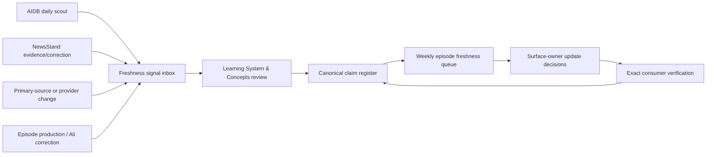

# LAiDIES claim, definition and freshness system

**Status:** BUILT LOCALLY — registry, signal inbox, weekly queue and candidate
scan are operational; full historical backfill and owner acceptance remain
open  
**Canonical owner:** Learning System & Concepts  
**Cadence owner:** Weekly Episode Engine  
**Signal sources:** AIDB Intelligence Desk, NewsStand, primary-source checks,
episode production and Ali corrections

## The job

This system gives one stable identity to every definition, statistic,
changeable product statement and other consequential claim, then records every
place that consumes it. It prevents an updated source from leaving old
narration, artwork, Study Packs, classes, Library entries, quizzes or pages
behind.

The maintained files are:

- `claim-register.json` — canonical claim truth, evidence, review timing and
  consumer graph;
- `claim-register.schema.json` — machine-readable contract;
- `freshness-signal-inbox.json` — bounded signals from AIDB, NewsStand,
  episode production and manual corrections;
- `freshness-signal-inbox.schema.json` — signal contract;
- `scripts/check-content-freshness.mjs` — validator, due/triggered queue and
  site-wide candidate scanner; and
- `freshness-runs/` — dated, reproducible weekly reports. Reports are evidence
  of a check, not evidence that every source was current or every correction
  shipped.

## What belongs in the register

Register a statement when changing or mis-stating it could change what a
reader believes, chooses or does. The register supports:

- `definition`
- `statistic`
- `product_capability`
- `model_or_version`
- `access_plan_price_region`
- `policy_or_data_practice`
- `research_finding`
- `historical_fact`
- `legal_safety_or_health`
- `quote_or_attribution`
- `dated_status`
- `analogy_boundary`
- `semantic_image_claim`

Pure jokes, obvious fiction, layout copy and stable navigation labels do not
need claim records unless they imply a factual promise.

## One claim, several surface jobs

The register owns the truth boundary. It does not force the same paragraph
onto every surface.

| Surface | Distinct job |
|---|---|
| Episode/article | encounter, stakes and story |
| Narration/captions | spoken understanding and exact as-recorded truth |
| Image/video | semantic retrieval without contradicting the claim |
| Trading Card/Study Pack | memory and practice |
| LIBRAiRY | durable lookup and depth |
| Class | demonstration, diagnosis and transfer |
| Quiz/game/tool | practice and feedback |
| NewsStand | what changed now, with dated evidence |

Every consumer records a file path, semantic locator, surface owner,
derivative job and verification state. Generated and rendered derivatives are
consumers too.

## Signal and authority flow



AIDB remains a scout. NewsStand owns dated editorial interpretation. Learning
System & Concepts accepts or rejects changes to durable concept truth. Each
surface owner accepts and verifies its own edit. No signal silently rewrites
canon or public content.

## Weekly episode production gate

The existing weekly episode-production command runs the episode-scoped check,
writes a dated Markdown/JSON pair under `freshness-runs/`, adds the result to
the production review and shows a visible PASS/HOLD task in the weekly command
centre:

```bash
node scripts/run-weekly-production.js NN
```

Run the checker directly for a site-wide maintenance pass or a strict CI-style
gate:

```bash
node scripts/check-content-freshness.mjs \
  --as-of YYYY-MM-DD \
  --episode NN \
  --report operations/product-stewards/learning-content-ecosystem/freshness-runs/YYYY-MM-DD-weekly.md \
  --json operations/product-stewards/learning-content-ecosystem/freshness-runs/YYYY-MM-DD-weekly.json \
  --strict
```

The weekly command still writes and opens the review packet on HOLD so the
correction queue remains usable. HOLD is release status, not a reason to hide
the work needed to clear it.

The run:

1. validates the register and signal inbox;
2. identifies overdue and due-soon claims;
3. matches open AIDB/NewsStand/manual signals to claim IDs or flags them as
   unmatched;
4. checks that every registered consumer path still exists;
5. scans current content and production sources for unregistered candidate
   statistics, product/version claims, prices/plans/regions, policies and
   “current/latest/as of” statements; and
6. emits the exact owner decision queue.

The scanner discovers candidates; it does not decide that regex-shaped text is
true, material or current.

### Admission rule

The weekly package cannot pass its substance/release gate while a material
claim used by the package is:

- `STALE`, `CONFLICTED`, `CORRECTION_REQUIRED` or `HOLD`;
- due with no completed source check;
- linked to an unresolved material signal;
- missing its required primary/official evidence; or
- corrected without every affected consumer being dispositioned.

An unaffected older episode does not need wholesale re-recording. The owner
chooses `NO_CHANGE`, `CURRENT_NOTE`, `DERIVATIVE_UPDATE` or
`RE_RECORD_OR_REFILM` and records why.

## Correction transaction

A material correction is complete only when the claim record contains:

1. old and corrected wording/evidence;
2. effective date, severity and owner;
3. every known consumer;
4. one disposition per consumer:
   `NO_CHANGE`, `UPDATE`, `REPLACE`, `REMOVE`, `CURRENT_NOTE`, `HOLD` or
   `SUPERSEDE`;
5. exact implementation and verification evidence; and
6. truthful public correction handling where the old claim was released.

Local edits remain `VERIFIED_LOCALLY`. Narration is not updated until new
audio is integrated; a rendered page is not updated until its exact artifact
is rebuilt; public state is not updated until the public bytes are verified.

## Backfill rule

The initial register contains the Episode 01 representative concept cluster
that exposed the failure. The weekly scanner supplies the site-wide candidate
queue for backfill. Backfill proceeds by materiality:

1. safety/legal/health/privacy and policy;
2. product/model/access/price/plan/region;
3. numerical research claims and dates;
4. canonical definitions and attribution;
5. lower-risk historical and contextual claims.

“Not yet registered” is an explicit backlog state, never proof that a claim is
safe or current.
