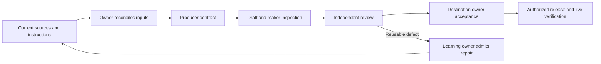

# Learning work: current dependency map

Generated 2026-09-07T03:15:47.787Z. Regenerate before using: this is a snapshot, never execution authority.

17 orders; 14 eligible for preparation; 0 eligible to draft; 17 held for release. Executor: DISABLED_UNBOUND. Projection: QUARANTINED.

This diagram shows the required route, not observed completion. Automated checks inspect recorded evidence; agents perform preparation and judgment. The execution adapter is disabled. Human decisions are determined by the actual task authority, not guessed from an owner label.

| Order | Owner | Recorded status | Next safe operation | Missing declared files |
|---|---|---|---|---|
| LCWO-001: Verify the Sandbox successor in Concepts 101 | library-101 | BUILT_LOCALLY | RECONCILE_INVALID_INPUTS | 6 |
| LCWO-002: Build the open, open-weight, source-available and closed AI concept cluster | library-101 | SPECIFIED | RECONCILE_INVALID_INPUTS | 7 |
| LCWO-003: Complete the Sandbox incident Weekly | newsstand | BUILT_LOCALLY | RECONCILE_INVALID_INPUTS | 4 |
| LCWO-004: Draft the broader Tribune argument on AI security and open versus closed systems | newsstand-tribune | SPECIFIED | RECONCILE_INVALID_INPUTS | 7 |
| LCWO-005: Extend the permissions class with controlled access, revocation and agent-boundary practice | classes | SPECIFIED | RECONCILE_INVALID_INPUTS | 7 |
| LCWO-006: Build the Accounts 101 connection, permission, saved-information and deletion cluster | library-101 | SPECIFIED | RECONCILE_INVALID_INPUTS | 4 |
| LCWO-007: Normalize the model-cost versus completed-task comparison | learning-content-ecosystem | QUEUED_WITH_TRIGGER | RECONCILE_INVALID_INPUTS | 4 |
| LCWO-008: Reconsider durable policy-calendar literacy only with a safe sourced mechanism | learning-content-ecosystem | QUEUED_WITH_TRIGGER | RECONCILE_INVALID_INPUTS | 3 |
| LCWO-009: Reconsider collective-action and AI-governance teaching only when the mechanism becomes teachable | learning-content-ecosystem | QUEUED_WITH_TRIGGER | RECONCILE_INVALID_INPUTS | 2 |
| LCWO-010: Build the source-bound Paige tip and Promptoscope derivative store | newsstand-daily | BUILT_LOCALLY | RECONCILE_INVALID_INPUTS | 4 |
| LCWO-011: Build the governed cross-site learning relationship and discovery pipeline | platform-reliability | BUILT_LOCALLY | RECONCILE_INVALID_INPUTS | 8 |
| LCWO-012: Build the intermediate reusable-skill lab without the department-replacement claim | sunnyvaile-high | SPECIFIED | RECONCILE_INVALID_INPUTS | 6 |
| LCWO-013: Build and review the practical Daily tip about reusable AI skills | newsstand-daily | SPECIFIED | RECONCILE_INVALID_INPUTS | 3 |
| LCWO-014: Build the Missing Middle lab for turning viral AI claims into working setups | sunnyvaile-high | BUILT_LOCALLY | RECONCILE_INVALID_INPUTS | 3 |
| LCWO-015: Build the recurring What the Viral Reel Left Out Daily format and parent-routing gate | newsstand-daily | BUILT_LOCALLY | RECONCILE_INVALID_INPUTS | 2 |
| LCWO-016: Build the Work-Life AI Mirror career-practice bank and Missing Middle extensions | learning-content-ecosystem | BUILT_LOCALLY | RECONCILE_INVALID_INPUTS | 3 |
| LCWO-017: Build the three-script Town Group Chat pilot | newsstand-daily | BUILT_LOCALLY | RECONCILE_INVALID_INPUTS | 2 |

## Exact holds and inputs

### LCWO-001

Recorded next action (not authorization): LIBRAiRY owner verifies the exact Sandbox entry in the actual reader, including mobile readability, source links, analogy limit and surrounding Concepts 101 navigation.

Recorded trigger: Immediate owner review; local successor already exists.

Producer hold: LCWO-001:missing producerContractPath

Release holds: producerContract:MISSING; producerReview:MISSING; semanticAdmission:MISSING; accuracy:REQUIRED; antiSlop:REQUIRED; currentBestPractice:REQUIRED; laidiesVoice:REQUIRED; analogyIntegrity:REQUIRED; usefulnessDepth:REQUIRED; formatFit:REQUIRED; searchIndexing:REQUIRED; relationshipLinking:REQUIRED; canonConsistency:REQUIRED; songOpportunity:REQUIRED; derivativeFeeds:REQUIRED; artifact:UNBOUND; review:ACCURACY+EXPERIENCE+OWNER; review:INDEPENDENCE_NOT_PROVEN; featureAdaptation:NOT_PROVEN

- [content/library-books/rendered/ai-fundamentals-101.html](</Users/alisoneakin/Projects/laidies-learning-map-20260906/content/library-books/rendered/ai-fundamentals-101.html>) — MISSING
- [content/library-books/sources/ai-fundamentals-101.source.json](</Users/alisoneakin/Projects/laidies-learning-map-20260906/content/library-books/sources/ai-fundamentals-101.source.json>) — MISSING
- [operations/product-stewards/learning-content-ecosystem/NEWSSTAND-INTAKE-openai-hugging-face-agent-security-2026-07-28.md](</Users/alisoneakin/Projects/laidies-learning-map-20260906/operations/product-stewards/learning-content-ecosystem/NEWSSTAND-INTAKE-openai-hugging-face-agent-security-2026-07-28.md>) — MISSING
- [operations/product-stewards/newsstand/validation-receipts/2026-07-29/stage-4-learning-system-concepts-openai-hugging-face-breaking-final-2026-07-29.md](</Users/alisoneakin/Projects/laidies-learning-map-20260906/operations/product-stewards/newsstand/validation-receipts/2026-07-29/stage-4-learning-system-concepts-openai-hugging-face-breaking-final-2026-07-29.md>) — MISSING
- [operations/product-stewards/newsstand/validation-receipts/2026-08-01/stage-4-learning-system-concepts-cross-lab-cyber-evaluation-openai-freshness-repaired-2026-08-01.md](</Users/alisoneakin/Projects/laidies-learning-map-20260906/operations/product-stewards/newsstand/validation-receipts/2026-08-01/stage-4-learning-system-concepts-cross-lab-cyber-evaluation-openai-freshness-repaired-2026-08-01.md>) — MISSING
- [operations/product-stewards/newsstand/validation-receipts/2026-08-02/stage-4-learning-system-concepts-cross-lab-cyber-evaluation-contrast-focus-repaired-2026-08-02.md](</Users/alisoneakin/Projects/laidies-learning-map-20260906/operations/product-stewards/newsstand/validation-receipts/2026-08-02/stage-4-learning-system-concepts-cross-lab-cyber-evaluation-contrast-focus-repaired-2026-08-02.md>) — MISSING

### LCWO-002

Recorded next action (not authorization): Draft the governed Concepts 101 cluster with precise access labels, practical consequences, misconceptions, analogy limits, primary-source packet and a reader check; then render it for independent review.

Recorded trigger: Immediate build from the accepted agent-security intake; merge later model-news examples into this one canonical cluster.

Producer hold: LCWO-002:missing producerContractPath

Release holds: producerContract:MISSING; producerReview:MISSING; semanticAdmission:MISSING; accuracy:REQUIRED; antiSlop:REQUIRED; currentBestPractice:REQUIRED; laidiesVoice:REQUIRED; analogyIntegrity:REQUIRED; usefulnessDepth:REQUIRED; formatFit:REQUIRED; searchIndexing:REQUIRED; relationshipLinking:REQUIRED; canonConsistency:REQUIRED; songOpportunity:REQUIRED; derivativeFeeds:REQUIRED; artifact:UNBOUND; review:BUILD+ACCURACY+EDITORIAL+EXPERIENCE+OWNER; review:INDEPENDENCE_NOT_PROVEN; featureAdaptation:NOT_PROVEN

- [content/library-books/rendered/ai-fundamentals-101.html](</Users/alisoneakin/Projects/laidies-learning-map-20260906/content/library-books/rendered/ai-fundamentals-101.html>) — MISSING
- [content/library-books/sources/ai-fundamentals-101.source.json](</Users/alisoneakin/Projects/laidies-learning-map-20260906/content/library-books/sources/ai-fundamentals-101.source.json>) — MISSING
- [operations/product-stewards/learning-content-ecosystem/NEWSSTAND-INTAKE-openai-hugging-face-agent-security-2026-07-28.md](</Users/alisoneakin/Projects/laidies-learning-map-20260906/operations/product-stewards/learning-content-ecosystem/NEWSSTAND-INTAKE-openai-hugging-face-agent-security-2026-07-28.md>) — MISSING
- [operations/product-stewards/newsstand/validation-receipts/2026-07-29/stage-4-learning-system-concepts-gemini-flash-and-kimi-k3-2026-07-29.md](</Users/alisoneakin/Projects/laidies-learning-map-20260906/operations/product-stewards/newsstand/validation-receipts/2026-07-29/stage-4-learning-system-concepts-gemini-flash-and-kimi-k3-2026-07-29.md>) — MISSING
- [operations/product-stewards/newsstand/validation-receipts/2026-07-29/stage-4-learning-system-concepts-openai-hugging-face-breaking-final-2026-07-29.md](</Users/alisoneakin/Projects/laidies-learning-map-20260906/operations/product-stewards/newsstand/validation-receipts/2026-07-29/stage-4-learning-system-concepts-openai-hugging-face-breaking-final-2026-07-29.md>) — MISSING
- [operations/product-stewards/newsstand/validation-receipts/2026-08-01/stage-4-learning-system-concepts-cross-lab-cyber-evaluation-openai-freshness-repaired-2026-08-01.md](</Users/alisoneakin/Projects/laidies-learning-map-20260906/operations/product-stewards/newsstand/validation-receipts/2026-08-01/stage-4-learning-system-concepts-cross-lab-cyber-evaluation-openai-freshness-repaired-2026-08-01.md>) — MISSING
- [operations/product-stewards/newsstand/validation-receipts/2026-08-02/stage-4-learning-system-concepts-cross-lab-cyber-evaluation-contrast-focus-repaired-2026-08-02.md](</Users/alisoneakin/Projects/laidies-learning-map-20260906/operations/product-stewards/newsstand/validation-receipts/2026-08-02/stage-4-learning-system-concepts-cross-lab-cyber-evaluation-contrast-focus-repaired-2026-08-02.md>) — MISSING

### LCWO-003

Recorded next action (not authorization): Run the exact Weekly draft through the current NewsStand source, editorial, learning, render, owner and release chain; update sources again if the evidence changes before review.

Recorded trigger: Immediate independent review of the July 28 updated local draft.

Producer hold: LCWO-003:missing producerContractPath

Release holds: producerContract:MISSING; producerReview:MISSING; semanticAdmission:MISSING; accuracy:REQUIRED; antiSlop:REQUIRED; currentBestPractice:REQUIRED; laidiesVoice:REQUIRED; analogyIntegrity:REQUIRED; usefulnessDepth:REQUIRED; formatFit:REQUIRED; searchIndexing:REQUIRED; relationshipLinking:REQUIRED; canonConsistency:REQUIRED; songOpportunity:REQUIRED; derivativeFeeds:REQUIRED; artifact:UNBOUND; review:ACCURACY+EDITORIAL+LEARNING+EXPERIENCE+OWNER; review:INDEPENDENCE_NOT_PROVEN; featureAdaptation:NOT_PROVEN

- [operations/drafts/openai-hugging-face-incident-2026-07-24/weekly-deep-dive.md](</Users/alisoneakin/Projects/laidies-learning-map-20260906/operations/drafts/openai-hugging-face-incident-2026-07-24/weekly-deep-dive.md>) — MISSING
- [operations/product-stewards/learning-content-ecosystem/NEWSSTAND-INTAKE-openai-hugging-face-agent-security-2026-07-28.md](</Users/alisoneakin/Projects/laidies-learning-map-20260906/operations/product-stewards/learning-content-ecosystem/NEWSSTAND-INTAKE-openai-hugging-face-agent-security-2026-07-28.md>) — MISSING
- [operations/product-stewards/newsstand/validation-receipts/2026-08-01/stage-4-learning-system-concepts-cross-lab-cyber-evaluation-openai-freshness-repaired-2026-08-01.md](</Users/alisoneakin/Projects/laidies-learning-map-20260906/operations/product-stewards/newsstand/validation-receipts/2026-08-01/stage-4-learning-system-concepts-cross-lab-cyber-evaluation-openai-freshness-repaired-2026-08-01.md>) — MISSING
- [operations/product-stewards/newsstand/validation-receipts/2026-08-02/stage-4-learning-system-concepts-cross-lab-cyber-evaluation-contrast-focus-repaired-2026-08-02.md](</Users/alisoneakin/Projects/laidies-learning-map-20260906/operations/product-stewards/newsstand/validation-receipts/2026-08-02/stage-4-learning-system-concepts-cross-lab-cyber-evaluation-contrast-focus-repaired-2026-08-02.md>) — MISSING

### LCWO-004

Recorded next action (not authorization): Perform the required complement review against the existing reward-hacking Tribune, then research and draft Who Keeps AI Safe When It Can Act? using the exact Tribune field order and current primary sources.

Recorded trigger: Immediate build from the accepted reverse brief; do not wait for NewsStand publication of the Breaking item.

Producer hold: LCWO-004:missing producerContractPath

Release holds: producerContract:MISSING; producerReview:MISSING; semanticAdmission:MISSING; accuracy:REQUIRED; antiSlop:REQUIRED; currentBestPractice:REQUIRED; laidiesVoice:REQUIRED; analogyIntegrity:REQUIRED; usefulnessDepth:REQUIRED; formatFit:REQUIRED; searchIndexing:REQUIRED; relationshipLinking:REQUIRED; canonConsistency:REQUIRED; songOpportunity:REQUIRED; derivativeFeeds:REQUIRED; artifact:UNBOUND; review:BUILD+ACCURACY+EDITORIAL+LEARNING+EXPERIENCE+OWNER; review:INDEPENDENCE_NOT_PROVEN; featureAdaptation:NOT_PROVEN

- [operations/drafts/openai-hugging-face-incident-2026-07-24/tribune-ai-security-open-closed-claim-map-2026-07-28.md](</Users/alisoneakin/Projects/laidies-learning-map-20260906/operations/drafts/openai-hugging-face-incident-2026-07-24/tribune-ai-security-open-closed-claim-map-2026-07-28.md>) — MISSING
- [operations/drafts/openai-hugging-face-incident-2026-07-24/tribune-ai-security-open-closed-reverse-brief-2026-07-28.md](</Users/alisoneakin/Projects/laidies-learning-map-20260906/operations/drafts/openai-hugging-face-incident-2026-07-24/tribune-ai-security-open-closed-reverse-brief-2026-07-28.md>) — MISSING
- [operations/drafts/openai-hugging-face-incident-2026-07-24/tribune-open-closed-ai-security-draft.md](</Users/alisoneakin/Projects/laidies-learning-map-20260906/operations/drafts/openai-hugging-face-incident-2026-07-24/tribune-open-closed-ai-security-draft.md>) — MISSING
- [operations/product-stewards/learning-content-ecosystem/NEWSSTAND-INTAKE-openai-hugging-face-agent-security-2026-07-28.md](</Users/alisoneakin/Projects/laidies-learning-map-20260906/operations/product-stewards/learning-content-ecosystem/NEWSSTAND-INTAKE-openai-hugging-face-agent-security-2026-07-28.md>) — MISSING
- [operations/product-stewards/newsstand/validation-receipts/2026-07-29/stage-4-learning-system-concepts-openai-hugging-face-breaking-final-2026-07-29.md](</Users/alisoneakin/Projects/laidies-learning-map-20260906/operations/product-stewards/newsstand/validation-receipts/2026-07-29/stage-4-learning-system-concepts-openai-hugging-face-breaking-final-2026-07-29.md>) — MISSING
- [operations/product-stewards/newsstand/validation-receipts/2026-08-01/stage-4-learning-system-concepts-cross-lab-cyber-evaluation-openai-freshness-repaired-2026-08-01.md](</Users/alisoneakin/Projects/laidies-learning-map-20260906/operations/product-stewards/newsstand/validation-receipts/2026-08-01/stage-4-learning-system-concepts-cross-lab-cyber-evaluation-openai-freshness-repaired-2026-08-01.md>) — MISSING
- [operations/product-stewards/newsstand/validation-receipts/2026-08-02/stage-4-learning-system-concepts-cross-lab-cyber-evaluation-contrast-focus-repaired-2026-08-02.md](</Users/alisoneakin/Projects/laidies-learning-map-20260906/operations/product-stewards/newsstand/validation-receipts/2026-08-02/stage-4-learning-system-concepts-cross-lab-cyber-evaluation-contrast-focus-repaired-2026-08-02.md>) — MISSING

### LCWO-005

Recorded next action (not authorization): Write one controlled fictional practice that distinguishes instructions, enforced boundaries, unnecessary permissions, monitoring, stopping, sharing state and revocation; define feedback and a transfer check before media production.

Recorded trigger: Immediate class-owner build; consolidate both accepted permissions impacts into the existing basics-permissions class rather than creating duplicates.

Producer hold: LCWO-005:missing producerContractPath

Release holds: producerContract:MISSING; producerReview:MISSING; semanticAdmission:MISSING; accuracy:REQUIRED; antiSlop:REQUIRED; currentBestPractice:REQUIRED; laidiesVoice:REQUIRED; analogyIntegrity:REQUIRED; usefulnessDepth:REQUIRED; formatFit:REQUIRED; searchIndexing:REQUIRED; relationshipLinking:REQUIRED; canonConsistency:REQUIRED; songOpportunity:REQUIRED; derivativeFeeds:REQUIRED; artifact:UNBOUND; review:BUILD+ACCURACY+SAFETY+INSTRUCTIONAL+EXPERIENCE+OWNER; review:INDEPENDENCE_NOT_PROVEN; featureAdaptation:NOT_PROVEN

- [content/site/high-classes.json#basics-permissions](</Users/alisoneakin/Projects/laidies-learning-map-20260906/content/site/high-classes.json#basics-permissions>) — MISSING
- [operations/product-stewards/learning-content-ecosystem/NEWSSTAND-INTAKE-chatgpt-health-and-claude-share-2026-07-29.md](</Users/alisoneakin/Projects/laidies-learning-map-20260906/operations/product-stewards/learning-content-ecosystem/NEWSSTAND-INTAKE-chatgpt-health-and-claude-share-2026-07-29.md>) — MISSING
- [operations/product-stewards/learning-content-ecosystem/NEWSSTAND-INTAKE-openai-hugging-face-agent-security-2026-07-28.md](</Users/alisoneakin/Projects/laidies-learning-map-20260906/operations/product-stewards/learning-content-ecosystem/NEWSSTAND-INTAKE-openai-hugging-face-agent-security-2026-07-28.md>) — MISSING
- [operations/product-stewards/newsstand/validation-receipts/2026-07-29/stage-4-learning-system-concepts-health-and-claude-share-2026-07-29.md](</Users/alisoneakin/Projects/laidies-learning-map-20260906/operations/product-stewards/newsstand/validation-receipts/2026-07-29/stage-4-learning-system-concepts-health-and-claude-share-2026-07-29.md>) — MISSING
- [operations/product-stewards/newsstand/validation-receipts/2026-07-29/stage-4-learning-system-concepts-openai-hugging-face-breaking-final-2026-07-29.md](</Users/alisoneakin/Projects/laidies-learning-map-20260906/operations/product-stewards/newsstand/validation-receipts/2026-07-29/stage-4-learning-system-concepts-openai-hugging-face-breaking-final-2026-07-29.md>) — MISSING
- [operations/product-stewards/newsstand/validation-receipts/2026-08-01/stage-4-learning-system-concepts-cross-lab-cyber-evaluation-openai-freshness-repaired-2026-08-01.md](</Users/alisoneakin/Projects/laidies-learning-map-20260906/operations/product-stewards/newsstand/validation-receipts/2026-08-01/stage-4-learning-system-concepts-cross-lab-cyber-evaluation-openai-freshness-repaired-2026-08-01.md>) — MISSING
- [operations/product-stewards/newsstand/validation-receipts/2026-08-02/stage-4-learning-system-concepts-cross-lab-cyber-evaluation-contrast-focus-repaired-2026-08-02.md](</Users/alisoneakin/Projects/laidies-learning-map-20260906/operations/product-stewards/newsstand/validation-receipts/2026-08-02/stage-4-learning-system-concepts-cross-lab-cyber-evaluation-contrast-focus-repaired-2026-08-02.md>) — MISSING

### LCWO-006

Recorded next action (not authorization): Create the durable Accounts 101 source and reader treatment that separates connection scope, permissions, saved information, sharing state, revocation and deletion without importing volatile product-policy claims.

Recorded trigger: Immediate build from the accepted Health and Claude-share learning intake.

Producer hold: LCWO-006:missing producerContractPath

Release holds: producerContract:MISSING; producerReview:MISSING; semanticAdmission:MISSING; accuracy:REQUIRED; antiSlop:REQUIRED; currentBestPractice:REQUIRED; laidiesVoice:REQUIRED; analogyIntegrity:REQUIRED; usefulnessDepth:REQUIRED; formatFit:REQUIRED; searchIndexing:REQUIRED; relationshipLinking:REQUIRED; canonConsistency:REQUIRED; songOpportunity:REQUIRED; derivativeFeeds:REQUIRED; artifact:UNBOUND; review:BUILD+ACCURACY+SAFETY+EDITORIAL+EXPERIENCE+OWNER; review:INDEPENDENCE_NOT_PROVEN; featureAdaptation:NOT_PROVEN

- [content/library-books/accounts-101.md](</Users/alisoneakin/Projects/laidies-learning-map-20260906/content/library-books/accounts-101.md>) — MISSING
- [content/library-books/rendered/accounts-101.html](</Users/alisoneakin/Projects/laidies-learning-map-20260906/content/library-books/rendered/accounts-101.html>) — MISSING
- [operations/product-stewards/learning-content-ecosystem/NEWSSTAND-INTAKE-chatgpt-health-and-claude-share-2026-07-29.md](</Users/alisoneakin/Projects/laidies-learning-map-20260906/operations/product-stewards/learning-content-ecosystem/NEWSSTAND-INTAKE-chatgpt-health-and-claude-share-2026-07-29.md>) — MISSING
- [operations/product-stewards/newsstand/validation-receipts/2026-07-29/stage-4-learning-system-concepts-health-and-claude-share-2026-07-29.md](</Users/alisoneakin/Projects/laidies-learning-map-20260906/operations/product-stewards/newsstand/validation-receipts/2026-07-29/stage-4-learning-system-concepts-health-and-claude-share-2026-07-29.md>) — MISSING

### LCWO-007

Recorded next action (not authorization): Open a normalization card only when an accepted model-choice lesson needs the same-job comparison across quality, elapsed time, tokens, tool calls, retries and structured-output reliability.

Recorded trigger: A named model-choice class, Library guide or tool reaches specification and needs a durable completed-task cost method.

Producer hold: See canonical checker result

Release holds: producerContract:MISSING; producerReview:MISSING; semanticAdmission:MISSING; accuracy:REQUIRED; antiSlop:REQUIRED; currentBestPractice:REQUIRED; laidiesVoice:REQUIRED; analogyIntegrity:REQUIRED; usefulnessDepth:REQUIRED; formatFit:REQUIRED; searchIndexing:REQUIRED; relationshipLinking:REQUIRED; canonConsistency:REQUIRED; songOpportunity:REQUIRED; derivativeFeeds:REQUIRED; artifact:UNBOUND; review:INTAKE; review:INDEPENDENCE_NOT_PROVEN; featureAdaptation:NOT_PROVEN

- [operations/product-stewards/learning-content-ecosystem/concept-map.md](</Users/alisoneakin/Projects/laidies-learning-map-20260906/operations/product-stewards/learning-content-ecosystem/concept-map.md>) — MISSING
- [operations/product-stewards/newsstand/validation-receipts/2026-07-29/stage-4-learning-system-concepts-gemini-flash-and-kimi-k3-2026-07-29.md](</Users/alisoneakin/Projects/laidies-learning-map-20260906/operations/product-stewards/newsstand/validation-receipts/2026-07-29/stage-4-learning-system-concepts-gemini-flash-and-kimi-k3-2026-07-29.md>) — MISSING
- [operations/product-stewards/newsstand/validation-receipts/2026-07-31/stage-4-learning-system-concepts-gpt-5-6-price-cuts-account-impact-paid-boundary-2026-07-31.md](</Users/alisoneakin/Projects/laidies-learning-map-20260906/operations/product-stewards/newsstand/validation-receipts/2026-07-31/stage-4-learning-system-concepts-gpt-5-6-price-cuts-account-impact-paid-boundary-2026-07-31.md>) — MISSING
- [operations/product-stewards/newsstand/validation-receipts/2026-07-31/stage-4-learning-system-concepts-gpt-5-6-price-cuts-repaired-2026-07-31.md](</Users/alisoneakin/Projects/laidies-learning-map-20260906/operations/product-stewards/newsstand/validation-receipts/2026-07-31/stage-4-learning-system-concepts-gpt-5-6-price-cuts-repaired-2026-07-31.md>) — MISSING

### LCWO-008

Recorded next action (not authorization): Open a concept intake only when a current multi-jurisdiction primary-source packet and independently reviewed evidence-reading outcome exist; do not turn it into legal advice or self-classification.

Recorded trigger: Named Learning System normalization task with current primary sources, analogy limits and a distinct non-advisory learner outcome.

Producer hold: See canonical checker result

Release holds: producerContract:MISSING; producerReview:MISSING; semanticAdmission:MISSING; accuracy:REQUIRED; antiSlop:REQUIRED; currentBestPractice:REQUIRED; laidiesVoice:REQUIRED; analogyIntegrity:REQUIRED; usefulnessDepth:REQUIRED; formatFit:REQUIRED; searchIndexing:REQUIRED; relationshipLinking:REQUIRED; canonConsistency:REQUIRED; songOpportunity:REQUIRED; derivativeFeeds:REQUIRED; artifact:UNBOUND; review:INTAKE; review:INDEPENDENCE_NOT_PROVEN; featureAdaptation:NOT_PROVEN

- [operations/product-stewards/learning-content-ecosystem/NEWSSTAND-INTAKE-eu-ai-omnibus-policy-calendar-2026-07-29.md](</Users/alisoneakin/Projects/laidies-learning-map-20260906/operations/product-stewards/learning-content-ecosystem/NEWSSTAND-INTAKE-eu-ai-omnibus-policy-calendar-2026-07-29.md>) — MISSING
- [operations/product-stewards/learning-content-ecosystem/concept-map.md](</Users/alisoneakin/Projects/laidies-learning-map-20260906/operations/product-stewards/learning-content-ecosystem/concept-map.md>) — MISSING
- [operations/product-stewards/newsstand/validation-receipts/2026-07-29/stage-4-learning-system-concepts-eu-ai-omnibus-2026-07-29.md](</Users/alisoneakin/Projects/laidies-learning-map-20260906/operations/product-stewards/newsstand/validation-receipts/2026-07-29/stage-4-learning-system-concepts-eu-ai-omnibus-2026-07-29.md>) — MISSING

### LCWO-009

Recorded next action (not authorization): Open a concept intake only after independent sources establish the general coordination mechanism, limits and learner outcome, or a concrete adopted pacing mechanism names participants, thresholds, measurement, verification and enforcement.

Recorded trigger: A named normalization task or later primary-source packet satisfies the exact Stage 4 trigger.

Producer hold: See canonical checker result

Release holds: producerContract:MISSING; producerReview:MISSING; semanticAdmission:MISSING; accuracy:REQUIRED; antiSlop:REQUIRED; currentBestPractice:REQUIRED; laidiesVoice:REQUIRED; analogyIntegrity:REQUIRED; usefulnessDepth:REQUIRED; formatFit:REQUIRED; searchIndexing:REQUIRED; relationshipLinking:REQUIRED; canonConsistency:REQUIRED; songOpportunity:REQUIRED; derivativeFeeds:REQUIRED; artifact:UNBOUND; review:INTAKE; review:INDEPENDENCE_NOT_PROVEN; featureAdaptation:NOT_PROVEN

- [operations/product-stewards/learning-content-ecosystem/concept-map.md](</Users/alisoneakin/Projects/laidies-learning-map-20260906/operations/product-stewards/learning-content-ecosystem/concept-map.md>) — MISSING
- [operations/product-stewards/newsstand/validation-receipts/2026-07-30/stage-4-learning-system-concepts-pacing-the-frontier-repaired-2026-07-30.md](</Users/alisoneakin/Projects/laidies-learning-map-20260906/operations/product-stewards/newsstand/validation-receipts/2026-07-30/stage-4-learning-system-concepts-pacing-the-frontier-repaired-2026-07-30.md>) — MISSING

### LCWO-010

Recorded next action (not authorization): NewsStand, Learning, Accuracy and Experience owners review the canonical store, validator, held representative records and empty states; only after gate-specific evidence may an exact record become eligible for a consumer.

Recorded trigger: Immediate owner review; the canonical local intake/suppression contract is built, while all representative records remain correctly held and publicly ineligible.

Producer hold: LCWO-010:missing producerContractPath

Release holds: producerContract:MISSING; producerReview:MISSING; semanticAdmission:MISSING; accuracy:REQUIRED; antiSlop:REQUIRED; currentBestPractice:REQUIRED; laidiesVoice:REQUIRED; analogyIntegrity:REQUIRED; usefulnessDepth:REQUIRED; formatFit:REQUIRED; searchIndexing:REQUIRED; relationshipLinking:REQUIRED; canonConsistency:REQUIRED; songOpportunity:REQUIRED; derivativeFeeds:REQUIRED; artifact:UNBOUND; review:ACCURACY+LEARNING+EXPERIENCE+PLATFORM+OWNER; review:INDEPENDENCE_NOT_PROVEN; featureAdaptation:NOT_PROVEN

- [content/daily-learning-derivatives.json](</Users/alisoneakin/Projects/laidies-learning-map-20260906/content/daily-learning-derivatives.json>) — MISSING
- [content/daily-learning-derivatives.schema.json](</Users/alisoneakin/Projects/laidies-learning-map-20260906/content/daily-learning-derivatives.schema.json>) — MISSING
- [operations/product-stewards/newsstand/DAILY-NEWSPAPER-EXPERIENCE-BRIEF.md](</Users/alisoneakin/Projects/laidies-learning-map-20260906/operations/product-stewards/newsstand/DAILY-NEWSPAPER-EXPERIENCE-BRIEF.md>) — MISSING
- [scripts/check-daily-learning-derivatives.mjs](</Users/alisoneakin/Projects/laidies-learning-map-20260906/scripts/check-daily-learning-derivatives.mjs>) — MISSING

### LCWO-011

Recorded next action (not authorization): Execute the named resolution queue beginning with LCR-003 representative class admission and LCR-007 Episode 04 search-metadata correction; backfill the remaining inventory only through canonical typed relationships and exact surface proof.

Recorded trigger: The local graph, validator, inventory report and executable resolution queue are built. Open blockers now have owners, review dates, closure checks and fail-on-overdue enforcement; owner builds and public surface admission remain required.

Producer hold: LCWO-011:missing producerContractPath

Release holds: producerContract:MISSING; producerReview:MISSING; semanticAdmission:MISSING; accuracy:REQUIRED; antiSlop:REQUIRED; currentBestPractice:REQUIRED; laidiesVoice:REQUIRED; analogyIntegrity:REQUIRED; usefulnessDepth:REQUIRED; formatFit:REQUIRED; searchIndexing:REQUIRED; relationshipLinking:REQUIRED; canonConsistency:REQUIRED; songOpportunity:REQUIRED; derivativeFeeds:REQUIRED; artifact:UNBOUND; review:LEARNING+SEARCH+SURFACE+EXPERIENCE; review:INDEPENDENCE_NOT_PROVEN; featureAdaptation:NOT_PROVEN

- [content/learning-blocker-resolution-queue.json](</Users/alisoneakin/Projects/laidies-learning-map-20260906/content/learning-blocker-resolution-queue.json>) — MISSING
- [content/learning-relationship-graph.json](</Users/alisoneakin/Projects/laidies-learning-map-20260906/content/learning-relationship-graph.json>) — MISSING
- [content/learning-relationship-graph.schema.json](</Users/alisoneakin/Projects/laidies-learning-map-20260906/content/learning-relationship-graph.schema.json>) — MISSING
- [operations/product-stewards/learning-content-ecosystem/OPERATING-SPEC.md](</Users/alisoneakin/Projects/laidies-learning-map-20260906/operations/product-stewards/learning-content-ecosystem/OPERATING-SPEC.md>) — MISSING
- [operations/product-stewards/learning-content-ecosystem/claim-register.json](</Users/alisoneakin/Projects/laidies-learning-map-20260906/operations/product-stewards/learning-content-ecosystem/claim-register.json>) — MISSING
- [operations/product-stewards/learning-content-ecosystem/concept-map.md](</Users/alisoneakin/Projects/laidies-learning-map-20260906/operations/product-stewards/learning-content-ecosystem/concept-map.md>) — MISSING
- [operations/product-stewards/learning-content-ecosystem/learning-relationship-inventory-report.json](</Users/alisoneakin/Projects/laidies-learning-map-20260906/operations/product-stewards/learning-content-ecosystem/learning-relationship-inventory-report.json>) — MISSING
- [scripts/check-learning-relationships.mjs](</Users/alisoneakin/Projects/laidies-learning-map-20260906/scripts/check-learning-relationships.mjs>) — MISSING

### LCWO-012

Recorded next action (not authorization): Build the bounded intermediate lab from the accepted intake, retaining Basics P8 as the skills safety front door and Masterclass Lesson 4 as the repeatable-workflow owner.

Recorded trigger: Immediate Classes owner build when the SUNNYVAiLE High write lane is free; the learner job, observable result, non-duplication ruling and official source boundary are specified.

Producer hold: LCWO-012:missing producerContractPath

Release holds: producerContract:MISSING; producerReview:MISSING; semanticAdmission:MISSING; accuracy:REQUIRED; antiSlop:REQUIRED; currentBestPractice:REQUIRED; laidiesVoice:REQUIRED; analogyIntegrity:REQUIRED; usefulnessDepth:REQUIRED; formatFit:REQUIRED; searchIndexing:REQUIRED; relationshipLinking:REQUIRED; canonConsistency:REQUIRED; songOpportunity:REQUIRED; derivativeFeeds:REQUIRED; artifact:UNBOUND; review:BUILD+ACCURACY+SAFETY+LEARNING+EDITORIAL+EXPERIENCE+OWNER; review:INDEPENDENCE_NOT_PROVEN; featureAdaptation:NOT_PROVEN

- [operations/classes/basics-p8-bolting-on-extra-powers.script.md](</Users/alisoneakin/Projects/laidies-learning-map-20260906/operations/classes/basics-p8-bolting-on-extra-powers.script.md>) — MISSING
- [operations/classes/intermediate-build-the-skill-keep-the-job.CONTENT.md](</Users/alisoneakin/Projects/laidies-learning-map-20260906/operations/classes/intermediate-build-the-skill-keep-the-job.CONTENT.md>) — MISSING
- [operations/classes/intermediate-build-the-skill-keep-the-job.script.md](</Users/alisoneakin/Projects/laidies-learning-map-20260906/operations/classes/intermediate-build-the-skill-keep-the-job.script.md>) — MISSING
- [operations/classes/masterclass-lesson-04-from-chatting-to-working.CONTENT.md](</Users/alisoneakin/Projects/laidies-learning-map-20260906/operations/classes/masterclass-lesson-04-from-chatting-to-working.CONTENT.md>) — MISSING
- [operations/product-stewards/learning-content-ecosystem/INTAKE-build-and-audit-reusable-ai-skills-2026-07-31.md](</Users/alisoneakin/Projects/laidies-learning-map-20260906/operations/product-stewards/learning-content-ecosystem/INTAKE-build-and-audit-reusable-ai-skills-2026-07-31.md>) — MISSING
- [operations/product-stewards/sunnyvaile-high/subproducts/classes/build-packet-intermediate-build-the-skill-keep-the-job-2026-07-31.md](</Users/alisoneakin/Projects/laidies-learning-map-20260906/operations/product-stewards/sunnyvaile-high/subproducts/classes/build-packet-intermediate-build-the-skill-keep-the-job-2026-07-31.md>) — MISSING

### LCWO-013

Recorded next action (not authorization): Create a held source-bound Paige record from the admitted draft only after a current skills claim is added to the claim register; run the complete Daily review chain before any public eligibility ruling.

Recorded trigger: Immediate NewsStand Daily build when its write lane is free; the tip, guardrail, canonical destination and no-Promptoscope/no-song dispositions are specified.

Producer hold: LCWO-013:missing producerContractPath

Release holds: producerContract:MISSING; producerReview:MISSING; semanticAdmission:MISSING; accuracy:REQUIRED; antiSlop:REQUIRED; currentBestPractice:REQUIRED; laidiesVoice:REQUIRED; analogyIntegrity:REQUIRED; usefulnessDepth:REQUIRED; formatFit:REQUIRED; searchIndexing:REQUIRED; relationshipLinking:REQUIRED; canonConsistency:REQUIRED; songOpportunity:REQUIRED; derivativeFeeds:REQUIRED; artifact:UNBOUND; review:BUILD+ACCURACY+FRESHNESS+EDITORIAL+LEARNING+EXPERIENCE+OWNER; review:INDEPENDENCE_NOT_PROVEN; featureAdaptation:NOT_PROVEN

- [content/daily-learning-derivatives.json](</Users/alisoneakin/Projects/laidies-learning-map-20260906/content/daily-learning-derivatives.json>) — MISSING
- [operations/product-stewards/learning-content-ecosystem/INTAKE-build-and-audit-reusable-ai-skills-2026-07-31.md](</Users/alisoneakin/Projects/laidies-learning-map-20260906/operations/product-stewards/learning-content-ecosystem/INTAKE-build-and-audit-reusable-ai-skills-2026-07-31.md>) — MISSING
- [operations/product-stewards/learning-content-ecosystem/claim-register.json](</Users/alisoneakin/Projects/laidies-learning-map-20260906/operations/product-stewards/learning-content-ecosystem/claim-register.json>) — MISSING

### LCWO-014

Recorded next action (not authorization): Accuracy and Learning select one current low-risk worked case; Classes writes the visual script and High builds the accessible Missing Middle workflow card without changing the approved learner objective or parent-derivative boundary.

Recorded trigger: Immediate SUNNYVAiLE High build when its write lane is free; the canonical content, observable artifact, build sequence, review gates and public suppression rule are specified locally.

Producer hold: LCWO-014:missing producerContractPath

Release holds: producerContract:MISSING; producerReview:MISSING; semanticAdmission:MISSING; accuracy:REQUIRED; antiSlop:REQUIRED; currentBestPractice:REQUIRED; laidiesVoice:REQUIRED; analogyIntegrity:REQUIRED; usefulnessDepth:REQUIRED; formatFit:REQUIRED; searchIndexing:REQUIRED; relationshipLinking:REQUIRED; canonConsistency:REQUIRED; songOpportunity:REQUIRED; derivativeFeeds:REQUIRED; artifact:UNBOUND; review:ACCURACY+SAFETY+LEARNING+EDITORIAL+EXPERIENCE+OWNER; review:INDEPENDENCE_NOT_PROVEN; featureAdaptation:NOT_PROVEN

- [operations/classes/intermediate-what-the-viral-reel-left-out.CONTENT.md](</Users/alisoneakin/Projects/laidies-learning-map-20260906/operations/classes/intermediate-what-the-viral-reel-left-out.CONTENT.md>) — MISSING
- [operations/product-stewards/learning-content-ecosystem/INTAKE-what-the-viral-reel-left-out-2026-07-31.md](</Users/alisoneakin/Projects/laidies-learning-map-20260906/operations/product-stewards/learning-content-ecosystem/INTAKE-what-the-viral-reel-left-out-2026-07-31.md>) — MISSING
- [operations/product-stewards/sunnyvaile-high/subproducts/classes/build-packet-intermediate-what-the-viral-reel-left-out-2026-07-31.md](</Users/alisoneakin/Projects/laidies-learning-map-20260906/operations/product-stewards/sunnyvaile-high/subproducts/classes/build-packet-intermediate-what-the-viral-reel-left-out-2026-07-31.md>) — MISSING

### LCWO-015

Recorded next action (not authorization): NewsStand Daily and Learning review the format contract, then create the first source-specific held record only after its current claim is registered and its exact canonical destination is accepted; do not reserve a public slot with filler.

Recorded trigger: Immediate owner review; the title, reader promise, one-card anatomy, source boundary, destination selection and fail-closed release rule are built locally.

Producer hold: LCWO-015:missing producerContractPath

Release holds: producerContract:MISSING; producerReview:MISSING; semanticAdmission:MISSING; accuracy:REQUIRED; antiSlop:REQUIRED; currentBestPractice:REQUIRED; laidiesVoice:REQUIRED; analogyIntegrity:REQUIRED; usefulnessDepth:REQUIRED; formatFit:REQUIRED; searchIndexing:REQUIRED; relationshipLinking:REQUIRED; canonConsistency:REQUIRED; songOpportunity:REQUIRED; derivativeFeeds:REQUIRED; artifact:UNBOUND; review:ACCURACY+FRESHNESS+EDITORIAL+LEARNING+EXPERIENCE+OWNER; review:INDEPENDENCE_NOT_PROVEN; featureAdaptation:NOT_PROVEN

- [operations/product-stewards/learning-content-ecosystem/INTAKE-what-the-viral-reel-left-out-2026-07-31.md](</Users/alisoneakin/Projects/laidies-learning-map-20260906/operations/product-stewards/learning-content-ecosystem/INTAKE-what-the-viral-reel-left-out-2026-07-31.md>) — MISSING
- [operations/product-stewards/newsstand/WHAT-THE-VIRAL-REEL-LEFT-OUT-FORMAT.md](</Users/alisoneakin/Projects/laidies-learning-map-20260906/operations/product-stewards/newsstand/WHAT-THE-VIRAL-REEL-LEFT-OUT-FORMAT.md>) — MISSING

### LCWO-016

Recorded next action (not authorization): Independently review the existing 30-item bank, beginning with context handoff, approach-before-answering, reclaiming an interrupted turn and selecting relevant interview context; verify the worked cases in the Missing Middle lab and produce one usable rehearsal artifact. Do not rebuild the bank.

Recorded trigger: Learning and SUNNYVAiLE High may begin when their write lane is free; creator posts remain discovery sources and cannot become published copy.

Producer hold: LCWO-016:missing producerContractPath

Release holds: producerContract:MISSING; producerReview:MISSING; semanticAdmission:MISSING; accuracy:REQUIRED; antiSlop:REQUIRED; currentBestPractice:REQUIRED; laidiesVoice:REQUIRED; analogyIntegrity:REQUIRED; usefulnessDepth:REQUIRED; formatFit:REQUIRED; searchIndexing:REQUIRED; relationshipLinking:REQUIRED; canonConsistency:REQUIRED; songOpportunity:REQUIRED; derivativeFeeds:REQUIRED; artifact:UNBOUND; review:ACCURACY+SAFETY+LEARNING+EDITORIAL+EXPERIENCE+OWNER; review:INDEPENDENCE_NOT_PROVEN; featureAdaptation:NOT_PROVEN

- [operations/classes/intermediate-what-the-viral-reel-left-out.CONTENT.md](</Users/alisoneakin/Projects/laidies-learning-map-20260906/operations/classes/intermediate-what-the-viral-reel-left-out.CONTENT.md>) — MISSING
- [operations/product-stewards/learning-content-ecosystem/INTAKE-work-life-ai-mirror-2026-08-01.md](</Users/alisoneakin/Projects/laidies-learning-map-20260906/operations/product-stewards/learning-content-ecosystem/INTAKE-work-life-ai-mirror-2026-08-01.md>) — MISSING
- [operations/product-stewards/learning-content-ecosystem/WORK-LIFE-AI-MIRROR-BANK.md](</Users/alisoneakin/Projects/laidies-learning-map-20260906/operations/product-stewards/learning-content-ecosystem/WORK-LIFE-AI-MIRROR-BANK.md>) — MISSING

### LCWO-017

Recorded next action (not authorization): Review the existing AI-memory-hook, town-continuity and pure-comedy scripts for character/canon, Editorial, Learning and Accessibility. Brand may select one visual pilot only after those verdicts; do not rewrite the three-script pilot.

Recorded trigger: NewsStand and the affected character owners may begin when their write lane is free; no real resident messages or private inbox data may be used.

Producer hold: LCWO-017:missing producerContractPath

Release holds: producerContract:MISSING; producerReview:MISSING; semanticAdmission:MISSING; accuracy:REQUIRED; antiSlop:REQUIRED; currentBestPractice:REQUIRED; laidiesVoice:REQUIRED; analogyIntegrity:REQUIRED; usefulnessDepth:REQUIRED; formatFit:REQUIRED; searchIndexing:REQUIRED; relationshipLinking:REQUIRED; canonConsistency:REQUIRED; songOpportunity:REQUIRED; derivativeFeeds:REQUIRED; artifact:UNBOUND; review:CANON+EDITORIAL+LEARNING+EXPERIENCE+ACCESSIBILITY+OWNER; review:INDEPENDENCE_NOT_PROVEN; featureAdaptation:NOT_PROVEN

- [operations/product-stewards/newsstand/TOWN-GROUP-CHAT-FORMAT.md](</Users/alisoneakin/Projects/laidies-learning-map-20260906/operations/product-stewards/newsstand/TOWN-GROUP-CHAT-FORMAT.md>) — MISSING
- [operations/product-stewards/newsstand/candidates/town-group-chat-pilot-2026-08-01.md](</Users/alisoneakin/Projects/laidies-learning-map-20260906/operations/product-stewards/newsstand/candidates/town-group-chat-pilot-2026-08-01.md>) — MISSING

## Limits and diagnostics

- Declared references only; undeclared consumers remain unknown.
- Existence and hashes do not prove quality, freshness, approval or public availability.
- No automatic dispatch; checker eligibility allows preparation only.
- JSON reference expansion is bounded to four levels.
- Superseded orders remain visible for history but are excluded from current context packets.

- FILE_UNAVAILABLE:  operations/product-stewards/learning-content-ecosystem/NEWSSTAND-INTAKE-openai-hugging-face-agent-security-2026-07-28.md
- FILE_UNAVAILABLE:  operations/product-stewards/learning-content-ecosystem/NEWSSTAND-INTAKE-chatgpt-health-and-claude-share-2026-07-29.md
- FILE_UNAVAILABLE:  operations/product-stewards/learning-content-ecosystem/NEWSSTAND-INTAKE-eu-ai-omnibus-policy-calendar-2026-07-29.md
- FILE_UNAVAILABLE:  operations/product-stewards/newsstand/validation-receipts/2026-07-29/stage-4-learning-system-concepts-openai-hugging-face-breaking-final-2026-07-29.md
- FILE_UNAVAILABLE:  operations/product-stewards/newsstand/validation-receipts/2026-08-01/stage-4-learning-system-concepts-cross-lab-cyber-evaluation-openai-freshness-repaired-2026-08-01.md
- FILE_UNAVAILABLE:  operations/product-stewards/newsstand/validation-receipts/2026-08-02/stage-4-learning-system-concepts-cross-lab-cyber-evaluation-contrast-focus-repaired-2026-08-02.md
- FILE_UNAVAILABLE:  operations/product-stewards/newsstand/validation-receipts/2026-07-29/stage-4-learning-system-concepts-health-and-claude-share-2026-07-29.md
- FILE_UNAVAILABLE:  operations/product-stewards/newsstand/validation-receipts/2026-07-29/stage-4-learning-system-concepts-gemini-flash-and-kimi-k3-2026-07-29.md
- FILE_UNAVAILABLE:  operations/product-stewards/newsstand/validation-receipts/2026-07-29/stage-4-learning-system-concepts-eu-ai-omnibus-2026-07-29.md
- FILE_UNAVAILABLE:  operations/product-stewards/newsstand/validation-receipts/2026-07-30/stage-4-learning-system-concepts-pacing-the-frontier-repaired-2026-07-30.md
- FILE_UNAVAILABLE:  operations/product-stewards/newsstand/validation-receipts/2026-07-31/stage-4-learning-system-concepts-gpt-5-6-price-cuts-repaired-2026-07-31.md
- FILE_UNAVAILABLE:  operations/product-stewards/newsstand/validation-receipts/2026-07-31/stage-4-learning-system-concepts-gpt-5-6-price-cuts-account-impact-paid-boundary-2026-07-31.md
- FILE_UNAVAILABLE:  operations/product-stewards/learning-content-ecosystem/INTAKE-build-and-audit-reusable-ai-skills-2026-07-31.md
- FILE_UNAVAILABLE:  operations/product-stewards/learning-content-ecosystem/INTAKE-what-the-viral-reel-left-out-2026-07-31.md
- FILE_UNAVAILABLE:  content/library-books/sources/ai-fundamentals-101.source.json
- FILE_UNAVAILABLE:  content/library-books/rendered/ai-fundamentals-101.html
- FILE_UNAVAILABLE:  operations/drafts/openai-hugging-face-incident-2026-07-24/weekly-deep-dive.md
- FILE_UNAVAILABLE:  operations/drafts/openai-hugging-face-incident-2026-07-24/tribune-open-closed-ai-security-draft.md
- FILE_UNAVAILABLE:  operations/drafts/openai-hugging-face-incident-2026-07-24/tribune-ai-security-open-closed-reverse-brief-2026-07-28.md
- FILE_UNAVAILABLE:  operations/drafts/openai-hugging-face-incident-2026-07-24/tribune-ai-security-open-closed-claim-map-2026-07-28.md
- FILE_UNAVAILABLE:  content/site/high-classes.json#basics-permissions
- FILE_UNAVAILABLE:  content/library-books/accounts-101.md
- FILE_UNAVAILABLE:  content/library-books/rendered/accounts-101.html
- FILE_UNAVAILABLE:  operations/product-stewards/learning-content-ecosystem/concept-map.md
- FILE_UNAVAILABLE:  operations/product-stewards/newsstand/DAILY-NEWSPAPER-EXPERIENCE-BRIEF.md
- FILE_UNAVAILABLE:  content/daily-learning-derivatives.schema.json
- FILE_UNAVAILABLE:  content/daily-learning-derivatives.json
- FILE_UNAVAILABLE:  scripts/check-daily-learning-derivatives.mjs
- FILE_UNAVAILABLE:  operations/product-stewards/learning-content-ecosystem/OPERATING-SPEC.md
- FILE_UNAVAILABLE:  content/learning-relationship-graph.schema.json
- FILE_UNAVAILABLE:  content/learning-relationship-graph.json
- FILE_UNAVAILABLE:  content/learning-blocker-resolution-queue.json
- FILE_UNAVAILABLE:  scripts/check-learning-relationships.mjs
- FILE_UNAVAILABLE:  operations/product-stewards/learning-content-ecosystem/learning-relationship-inventory-report.json
- FILE_UNAVAILABLE:  operations/product-stewards/learning-content-ecosystem/claim-register.json
- FILE_UNAVAILABLE:  operations/classes/intermediate-build-the-skill-keep-the-job.CONTENT.md
- FILE_UNAVAILABLE:  operations/classes/intermediate-build-the-skill-keep-the-job.script.md
- FILE_UNAVAILABLE:  operations/product-stewards/sunnyvaile-high/subproducts/classes/build-packet-intermediate-build-the-skill-keep-the-job-2026-07-31.md
- FILE_UNAVAILABLE:  operations/classes/basics-p8-bolting-on-extra-powers.script.md
- FILE_UNAVAILABLE:  operations/classes/masterclass-lesson-04-from-chatting-to-working.CONTENT.md
- FILE_UNAVAILABLE:  operations/classes/intermediate-what-the-viral-reel-left-out.CONTENT.md
- FILE_UNAVAILABLE:  operations/product-stewards/sunnyvaile-high/subproducts/classes/build-packet-intermediate-what-the-viral-reel-left-out-2026-07-31.md
- FILE_UNAVAILABLE:  operations/product-stewards/newsstand/WHAT-THE-VIRAL-REEL-LEFT-OUT-FORMAT.md
- FILE_UNAVAILABLE:  operations/product-stewards/learning-content-ecosystem/INTAKE-work-life-ai-mirror-2026-08-01.md
- FILE_UNAVAILABLE:  operations/product-stewards/learning-content-ecosystem/WORK-LIFE-AI-MIRROR-BANK.md
- FILE_UNAVAILABLE:  operations/product-stewards/newsstand/TOWN-GROUP-CHAT-FORMAT.md
- FILE_UNAVAILABLE:  operations/product-stewards/newsstand/candidates/town-group-chat-pilot-2026-08-01.md
- MISSING_DECLARED_INPUT: LCWO-001 operations/product-stewards/learning-content-ecosystem/NEWSSTAND-INTAKE-openai-hugging-face-agent-security-2026-07-28.md
- MISSING_DECLARED_INPUT: LCWO-002 operations/product-stewards/learning-content-ecosystem/NEWSSTAND-INTAKE-openai-hugging-face-agent-security-2026-07-28.md
- MISSING_DECLARED_INPUT: LCWO-002 operations/product-stewards/newsstand/validation-receipts/2026-07-29/stage-4-learning-system-concepts-gemini-flash-and-kimi-k3-2026-07-29.md
- MISSING_DECLARED_INPUT: LCWO-003 operations/product-stewards/learning-content-ecosystem/NEWSSTAND-INTAKE-openai-hugging-face-agent-security-2026-07-28.md
- MISSING_DECLARED_INPUT: LCWO-004 operations/product-stewards/learning-content-ecosystem/NEWSSTAND-INTAKE-openai-hugging-face-agent-security-2026-07-28.md
- MISSING_DECLARED_INPUT: LCWO-005 operations/product-stewards/learning-content-ecosystem/NEWSSTAND-INTAKE-openai-hugging-face-agent-security-2026-07-28.md
- MISSING_DECLARED_INPUT: LCWO-005 operations/product-stewards/learning-content-ecosystem/NEWSSTAND-INTAKE-chatgpt-health-and-claude-share-2026-07-29.md
- MISSING_DECLARED_INPUT: LCWO-006 operations/product-stewards/learning-content-ecosystem/NEWSSTAND-INTAKE-chatgpt-health-and-claude-share-2026-07-29.md
- MISSING_DECLARED_INPUT: LCWO-007 operations/product-stewards/newsstand/validation-receipts/2026-07-29/stage-4-learning-system-concepts-gemini-flash-and-kimi-k3-2026-07-29.md
- MISSING_DECLARED_INPUT: LCWO-008 operations/product-stewards/learning-content-ecosystem/NEWSSTAND-INTAKE-eu-ai-omnibus-policy-calendar-2026-07-29.md
- MISSING_DECLARED_INPUT: LCWO-009 operations/product-stewards/newsstand/validation-receipts/2026-07-30/stage-4-learning-system-concepts-pacing-the-frontier-repaired-2026-07-30.md
- MISSING_DECLARED_INPUT: LCWO-010 operations/product-stewards/newsstand/DAILY-NEWSPAPER-EXPERIENCE-BRIEF.md
- MISSING_DECLARED_INPUT: LCWO-011 operations/product-stewards/learning-content-ecosystem/OPERATING-SPEC.md
- MISSING_DECLARED_INPUT: LCWO-012 operations/product-stewards/learning-content-ecosystem/INTAKE-build-and-audit-reusable-ai-skills-2026-07-31.md
- MISSING_DECLARED_INPUT: LCWO-013 operations/product-stewards/learning-content-ecosystem/INTAKE-build-and-audit-reusable-ai-skills-2026-07-31.md
- MISSING_DECLARED_INPUT: LCWO-014 operations/product-stewards/learning-content-ecosystem/INTAKE-what-the-viral-reel-left-out-2026-07-31.md
- MISSING_DECLARED_INPUT: LCWO-015 operations/product-stewards/learning-content-ecosystem/INTAKE-what-the-viral-reel-left-out-2026-07-31.md
- MISSING_DECLARED_INPUT: LCWO-016 operations/product-stewards/learning-content-ecosystem/INTAKE-work-life-ai-mirror-2026-08-01.md
- MISSING_DECLARED_INPUT: LCWO-017 operations/product-stewards/newsstand/TOWN-GROUP-CHAT-FORMAT.md
- FILE_UNAVAILABLE:  content/library-books/straight-answers.md
- MISSING_DECLARED_INPUT: LCWO-001 operations/product-stewards/newsstand/validation-receipts/2026-07-29/stage-4-learning-system-concepts-openai-hugging-face-breaking-final-2026-07-29.md
- MISSING_DECLARED_INPUT: LCWO-002 operations/product-stewards/newsstand/validation-receipts/2026-07-29/stage-4-learning-system-concepts-openai-hugging-face-breaking-final-2026-07-29.md
- MISSING_DECLARED_INPUT: LCWO-004 operations/product-stewards/newsstand/validation-receipts/2026-07-29/stage-4-learning-system-concepts-openai-hugging-face-breaking-final-2026-07-29.md
- MISSING_DECLARED_INPUT: LCWO-005 operations/product-stewards/newsstand/validation-receipts/2026-07-29/stage-4-learning-system-concepts-openai-hugging-face-breaking-final-2026-07-29.md
- MISSING_DECLARED_INPUT: LCWO-001 operations/product-stewards/newsstand/validation-receipts/2026-08-01/stage-4-learning-system-concepts-cross-lab-cyber-evaluation-openai-freshness-repaired-2026-08-01.md
- MISSING_DECLARED_INPUT: LCWO-002 operations/product-stewards/newsstand/validation-receipts/2026-08-01/stage-4-learning-system-concepts-cross-lab-cyber-evaluation-openai-freshness-repaired-2026-08-01.md
- MISSING_DECLARED_INPUT: LCWO-003 operations/product-stewards/newsstand/validation-receipts/2026-08-01/stage-4-learning-system-concepts-cross-lab-cyber-evaluation-openai-freshness-repaired-2026-08-01.md
- MISSING_DECLARED_INPUT: LCWO-004 operations/product-stewards/newsstand/validation-receipts/2026-08-01/stage-4-learning-system-concepts-cross-lab-cyber-evaluation-openai-freshness-repaired-2026-08-01.md
- MISSING_DECLARED_INPUT: LCWO-005 operations/product-stewards/newsstand/validation-receipts/2026-08-01/stage-4-learning-system-concepts-cross-lab-cyber-evaluation-openai-freshness-repaired-2026-08-01.md
- MISSING_DECLARED_INPUT: LCWO-001 operations/product-stewards/newsstand/validation-receipts/2026-08-02/stage-4-learning-system-concepts-cross-lab-cyber-evaluation-contrast-focus-repaired-2026-08-02.md
- MISSING_DECLARED_INPUT: LCWO-002 operations/product-stewards/newsstand/validation-receipts/2026-08-02/stage-4-learning-system-concepts-cross-lab-cyber-evaluation-contrast-focus-repaired-2026-08-02.md
- MISSING_DECLARED_INPUT: LCWO-003 operations/product-stewards/newsstand/validation-receipts/2026-08-02/stage-4-learning-system-concepts-cross-lab-cyber-evaluation-contrast-focus-repaired-2026-08-02.md
- MISSING_DECLARED_INPUT: LCWO-004 operations/product-stewards/newsstand/validation-receipts/2026-08-02/stage-4-learning-system-concepts-cross-lab-cyber-evaluation-contrast-focus-repaired-2026-08-02.md
- MISSING_DECLARED_INPUT: LCWO-005 operations/product-stewards/newsstand/validation-receipts/2026-08-02/stage-4-learning-system-concepts-cross-lab-cyber-evaluation-contrast-focus-repaired-2026-08-02.md
- MISSING_DECLARED_INPUT: LCWO-005 operations/product-stewards/newsstand/validation-receipts/2026-07-29/stage-4-learning-system-concepts-health-and-claude-share-2026-07-29.md
- MISSING_DECLARED_INPUT: LCWO-006 operations/product-stewards/newsstand/validation-receipts/2026-07-29/stage-4-learning-system-concepts-health-and-claude-share-2026-07-29.md
- MISSING_DECLARED_INPUT: LCWO-008 operations/product-stewards/newsstand/validation-receipts/2026-07-29/stage-4-learning-system-concepts-eu-ai-omnibus-2026-07-29.md
- MISSING_DECLARED_INPUT: LCWO-007 operations/product-stewards/newsstand/validation-receipts/2026-07-31/stage-4-learning-system-concepts-gpt-5-6-price-cuts-repaired-2026-07-31.md
- MISSING_DECLARED_INPUT: LCWO-007 operations/product-stewards/newsstand/validation-receipts/2026-07-31/stage-4-learning-system-concepts-gpt-5-6-price-cuts-account-impact-paid-boundary-2026-07-31.md

