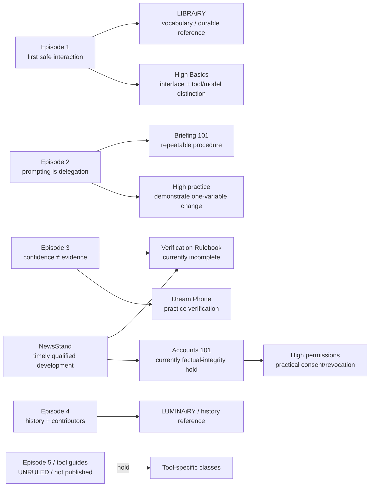

# LAiDIES learning-content concept and progression map

**Status:** BUILT LOCALLY — source-mapped foundation. It is not an item-level accuracy or pedagogical approval.
**Evidence convention:** `OBSERVED` means named current repository source; `INFERENCE` means a portfolio recommendation that needs review; `OPEN` means source/research work remains.

## One intended learner path

## Concept map

| Concept / learner need | Observed current home | Distinct job that should remain | Overlap / fault line | Recommended progression | Evidence status |
|---|---|---|---|---|---|
| First encounter with AI | Episode 1; High Basics period 1; Vocab | Episode makes starting emotionally safe; High demonstrates product/model/context/tool layers; Vocab supports recall | Representative definitions were reconciled 2026-07-29 and rewritten to the five-job LAiDIES teaching-copy standard 2026-07-30; audio rerecord and surface admission remain open | Episode 1 → High Basics product/system map → Vocab/Concepts lookup | REPRESENTATIVE CONCEPT + WRITING CORRECTION VERIFIED LOCALLY; RELEASE OPEN |
| Prompting, context and delegation | Episode 2; Briefing 101; handbook chapter 1/2; ChatGPT setup lessons | Episode demonstrates change; LIBRAiRY holds reusable procedure; High runs a controlled practice | Existing content audit documents duplicated briefing anatomy | Episode 2 → Briefing 101 → one High real-task exercise → FAiRY prompt help | OBSERVED duplication; recommendation INFERENCE |
| Context, history, memory and custom instructions | Vocab; Setup 101; High Basics periods 3–6; ChatGPT classes 2–4 | High should show mechanics/settings; LIBRAiRY should preserve durable distinctions | Product/account specifics are perishable; memory/history/context easily collapse into one vague concept | Basic current-context → saved-vs-current → memory → authored instruction → workspace | OBSERVED High order; quality/freshness review OPEN |
| Chat/session, project, workspace and working mode | Masterclass decision in Ali Idea Backlog; Setup 101; proposed High `basics-projects`; current product research | Concepts/canonical register defines the layers and boundaries; LIBRAiRY preserves a revisable lookup or practical companion if its job survives reconciliation; High demonstrates organizing and controlling a real workflow | “Workspace” names different layers across vendors; Chat, Work/Cowork, Projects, memory and durable artifacts can be mistaken for interchangeable containers | Canonical layer entries → narrated visual masterclass → reusable checkpoint/handoff reference → dated product demonstrations | DECIDED distribution; Concepts entries and Library reconciliation OPEN |
| Permissions, files and connectors | Accounts 101; High Basics periods 7–9; NewsStand Health story | High provides consent/revoke practice; LIBRAiRY provides durable safety decision frame; NewsStand contextualizes a current release | Accounts is on factual-integrity hold; health story has only one visible vendor source | Accounts repair → permissions class → current NewsStand as case study | OBSERVED; release/accuracy gates OPEN |
| Agent containment, monitoring and stopping | Concepts 101 Agentic AI + local Sandbox successor; Episode 4; proposed High `basics-permissions`; OpenAI/Hugging Face incident packet | Concepts owns the durable distinctions; Weekly applies them to dated evidence; High practises reducing access and identifying control layers | Permission, written instruction, sandbox, trajectory monitoring and independent stopping were previously collapsed into one vague safety claim | Agentic AI → Sandbox/least privilege → High controlled permissions exercise → Weekly incident case | Sandbox treatment BUILT LOCALLY; remaining concept rows and surface admission OPEN |
| Open, open-weight and closed AI | Open Source AI Definition; current vendor/product reporting; Hugging Face incident response | Concepts defines the labels and their limits; Tribune examines security, scrutiny, control and accountability; product cards retain dated implementation facts | “Open” is used inconsistently; weights alone do not establish full open source; neither open nor closed is a complete safety verdict | Concepts distinctions → Tribune security argument → dated product examples | CAPTURED / SPECIFICATION OPEN |
| Model, product, app, API and tool layers | Episode 01 definitions; Vocab; Concepts 101; Who's Who; Episode 5; High Basics/tool courses | Concepts/Vocab hold the durable model/system distinction; High demonstrates it; dated tool courses show current controls | Core model definition and system boundary were ruled 2026-07-29 and the maintained memory line/copy roles were reconciled 2026-07-30; Episode 5 analogy and current provider comparisons remain separately unruled/perishable | Episode 1 recognition → High layer diagnosis → durable Concepts lookup → dated product demonstrations; hold Episode 5 analogy until ruled | CORE DEFINITION + TEACHING COPY VERIFIED LOCALLY; EPISODE 5 / WHO'S WHO / DATED PRODUCTS REMAIN HOLD |
| Participation gap in generative-AI use | Episode 1; Episode 01 Study Pack; facts ledger | Episode creates urgency and belonging; Study Pack supports recall; current research packet qualifies the evidence | Older 25% and 78:100 treatments were superseded by the May 2026 HBS Working Paper version; the card now distinguishes participation from ability without explaining women’s lived experience back to them | Episode 1 story → participation-gap card → dated research receipt | VERIFIED LOCALLY 2026-07-30; WORKING-PAPER LIMITS REQUIRED |
| Hallucination, grounding, retrieval and verification | Episode 3; Vocab; How to Check AI's Work; Straight Answers; Dream Phone; NewsStand provenance story | Episode creates stakes; reference gives method; game supplies retrieval practice; NewsStand applies it to current claims | The maintained definition now covers false or unsupported content inside otherwise useful work and separates polished style from evidence; Verification Rulebook remains a placeholder | Episode 3 → complete rulebook → Dream Phone → NewsStand story reading | REPRESENTATIVE DEFINITION/COPY VERIFIED LOCALLY; P0 METHOD IMPLEMENTATION GAP |
| AI history and named contributors | Episode 4; Vocab AI winter/training data; LUMINAiRY | Episode builds historical/narrative belonging; reference supports lookup | Exact historic claims and broad “women built every leap” framing need source audit | Episode 4 → LUMINAiRY/history cards → relevant Vocab | OBSERVED; item-level fact audit OPEN |
| Timely product/policy developments | NewsStand stories | Timely, source-qualified reporting with correction/retraction discipline | A dated NewsStand story should never be stretched into evergreen curriculum | NewsStand → precise evergreen reference only when it helps | OBSERVED editorial contract; independent review OPEN |

## Structural observations

### OBSERVED: the format jobs are intelligible, but handoffs are not reliably bound

The source material supports a coherent model: episodes introduce and dramatise, books retain durable concepts/procedures, High classes demonstrate/practise, and NewsStand deals with current developments. Existing links sometimes make these connections, but the inventory has no canonical prerequisite/next-experience graph and no test that the next destination is published, distinct and editorially cleared.

### OBSERVED: the principal overlap clusters

1. **Prompting:** Episode 2, Briefing 101, handbook chapters 1–2, ChatGPT-specific prompt/setup content, FAiRY. The distinction should be narrative motivation → tool-agnostic procedure → task practice → on-demand help.
2. **Memory/context/settings:** Setup 101, Vocab terms, High Basics 3–6, ChatGPT-specific lessons. The clean axis is current context, saved history, tool-authored memory, user-authored standing instructions, then persistent workspace.
3. **Verification:** Episode 3, glossary entries, How to Check, Straight Answers, Dream Phone and NewsStand. The clean axis is why confidence misleads → repeatable verification method → practice → current editorial application.
4. **Tools/model/app:** Who's Who, Vocab, Episode 5 draft, current-model scripts, future tool books and tool courses. This is currently a HOLD because the core canon and dated fact source are unresolved.
5. **Account/privacy/permission:** Accounts 101, tool cards, High permissions/connectors and the Health NewsStand story. The clean axis is provider/account-specific policy → consent/revoke mechanics → current event context; it cannot rest on a universal privacy slogan.

## Progression rules proposed for review

These are **INFERENCES**, not changes to public content.

1. Every published episode should expose exactly one approved next step in each relevant mode: `look up`, `practise`, and—only where useful—`apply to current news`.
2. No book/class link may point into an `EXISTING_HOLD`, `NOT_PUBLISHED`, placeholder or UNRULED item without an honest label and an alternative safe route.
3. A topic taught in two formats needs a written difference in learner job, not merely different copy or visual styling.
4. A High class should not be counted as an application step until its source/currency, exact demo, learner feedback and accessible recovery journey pass.
5. NewsStand should link to evergreen learning only as supporting context. Its headline, date, source qualification and correction path remain primary.

## Open research register

- **Item-level subject-matter review required:** Accounts 101, Setup 101, Who's Who, Straight Answers, every provider-specific High class, Episode 4 historical claims, and current NewsStand stories.
- **Instructional-design review required:** Vocab-to-Concepts boundary, Episode 2/Briefing/High division, Episode 3/Verification/Dream Phone division, and every class with no evidence of explanation-to-transfer.
- **User evidence required:** learner route comprehension, whether learners can distinguish model/app/context/memory, and whether they can apply verification without simply repeating the slogan.
- **Freshness/review system required:** dated source packets, correction owner, recheck trigger and public correction/retraction handling for each perishable item.
