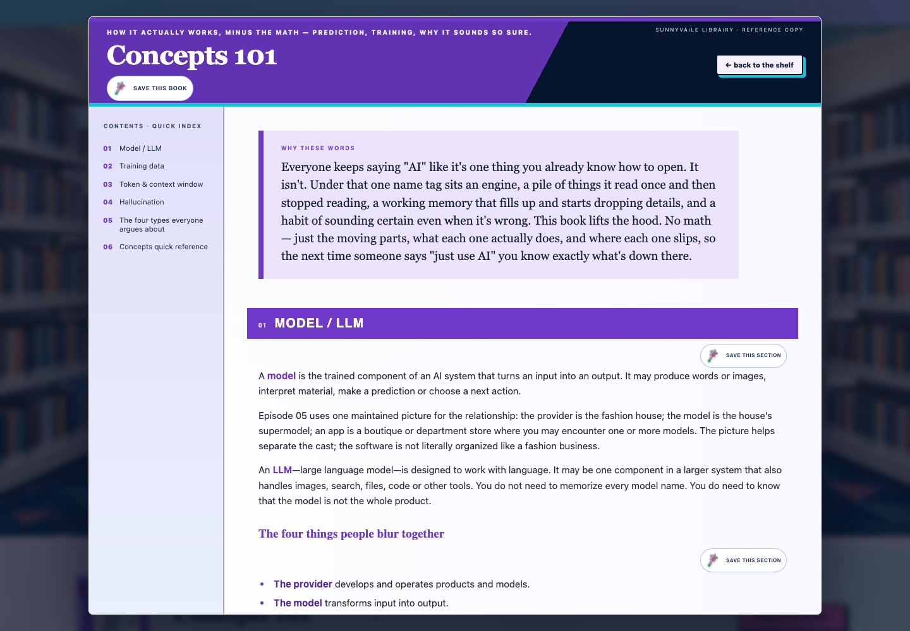
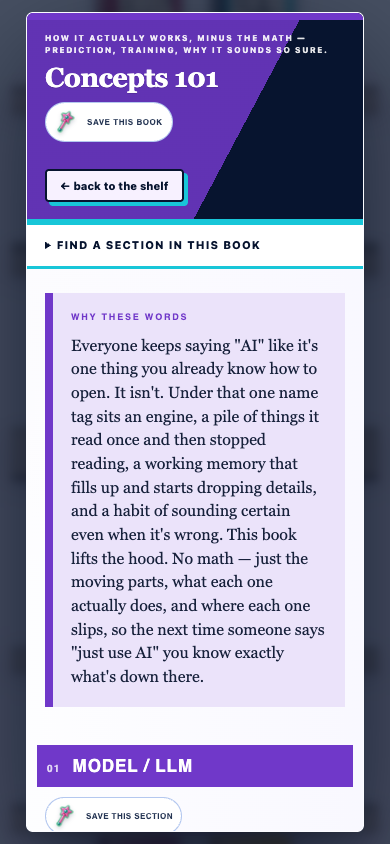
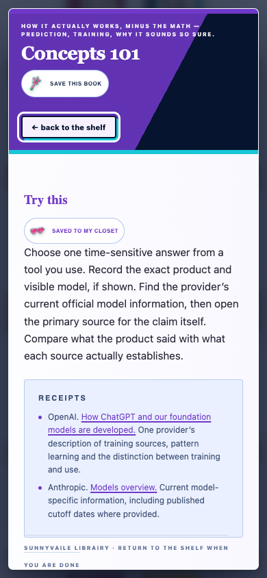

# Concepts 101 full-reader format-fit judgment

**Judged:** 2026-08-03 (America/Vancouver)
**Mode:** combined visual UX and bounded accessibility audit
**Role:** independent judge; no maker, owner-admission, release or public authority
**Verdict:** **PASS — bounded full-reader format fit.**

The exact candidate provides a book-like continuous reading experience without
page-flip friction, makes the whole book and its six top-level subjects clear,
scales the contents separately from the body, and gives mobile readers a
compact real section finder. The exact-section view now contains only the
selected section's Puffy action. No additional format repair is required before
the separate native and owner admission gates.

## Exact evidence tuple

| Artifact | SHA-256 |
|---|---|
| `manifest.json` | `ab263923315216ce461bfd8d27a1e22e49dd19176d58c61501f55666d40f8254` |
| `library.html` | `3c324608fab51a5b0a02ddd8153e2b0c5c65617af21da6499b775ee8e9f4d572` |
| `scripts/test-library-product.cjs` | `62f77f23e8c67844490d87f35fb3f1cfd4f3db80fff9f9e8e1375780002bd065` |
| `content/library-books/rendered/concepts-101.html` | `bb25fae48b640f53112bd9191391e66dbbf5bf4a8603d6c5bd55a8cf85508f4b` |
| `content/library-books/concepts-101.claims.json` | `d8b5abefa36ce3921f206d9f4311828f01e38a54d6dd5fa2fc2999ae442fe44a` |
| `content/library-books/admission-manifest.json` | `54ccaae93ee05f8cc9b27b3cbb31810ae3fef660b3caf4fa25b46251631c3010` |
| `content/site/site-index.json` | `f95d7921932fff48fc5483e78845790f05c89c628886ca86c424e8c59c6683d5` |
| Desktop screenshot | `4df5e0bfc07938f6141e25f23a6d63a014162639c20bcdb0b2f199245f75de92` |
| Mobile-start screenshot | `4c64f4fba71d045a9d56166f1436cc8f295284fb1385e54cff3fe8d776330462` |
| Mobile exact-section screenshot | `9fe988c9e05cf45260d811987d0e7186ccbaaf38ba5d541a43e69e2a4f322adf` |

All manifest identities match the actual files. The publication proposal still
correctly says `status: hold`, `admitted_books: 0`; the local available fixture
used for screenshots and product tests is not production admission.

## Step-by-step audit

### 1. Desktop book opening — healthy

- The complete `Concepts 101` title is contained within the masthead; it neither
  clips nor overlaps the body.
- `CONTENTS · QUICK INDEX` shows six top-level subjects in a persistent,
  separately scrollable column. It answers what the book covers without
  flooding the index with every subheading, and additional chapters can be
  added without shrinking the text or covers.
- The reference-copy masthead, editorial lede, numbered chapter bars and
  continuous reading column feel like a book rather than a class, slide deck,
  card stack or page-flip gimmick.
- The hierarchy, line length and type sizes are comfortably readable at
  1440×1000. The quiet paper surface protects long-form reading while the
  purple/navy/cyan treatment remains recognizably LAiDIES.
- No random decorative circles, connecting lines or visible dot-rule dividers
  compete with the text. Visual emphasis follows content structure.
- `Save this book` and `Save this section` are visibly and linguistically
  distinct.

### 2. Mobile book opening — healthy

- The title, whole-book action and return action remain intact and unclipped.
- `Find a section in this book` is an obvious, compact native disclosure rather
  than a permanently hidden desktop sidebar. It expands to the same six real
  top-level destinations and remains keyboard/focus operable.
- The 5,287-word book reflows into a readable single column with no horizontal
  overflow. The opening summary explains the purpose before the first chapter,
  and the first chapter/action is visible without a page-turn interaction.
- The section finder can grow through its independently scrollable navigation;
  it does not shrink the reading surface or require a new card layout.

### 3. Mobile exact-section reopen — healthy

- The exact saved `Try this` occurrence reopens, is visibly titled, and shows
  the selected action as `Saved to My Closet`.
- Only one section Puffy row is visible. The previously detached unrelated
  controls are absent because Puffy wiring now occurs before focused-section
  filtering.
- Receipts remain readable source material and have no false section-save
  control. The selected passage is complete and ends with an explicit return
  cue rather than exposing unrelated book content.
- Hiding the general contents in this focused reopen is appropriate: the
  visitor asked for one saved section, while `back to the shelf` remains clear.

## Independent mechanical checks

- `node scripts/test-library-product.cjs` — **PASS**, 65 checks and 43 external
  requests blocked. This includes six mobile destinations, an operable compact
  section finder, unique duplicate-title anchors, exact reopen and exactly one
  visible focused-section Puffy row.
- `node scripts/validate-library-product.mjs` — **PASS**, 15 books, 8 hold, 7
  preview, 0 available.
- `node scripts/check-concepts-101-claims.mjs` — **PASS**, exact rendered hash,
  six claims, eight sources, three currentness records, four propagations,
  status HOLD.
- `node scripts/check-library-vocab-concepts-consolidation.mjs` — **PASS**, 17
  consolidated terms and Vocab excluded from the shelf.
- Product-test JavaScript syntax and targeted `git diff --check` — **PASS**.

## Evidence limits and remaining gates

The screenshots and local Chromium checks support format, hierarchy, visible
labels, focus mechanics, responsive reflow and exact-section behavior. They do
not establish full WCAG conformance or native assistive-technology behavior.

Native Safari, VoiceOver, 200% zoom and Library owner/taste admission remain
separate requirements. Any later deployment requires exact release admission;
publication requires a cold public-origin witness. The preview-held search
metadata remains non-operable while the production book is held.

No candidate/source/test/manifest/control-room/release/deployment/public file
was changed by this judgment.
