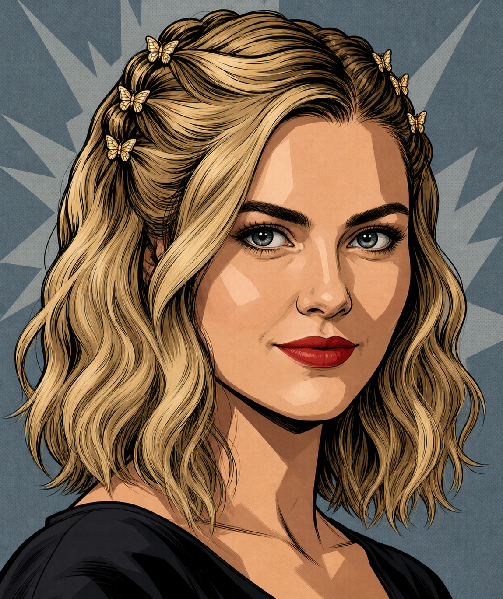

# Art styles by purpose

Select the visual job first. Rendering, character identity, lettering, composition and colour references answer different questions. The provisional whole-site style discussion does not override a specific current approval.

[Back to the reference collection](README.md)

<!-- Generated from existing authority by scripts/build-current-reference-index.mjs. Do not edit this view; update the source and regenerate. -->

| Reference | What it is for | Authority |
|---|---|---|
| **The Heroine / episode and trailer people style**  | Episode/trailer rendering; identity authority for The Heroine only. This does not select one rendering style for every building page. Destination: episode, trailer | [Approval source](../episode-visual-system-lock.md#3-current-ensemble--identity-references) Reference ID: `PEOPLE_STYLE_MASTER` |
| **Adult editorial illustration**  | Style and integrated background storytelling only. Adult editorial/comic detail, meaningful action, print texture and electric accents. Not a likeness/historical truth reference, reusable whole scene, or full-page approval. Destination: editorial | [Approval source](source-decisions.md#editorial-illustration-style) Reference ID: `EDITORIAL_STYLE_AUG30` |

| Job | Existing curated reference set | Boundary |
|---|---|---|
| Trading cards | [Card examples](trading-cards/README.md) | Ben-Day halftone and card composition; do not substitute these faces for a named character. |
| Comic pages and panels | [Page](comic-book-page-style/README.md), [strip](comic-strip-layout/README.md), [storytelling](comic-storytelling/README.md) | Composition and printed surfaces; the people master still governs episode faces. |
| Lettering | [Text emphasis](comic-text-emphasis/README.md), [font examples](font-and-text-emphasis/README.md) | Lettering treatment; functional text stays editable and deterministic. |
| Collage and graphic backgrounds | [Cover collage](comic-cover-collage/README.md), [ident backgrounds](comic-ident-background/README.md) | Composition and graphic energy; no automatic character or place authority. |
| Episode environments | [Scene references](episode-style-popart/README.md) | Depth/composition only; no approved current town daytime palette or Welcome sign is supplied by these examples. |
| Supplemental rendering and wardrobe | [Style-only references](style-only-refs/README.md), [wardrobe](heroine-wardrobe/README.md) | Supplemental references only; never replace the exact identity, people master or episode outfit. |

For room/page artwork use [the current place and its limits](current-buildings.md). Full episode people rules: [episode visual lock](../episode-visual-system-lock.md).
