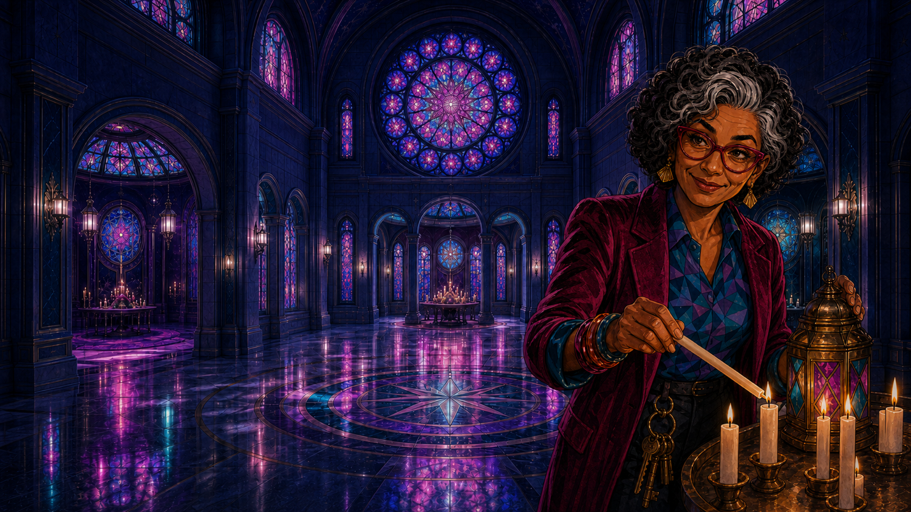
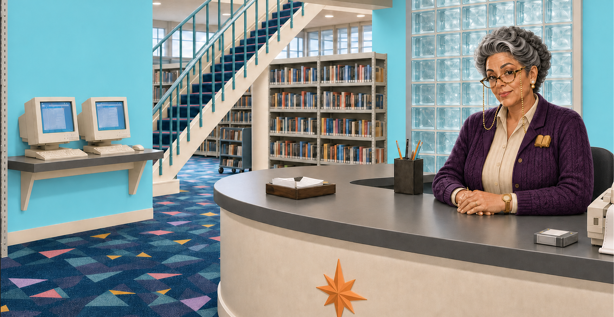
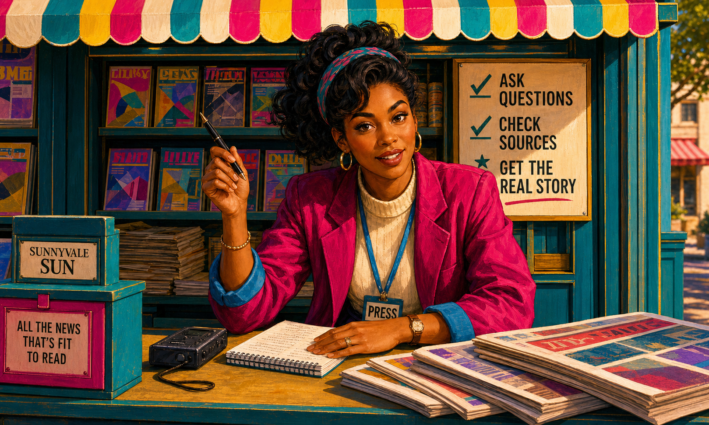
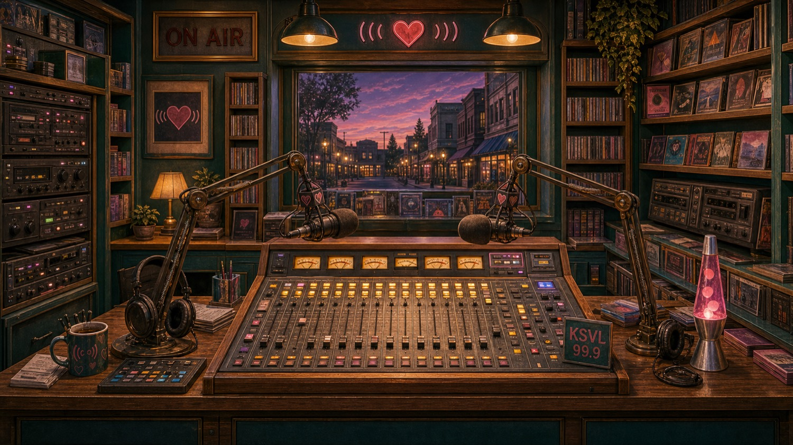
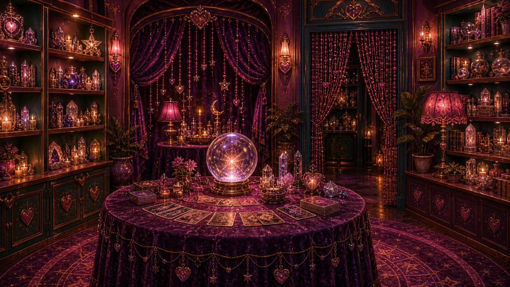
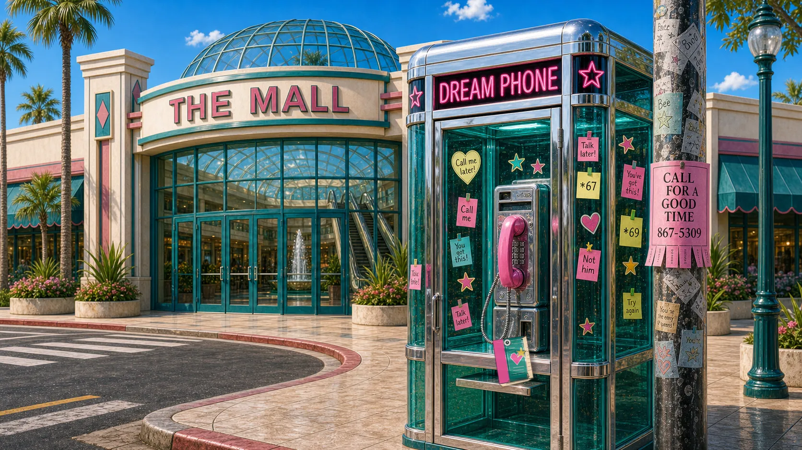
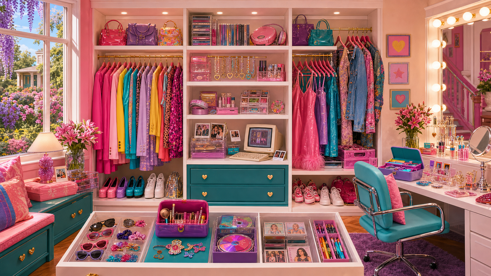
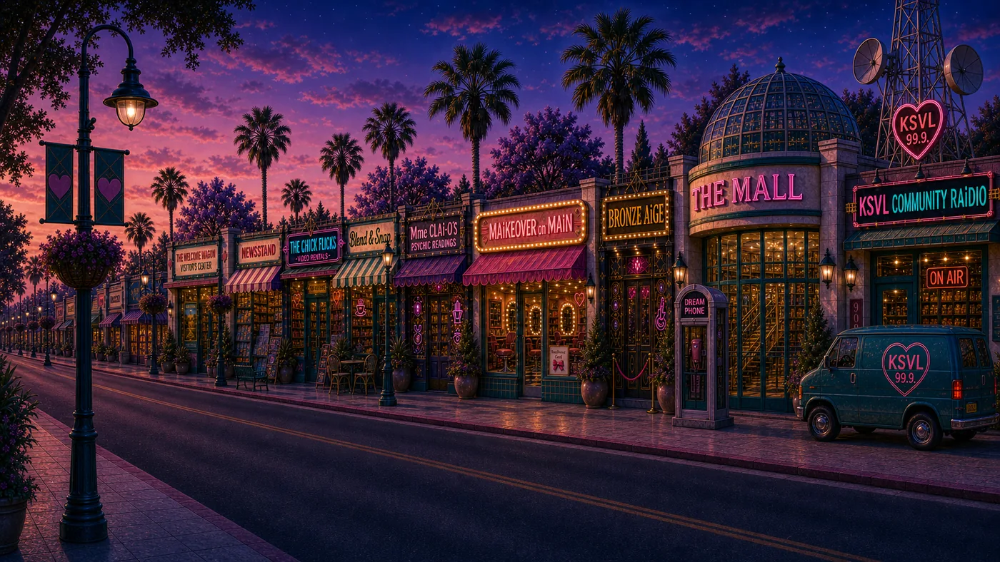

# Current building and place references

This is a small selection of exact room/place sources and their allowed uses, not a library of interchangeable building pictures. Exterior identity, interior design and page placement are separate. Where approval binds an exact page checksum, a changed page needs a fresh placement check.

[Back to the reference collection](README.md)

<!-- Generated from existing authority by scripts/build-current-reference-index.mjs. Do not edit this view; update the source and regenerate. -->

| Reference | What it is for | Authority |
|---|---|---|
| **LUMINAiRY — approved page hero**  | Exact plant-free v3 LUMINAiRY hero. Keep object-position: 92% center at the 760px breakpoint. Visual approval for this placement only; not public release or generic building/character/episode use. Destination: luminairy | [Approval source](source-decisions.md#matron-lumen-identity-and-luminairy-placement) Reference ID: `LUMINAIRY_PAGE_HERO` |

## Existing scoped sources

The approval text below is read directly from the receiving asset registry. These images do not become general references for other rooms, characters, episodes or new artwork merely by appearing here. The cyan Library room is the later selected room base; use the current Miss Jeeves identity separately when making a masthead candidate.

### LIBRAiRY — cyan room base

Exact full-frame Library arrival/reference-desk masthead in library.html SHA-256 ef14ac8e50b3c877c1f0e950c2091a63b4e90ae0fc5c1352fa0f97b57787248b only. Natural aspect ratio and complete Miss Jeeves head are mandatory; no Homepage, social, motion or general character-asset authority.

[Open original](../../assets/building-interiors/delivery-20260722-library-interior-reroll-v1/library-interior-wide-jeeves-blue-walls-v3.png) · [Exact reuse approval](../assets/active-asset-registry.json) · Role `library.arrival.reference-desk.owner-corrected-blue`

### NewsStand — Paige source-checking crop

NewsStand arrival pane in newsstand.html only, using exact source crop x=700–1360 and y=40–744 (15:16; CSS width 245.303%, left -106.061%, top -6.061%). No full-image use, wider/lower crop, operable rack, publication-cover, social, episode, motion, other route or general Paige-image authority.

[Open original](../../assets/town-characters/scenes/paige-scene.png) · [Exact reuse approval](../assets/active-asset-registry.json) · Role `newsstand.arrival.paige-source-check`

### KSVL 99.9 — studio

KSVL arrival environment in radio.html and the KSVL Homepage spotlight in index.html only. No album, sticker, character, social, motion or general studio-library authority.

[Open original](../../assets/building-interiors/ksvl-booth.jpg) · [Exact reuse approval](../assets/active-asset-registry.json) · Role `ksvl.arrival.booth`

### Mme CLAi-O — reading room

Exact existing responsive Mme CLAi-O reading-room/table/deck environment in games/madame-claio.html only. No portrait, character identity, card-front, social, motion, episode, general building-interior library or other route authority.

[Open original](../../assets/building-interiors/mme-claio-reading-room.jpg) · [Exact reuse approval](../assets/active-asset-registry.json) · Role `mme-claio.reading-room`

### Dream Phone — Homepage booth image

Dream Phone activity image in index.html only. No caller portrait, public experiment, in-game dialer, social, motion or general building-library authority.

[Open original](../../assets/sunnyvaile-buildings/y2k-v3/17-dream-phone-booth.webp) · [Exact reuse approval](../assets/active-asset-registry.json) · Role `homepage.activity.dream-phone-booth`

### Closet — Resident Card room

Exact existing static responsive arrival-room image in laidies-card.html only. No hotspot map, item ownership, account/sync, reward/progression, Sorority House environment, social, motion or other route authority.

[Open original](../../assets/closet/closet-interior-hero-v2-90s-vibrant.png) · [Exact reuse approval](../assets/active-asset-registry.json) · Role `closet.arrival-room`

### MAiN Street — Homepage masthead

Exact current Homepage masthead background used by index.html and repeatedly protected by Ali from redesign or replacement. It is the admitted MAiN Street visual reference; the retired phone-bedroom composition is not the current masthead.

[Open original](../../assets/sunnyvaile-streets/main-street-dusk.webp) · [Exact reuse approval](../assets/active-asset-registry.json) · Role `homepage.masthead.background`

## Where no general current building reference is selected

| Place | Current boundary / next source |
|---|---|
| Blend & Snap | NO CURRENT APPROVED SOURCE for its replacement storefront. The cottage-core family is rejected; do not restore it. |
| MAiKEOVER | The later room-colour decision rejects mauve cabinetry. The older salon ACTIVE entry alone does not establish a current matching room; resolve the exact room with its owner. Card finishes have separate colour freedom. |
| Visitor’s Centre, Town Hall, Post Office, Chick Flicks, BRONZE AiGE, The Mall, SUNNYVAiLE High, FAiRY Godmother’s house, Delta LAi Nu | No general building-identity source has been verified into this small collection. This is an approval/reconciliation gap, not a claim that no artwork exists. Do not infer a building reference from an old hero folder, district crop or map. Use the current product owner’s exact decision. |

The exact [town map](../../assets/final_map/sunnyvaile-town-map-final-v5.webp) governs geography, not a replacement rendering style or automatic approval of each pictured building.
