# Current character references

Use these exact references to preserve identity. An identity reference helps make matching artwork; it is not automatic permission to paste those pixels into a page. The episode references below do not select a new sitewide rendering style.

[Back to the reference collection](README.md)

<!-- Generated from existing authority by scripts/build-current-reference-index.mjs. Do not edit this view; update the source and regenerate. -->

| Reference | What it is for | Authority |
|---|---|---|
| **The Heroine / episode and trailer people style**  | Episode/trailer rendering; identity authority for The Heroine only. This does not select one rendering style for every building page. Destination: episode, trailer | [Approval source](../episode-visual-system-lock.md#3-current-ensemble--identity-references) Reference ID: `PEOPLE_STYLE_MASTER` |
| **Penny** <a href="../../assets/town-characters/scenes/penny-scene.png">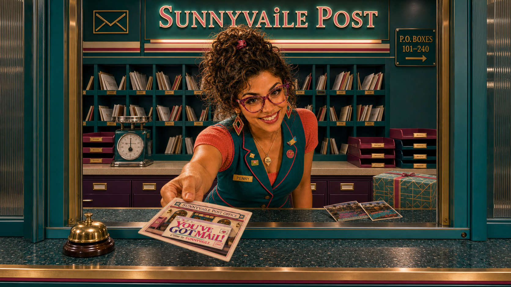</a> | identity only; intro lettering must be exactly PENNY and POST OFFICE Destination: episode | [Approval source](../episode-visual-system-lock.md#3-current-ensemble--identity-references) Reference ID: `IDENTITY_PENNY` |
| **Paige** <a href="../../assets/town-characters/comic/paige-comic-v1.png">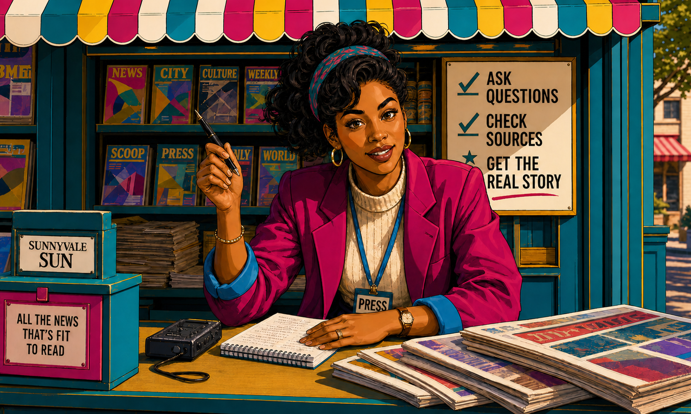</a> | identity only Destination: episode | [Approval source](../episode-visual-system-lock.md#3-current-ensemble--identity-references) Reference ID: `IDENTITY_PAIGE` |
| **DJ SunnyV**  | identity only Destination: episode | [Approval source](../episode-visual-system-lock.md#3-current-ensemble--identity-references) Reference ID: `IDENTITY_DJ_SUNNYV` |
| **JoJo** <a href="../../assets/town-characters/comic/jojo-comic-v1.png">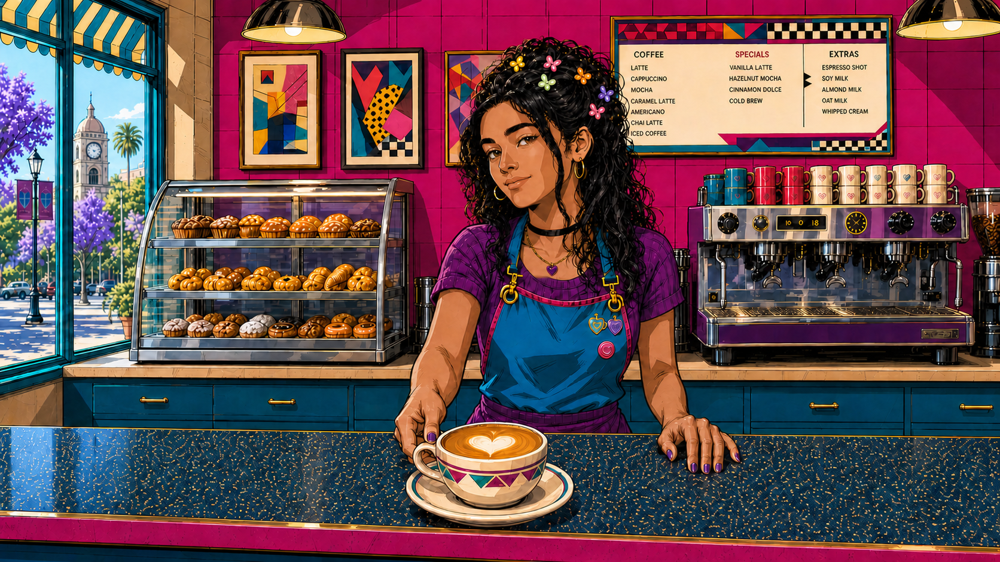</a> | identity only Destination: episode | [Approval source](../episode-visual-system-lock.md#3-current-ensemble--identity-references) Reference ID: `IDENTITY_JOJO` |
| **Cosmo**  | identity only Destination: episode | [Approval source](../episode-visual-system-lock.md#3-current-ensemble--identity-references) Reference ID: `IDENTITY_COSMO` |
| **Paulette** <a href="../../assets/town-characters/comic/paulette-comic-v1.png">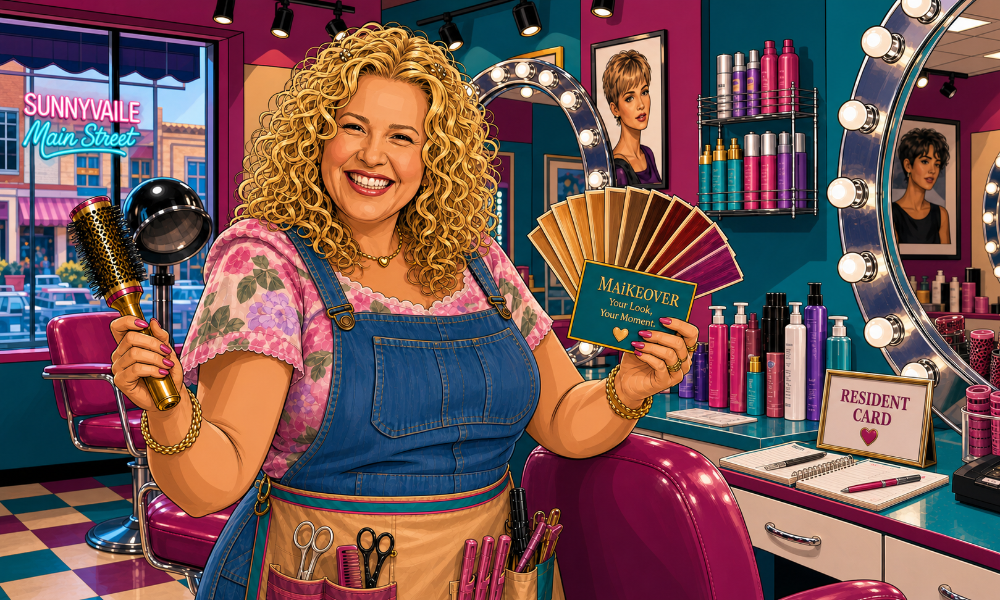</a> | identity only; receives the full solo feature formerly assigned to June Destination: episode | [Approval source](../episode-visual-system-lock.md#3-current-ensemble--identity-references) Reference ID: `IDENTITY_PAULETTE` |
| **Mayor Deb** <a href="../../assets/town-characters/scenes/mayor-deb-scene.png">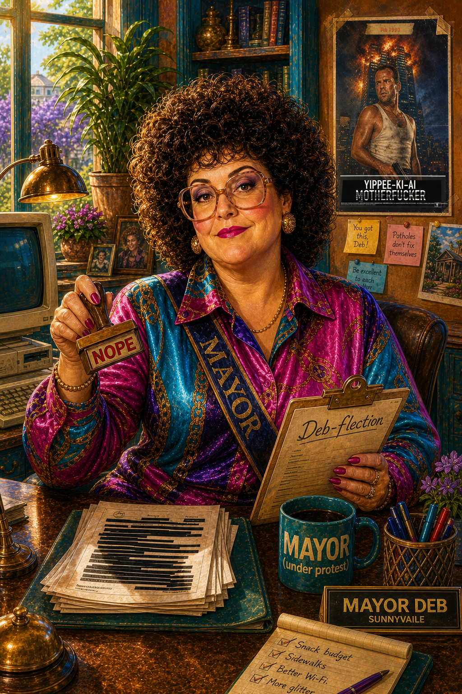</a> | identity only Destination: episode | [Approval source](../episode-visual-system-lock.md#3-current-ensemble--identity-references) Reference ID: `IDENTITY_MAYOR_DEB` |
| **Mme CLAi-O** <a href="../../assets/video/delivery-20260714-opening-v6/shots/opening-03-mme-claio-clean-face.png">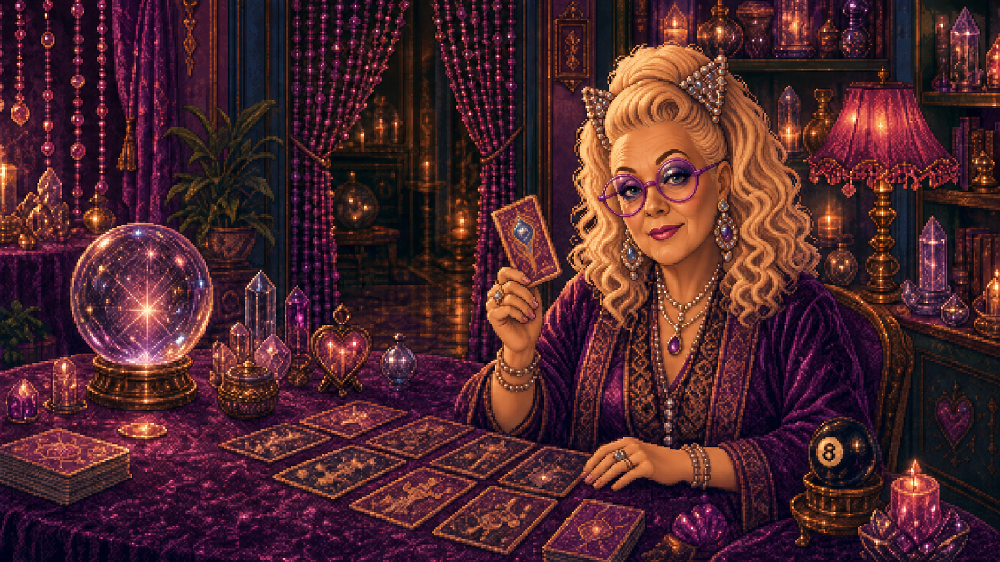</a> | identity only Destination: episode | [Approval source](../episode-visual-system-lock.md#3-current-ensemble--identity-references) Reference ID: `IDENTITY_MME_CLAIO` |
| **FAiRY Godmother** <a href="../../assets/video/delivery-20260714-opening-v6/shots/opening-08-fairy-godmother-clean-lit-group-face-v3.png">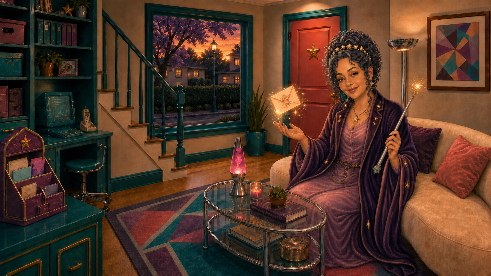</a> | identity only Destination: episode | [Approval source](../episode-visual-system-lock.md#3-current-ensemble--identity-references) Reference ID: `IDENTITY_FAIRY_GODMOTHER` |
| **Matron Lumen** <a href="../../assets/town-characters/candidates-20260901/matron-lumen-sunnyvaile-identity-pilot-v1.png">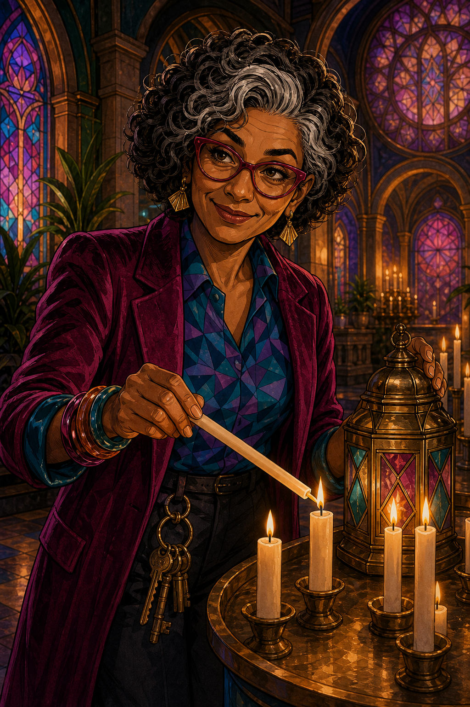</a> | Identity for the approved LUMINAiRY adaptation: silver-streaked curls, raspberry glasses, period wardrobe and practical candle tending. Other episode/card/shared placements require separate approval; do not reuse old fantasy-clergy identity. Destination: luminairy | [Approval source](source-decisions.md#matron-lumen-identity-and-luminairy-placement) Reference ID: `IDENTITY_MATRON_LUMEN` |
| **Miss Jeeves**  | Exact pencil-free teal identity for a Library masthead candidate. Preserve full face, dark curls, round gold glasses, pearl studs, teal cardigan and white collar. No approved replacement masthead, Homepage reuse or deployment follows from this identity selection. Destination: library | [Approval source](source-decisions.md#miss-jeeves-identity-and-library-room) Reference ID: `IDENTITY_MISS_JEEVES` |
| **June** <a href="../../assets/town-characters/scenes/june-scene.png">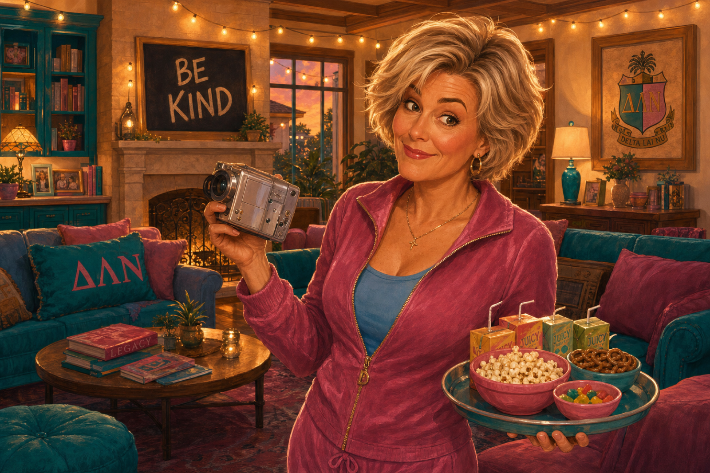</a> | Episode ensemble identity only, from the existing people lock. Does not restore a June solo intro slot assigned to Paulette. Destination: episode | [Approval source](../episode-visual-system-lock.md#3-current-ensemble--identity-references) Reference ID: `IDENTITY_JUNE` |

## Existing images with separate reuse approval

These are the two narrowly approved Resident Card avatars; they do not replace the identity/style references above.

### Mme CLAi-O — Resident Card avatar

<a href="../../assets/town-characters/avatars/mme-claio-avatar-v1.png">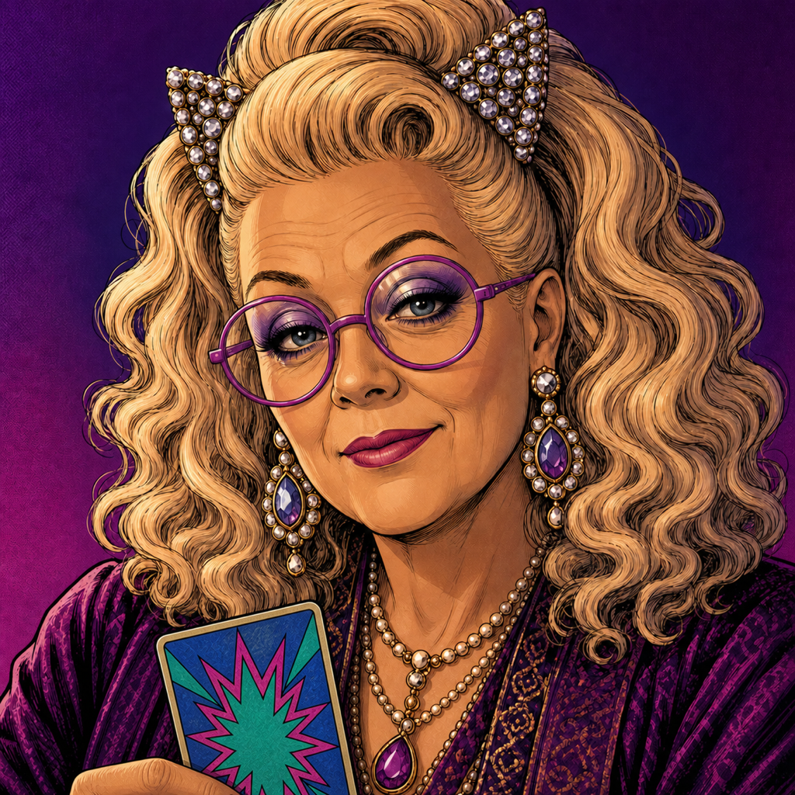</a>

Mme CLAi-O Resident Card avatar and existing Episode 01 t=1076.3 CTA portrait only. The Episode CTA image is decorative and its text supplies the meaning. No building hero, social, motion, card-front, general portrait-library or other episode authority.

[Open original](../../assets/town-characters/avatars/mme-claio-avatar-v1.png) · [Exact reuse approval](../assets/active-asset-registry.json) · Role `town-character.mme-claio.avatar`

### FAiRY Godmother — Resident Card avatar

<a href="../../assets/town-characters/avatars/fairy-godmother-avatar-v1.png">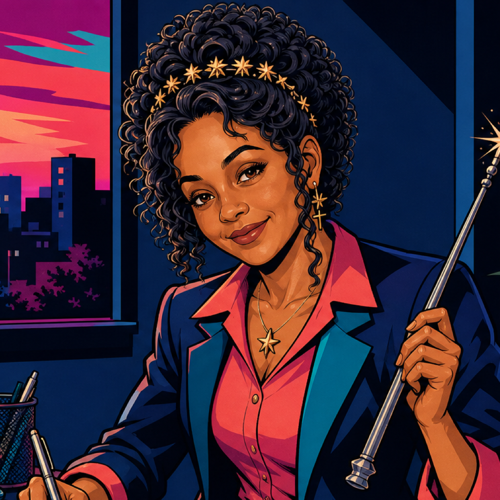</a>

FAiRY Godmother Resident Card avatar only, with character-specific alt text. No Homepage intent artwork, building hero, social, motion, card-front, episode cue, general portrait-library or other route authority.

[Open original](../../assets/town-characters/avatars/fairy-godmother-avatar-v1.png) · [Exact reuse approval](../assets/active-asset-registry.json) · Role `town-character.fairy-godmother.avatar`

## Characters outside this small keeper set

Historical women and Patron Saints require their own exact likeness and destination approval. This collection does not invent a current portrait for an unlisted person. Consult the current owner rather than browsing old renders.
