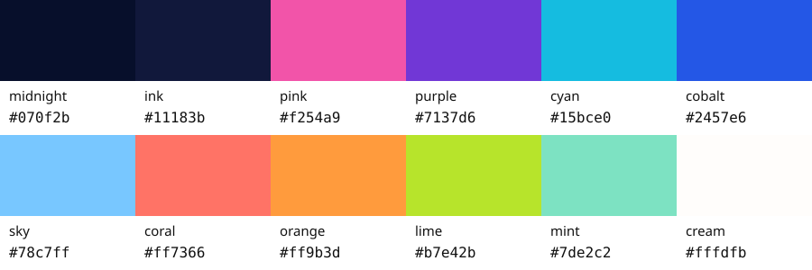
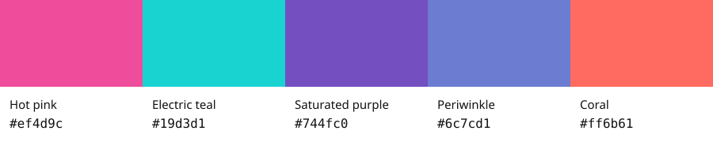

# Colours and where they apply

These are scoped colour references, not one mandatory palette for every building or image. Match the current destination’s approved environment and decisions.

[Back to the reference collection](README.md)

<!-- Generated from existing authority by scripts/build-current-reference-index.mjs. Do not edit this view; update the source and regenerate. -->

## Current LIBRAiRY palette and Homepage adoption

**midnight** `#070f2b` · **ink** `#11183b` · **pink** `#f254a9` · **purple** `#7137d6` · **cyan** `#15bce0` · **cobalt** `#2457e6` · **sky** `#78c7ff` · **coral** `#ff7366` · **orange** `#ff9b3d` · **lime** `#b7e42b` · **mint** `#7de2c2` · **cream** `#fffdfb`

[Exact destination colour rulings](source-decisions.md#current-library-and-homepage-colours). The Homepage adoption explicitly names pink, cyan, orange, lime, sky and ink from this family. Yellow is not an active Library colour. Cream is a bounded paper colour, not permission for a plain white page backdrop. This newer destination palette takes precedence over the older general accents below for that destination.

## Earlier general page-UI accents

| Page UI accent | Exact code |
|---|---|
| Hot pink | `#ef4d9c` |
| Electric teal | `#19d3d1` |
| Saturated purple | `#744fc0` |
| Periwinkle | `#6c7cd1` |
| Coral | `#ff6b61` |

Source: [current page design bar](../page-design-bar.md). Near-black navy is the shared ink direction; this source does not specify one universal navy hex. Do not invent one here.

- **Buildings:** the approved environment supplies dominant colour, lighting and material; check [current building references](current-buildings.md).
- **Resident Card:** pink/lilac are permitted bounded finishes; they do not permit dusty mauve cabinetry or a plum room. [Exact Card/MAiKEOVER colour decision](../resident-card-design-decisions.md).
- **LUMINAiRY:** the approved plant-free hero binds ink navy, raspberry, violet, cyan and teal visually; preserve its actual artwork rather than imposing the old shared burgundy.
- **Background inspiration:** source palettes are inspiration, not automatic locked colours. Adapt to the destination when making new artwork.
- **Retired page UI:** gold `#c9a227`, plum `#4b2148`, white/plum themes and pastel candy bands are not the current page system. A permitted card finish or stained-glass object is a different scope.

The [older provisional site direction](../site-visual-system-lock-2026-07-23.md) remains subordinate to later destination decisions. Its existence does not settle the sitewide art-family question.
